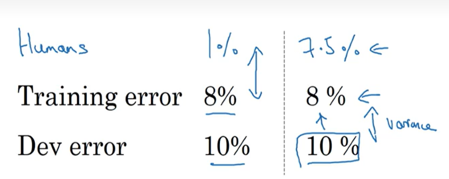
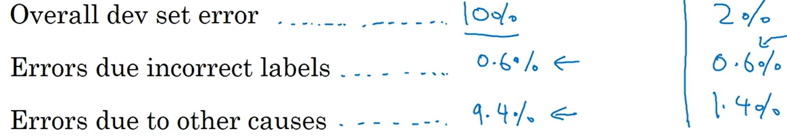
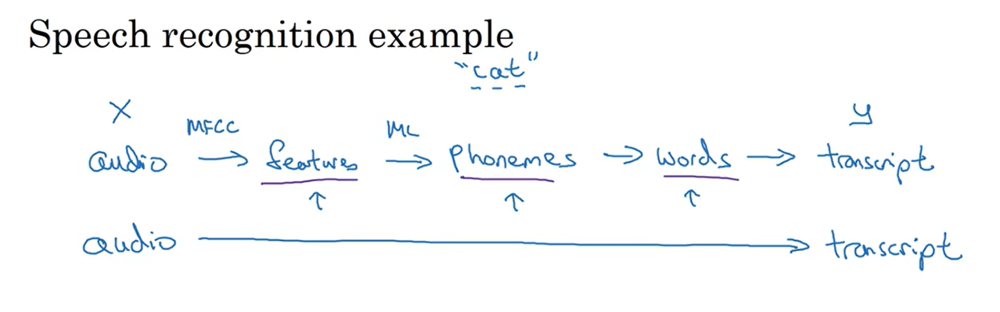

#! https://zhuanlan.zhihu.com/p/663867959
# 深度学习吴恩达老师课堂笔记（三）

续前面的[深度学习吴恩达老师课堂笔记（一）](https://zhuanlan.zhihu.com/p/663532574)和[深度学习吴恩达老师课堂笔记（二）](https://zhuanlan.zhihu.com/p/663689302)继续学习，这里主要介绍一下深度学习网络的一些分析优化方法。

## 3. 结构化机器学习项目

### 3.1 一些优化理论或经验

对于机器学习问题，大多数情况下有非常多的可以调节的超参数，在解决实际问题的时候需要有比较明确的方向来决定到底该调整哪个超参数，因此需要对超参数进行正交化，实际上也就是让每个超参数的含义更加明确。实际上这里就是通过设定目标（给定性能指标）和分析性能偏差（高方差or高偏差）这两步实现正交化。

首先比较重要的就是需要构建**单一**的网络性能评价指标（单实数评估指标）。比如偏斜分类问题中可以选取召回率和准确率的调和平均数作为评价指标。不过指标也会通过实际运行情况和误差分析结果不断改进（比如一开始认为只需要评价错误率后来发现必须要严格避免某一种错误从而在指标中增加该错误带来的权重之类的）。

前面提到过可以通过分析网络的训练集性能与验证集性能来判断当前是处于高方差还是处于高偏差，不过当时的分析都是将网络性能与100%正确率进行比较，在有些问题中这样的比较会导致网络性能反而下降，这是由参考对象选取的不准确导致的。一般而言，对于大多数问题而言，存在一个理论最高分类正确正确率，这一部分是由于样本本身就存在非常明显的人类都无法分辨的特征，进而导致网络也很难从中学习到明显的分类特征，这一部分会导致网络在实际应用的时候会存在贝叶斯最优错误率(Bayes optimal error)。实际上人类的能力在大多数任务中都很接近贝叶斯最优错误率，这也是为什么很多神经网络的性能在接近或者超过贝叶斯最优错误率以后进步就很缓慢，另一个可能是在达到人类水平之前人类可以提出很多方法来改善网络性能（比如外包人来大量标注数据集标签），而这些方法在网络性能已经提升的情况下就不怎么适用了（人类已经很难甚至不能分析出问题来源）。比如下面的问题，我们一般会通过将网络的训练集、验证集正确率来比较以分析当前出现的是高方差问题还是高偏差问题：

<!--  -->
这上面这种情况下，一般会倾向于认为左侧网络出现了高偏差问题而右侧网络出现了高方差问题。而这种显然分析在网络性能接近甚至超过人类的情况下不怎么起作用以致人类不知道该如何改进网络（事实上，我们会认为人类能力【这里所谓的人类能力并不会泛指全体人类的平均水平，这个“人类”的定义会随着应用场景和任务需求发生变化，可能有的时候指的是一般人类水平有的时候指的是专家水平，总之需要抓住的一点就是我们在这个问题中使用人类平均水平来替代贝叶斯最优错误率】接近贝叶斯最优错误率从而网络不能再继续改进）。一般会将这里训练集误差与贝叶斯最优错误率之间的差距认为是“可避免偏差”，而将训练集误差与验证集误差之间的差距认为是方差。

对于数据集误标注引起的误差，一般来说，深度学习网络对于在训练集中的个别随机误差的适应能力是很强的，所以一般情况下不需要专门对训练集进行重新数据标注（不过如果标注误差存在明显的规律性则另当别论）。对于验证集和测试集的标注错误引起的问题则需要考察这一部分误标注对于最终分析指标造成的影响，比如下面这两种情况：

<!--  -->
左侧情况误标注对最终结果影响很小，基本不会影响网络性能判断所以在左侧情况中也没有必要重新进行数据集标注；但是右侧情况下数据集标注误差已经占了总误差的大头所以在这种情况下很有必要重新进行**测试集+验证集**数据的重新标注。注意这里同时对测试集和验证集都重新进行数据标注主要是为了保证两边数据的严格同分布。在这种重新标注中需要注意的点就在于最好将整个测试集和验证集都重新标注**而不是只重新标注网络误分类的那一部分**，因为可能有些误标注结果被网络“蒙”对了而导致正确率虚高。

建立一个健壮的机器学习系统首先最关键的内容就是要快速搭建出第一版模型，选定指标后开始训练，在此基础上开始进行迭代改进。

在深度学习过程还存在的问题就是由于深度学习网络对于数据集的胃口非常大，所以一般很难获得一批直接完美契合测试场景的数据集。比如想要做一个在移动端进行动物分类的网络，实际可以从用户端获得的数据集可能有 20000 张（使用移动端设备拍摄出来的结果可能是模糊的、质量不佳的），但是可以通过网络手段从网站上找到 500000 张专业摄影后的数据集。在这种情况下直接把这两套数据集随机打乱后分配出训练集、测试集和验证集显然并不合理——实际的测试集中只有很少部分是我们真正想要用来学习的移动端数据，可能会花费大量时间在提高网络对于优质网图的识别正确率。因此合理的分类方式是将搜集到的 50w 张网图全部作为训练集，同时在训练集中掺杂 10000 张搜集到的移动端拍摄图像；再将剩下的 10000 张移动端拍摄图像平均分配到验证集和测试集中。不过这就会造成训练集和验证集、测试集的数据分布不一致，在深度学习网络中这是可以被接受的，但是很关键的一点就是需要保证验证集与测试集的数据分布一致性。

不过这样划分数据集会造成的问题就是，在上述例子中验证集数据的分类难度是高于训练集的，这必然会造成从训练集到验证集分类正确率的下降，按照前面的分析方法这种现象会被归类为过拟合，但是实际上在现在这种情况下这个结论并不能算作很合理。于是需要重新建立一个训练-验证集，这个数据集中的数据应当和训练集同分布但是没有被用于训练的。此时从训练集到训练-验证集的正确率变化反映的就是网络是否出现过拟合，从训练-验证集到验证集的正确率变化反映的**数据不匹配问题**。

对于数据不匹配问题的解决其实没有比较系统化的解决方案，首先就是人工观察两个数据集尝试发现不匹配的特征主要是什么，然后就可以通过数据增强手段（人工数据合成，不过就是需要考虑网络会不会对人工加入的这些特征过拟合）或者扩充数据集的方法来让训练集的分布更像测试集。

### 3.2 迁移学习、多任务学习与端到端学习

#### 3.2.1 迁移学习

实际上，还有一种快速训练的方法也会被广泛采用，那就是**迁移学习**，这篇文章讲迁移学习讲得很清晰：[一文看懂迁移学习：怎样用预训练模型搞定深度神经网络？](https://zhuanlan.zhihu.com/p/27657264)这里的迁移学习指的是从头训练深度学习网络存在较大的难度和时间算力成本，于是可以考虑使用别人已经训练好的网络进行“魔改”，我们将使用的已经训练好的模型就称为预训练模型，将我们做的改动称为微调。这里的微调主要根据使用场景不同有几种形式：

- 特征提取。也就是将预训练网络的输出层去掉，将最后一级隐藏层的输出作为我们的网络的输入，相当于将预训练网络当成特征提取器。
- 作为网络模板。也就是使用预训练网络的结构，但是将网络参数全部丢弃从头开始训练。
- 训练特定层，冻结其他层。就是使用预训练网络的结构和参数，但是根据使用场景针对其中的部分网络层参数重新进行训练。

实际上到底使用哪种预训练模式和我们的应用场景、拥有的数据集体量有关，比如：

1. 当我们的应用场景和预训练网络的场景匹配度较高，而手头数据较少的时候。可以考虑将预训练网络作为特征提取器，基本上只需要更改一下输出层就可以用了。
2. 当我们的应用场景和预训练网络的场景匹配度较高，而手头数据较多的时候。这种情况下其实使用哪种方法结果都差不多，可以考虑在原有的网络结构的基础上使用全套网络原生参数继续使用现有数据集进行训练；
3. 当我们的应用场景和预训练网络的场景匹配度较低，而手头数据较少的时候。这种情况下可以使用冻结前几层训练后几层的方法。这个时候小数据集的缺陷就通过冻结了网络的前几层补偿了；
4. 当我们的应用场景和预训练网络的场景匹配度较低，而手头数据较多的时候。这种情况下使用预训练模型其实不是一个很好的选择，可以考虑借鉴网络结构，但是将网络权重全部清空从头训练。

不过一般来说迁移学习比较有效的场合还是目前需要完成的任务的数据量比较少的情况，而被迁移任务与当前任务存在比较高的相似度的情况。

#### 3.2.2 多任务学习

除了迁移学习，还有一种思路就是多任务学习。迁移学习的进行相当于是串行任务，而多任务学习种中存在并行任务，实际上是期望同一个神经网络同时完成多项任务，并希望这几项任务的学习可以互相起到帮衬作用。比如现在需要完成的任务是分别判断出同一图像是否存在行人、交通灯、车辆，也有是对于每张图像都会存在三个互相独立的三个标签（输出层输出是一个三维向量，但是又与 Softmax 多分类不一样，Softmax 的输出是归一化的，而这里多任务学习中输出并不归一化）。在这种情况下前几层网络提取特征的时候就会有部分互相帮衬的效果，使用这种多任务学习得到的结果一般而言会比单独训练三个网络要好，这个时候的代价函数可以等价写成三种标签代价函数之和。

这种网络还有一种好处就是对于每一张图像，并不需要完全拥有完全的三种标签，可以存在部分标签缺失，只需要在计算代价函数的时候不计算缺失标签对应的损失即可。

一般情况下我们会在以下场景中考虑使用多任务学习：

- 当训练一些可以共享相似的低层次特征的任务的时候（比如都是进行图像识别分类）；
- 待训练任务各自的数据集都不多而且大致体量都都相近（这一点区别于迁移学习的应用场景）。比如需要对图像做100个分类任务，但是每个任务都只有 10000 张数据集，这种情况下就可以合并以后进行多任务学习；
- 可以使用更大的网络同时做好所有任务（相比于对每个任务单独训练一个网络而言）。研究表明多任务学习表现不如单任务学习的唯一可能就是网络还不够大。

#### 3.2.3 端到端深度学习

在机器学习阶段，构建一个机器学习网络可能需要按照功能将整个大任务划分为若干个不同的步骤，每个步骤单独划分出一个任务交给机器学习来完成；而随着深度学习的兴起，端到端方法也大展身手，所谓端到端就是直接将一个完整的大的任务完全交给深度学习网络来完成而不再划分中间任务：

<!--  -->
不过端到端神经网络也会遇到自己的问题，也就是端到端网络的训练需要大量数据来支撑。实际上在数据量比较小的时候端到端神经网络的表现可能远不如传统方式搭建出来的机器学习系统。

当然端到端学习也有自己的优势和劣势：

- 优势主要集中在任务完成过程不是范式化的，神经网络可以不按照人类预定的范式学习，可能会有出奇不意的效果；当然也可以使得设计系统所需要的精力下降。
- 缺点就在于端到端学习网络会需要非常大的数据集体量，并且还排除了可能有用的手工设计组件（在数据量小的时候人工设计的部分组件可以体现出人类的认知从而等效增大数据集，这也是为什么非端到端的机器学习系统需要的数据集体量是小于端到端的）。

至此深度学习网络的一些特性和分析方法都介绍完了，下面就可以开始介绍卷积神经网络了。
