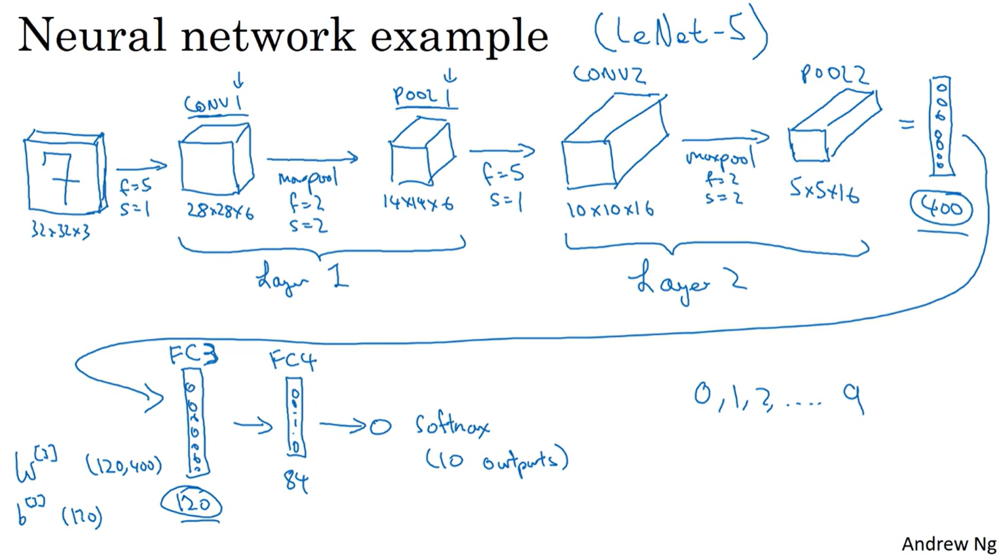
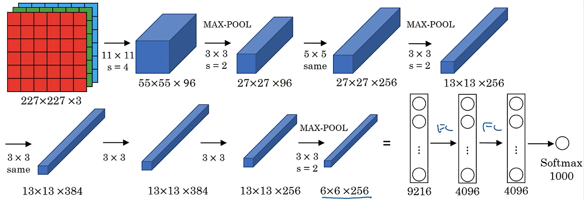
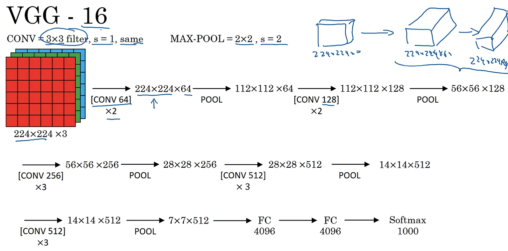
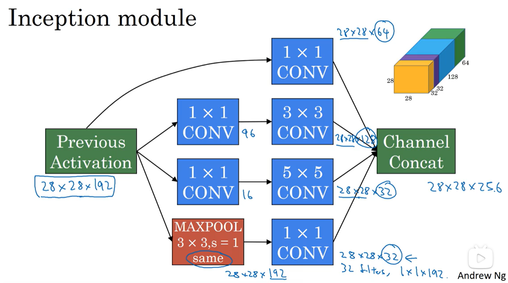
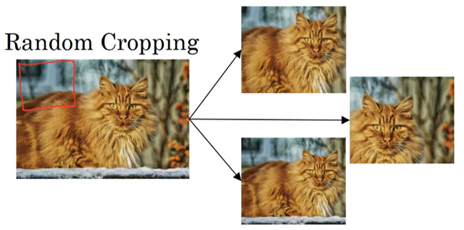

#! https://zhuanlan.zhihu.com/p/663943549
# 深度学习吴恩达老师课堂笔记（四）

前面的[深度学习吴恩达老师课堂笔记（一）](https://zhuanlan.zhihu.com/p/663532574)、[深度学习吴恩达老师课堂笔记（二）](https://zhuanlan.zhihu.com/p/663689302)和[深度学习吴恩达老师课堂笔记（三）](https://zhuanlan.zhihu.com/p/663867959)大概介绍了深度学习网络相对于机器学习网络的一些特点和改进方法，这一部分开始介绍卷积神经网络。

## 4. 卷积神经网络(Convolutional Neural Networks, CNN)

### 4.1 CNN 基础

传统的深度学习网络在面对计算机视觉的问题的时候会遇到的主要问题就是输入变量过多，比如如果想要向神经网络中输入一张1000×1000的三通道图像，那么这里在进行全连接的时候第一层神经元每个神经元的参数量足足有3百万个，如果第一层网络总共有1000个神经元的话从输入层到第一隐藏层就会有30亿个，这显然是一个很大的数字，在这种情况下很难有有效的手段来防止过拟合（主要是数据量的问题）以及会占据非常大的内存空间。鉴于这些问题，计算机视觉领域提出了卷积神经网络的解决方案。

**注意：卷积神经网络中的卷积因为只借鉴了加权求和的思路，所以这里在计算的时候一般不需要将卷积核翻转再运算。严格来说这种运算叫做互相关(Cross-correlation)，但是因为在这里的使用中两个是一样的所以统称为卷积。**

【其他关于卷积的基础知识这里就不再介绍了】

在边缘检测的时候使用的卷积核是多种多样的，这里主要是存在一部分对于卷积核数值的不同选择，比如对于数值边缘检测，光是常见的三维卷积核分别有下面的这几种：
$$
\begin{bmatrix} 1&0&-1\\1&0&-1\\1&0&-1 \end{bmatrix}\quad\begin{bmatrix} 1&0&-1\\2&0&-2\\1&0&-1 \end{bmatrix}\quad\begin{bmatrix} 3&0&-3\\10&0&-10\\3&0&-3 \end{bmatrix}\\
$$
<!-- $$
\begin{bmatrix}
1&0&-1\\1&0&-1\\1&0&-1
\end{bmatrix}\quad\begin{bmatrix}
1&0&-1\\2&0&-2\\1&0&-1
\end{bmatrix}\quad\begin{bmatrix}
3&0&-3\\10&0&-10\\3&0&-3
\end{bmatrix}
$$ -->
这三个算子中后两个分别被称为 Sobel 算子和 Scharr 算子，这三个都会比较常用，而 Scharr 算子则更加灵敏（噪声更大）。实际上，这些算子进行边缘检测的时候是可以检测出边缘的跳变方向的，因此如果只想进行边缘检测任务的话需要在卷积计算以后把每个元素取绝对值。

实际上，在深度学习中，我们可以使用梯度下降算法让网络自己计算出适合于该任务的卷积核，而不是使用这种预设好的卷积核。

实际上，在使用卷积运算的时候不得不面对的一个问题就是图像在卷积运算以后的大小会发生变化，比如一个n×n的图像在和一个f×f的卷积核进行卷积运算以后得到的图像大小是(n-f+1)×(n-f+1)，这种情况下多进行几次卷积运算以后得到的图像就会大幅度缩小，同时图像边缘的大量信息被丢失了（角落上的像素点被卷积的次数少于图像中间的像素点）。为了解决这个问题通常会对原始图像进行扩大(padding)，在原始图像的外缘填充p层元素，使得卷积以后的图像大小是(n+2p-f+1)×(n+2p-f+1)基本和原图像保持一致（一般而言卷积核大小f都是一个奇数）。而这里被虚拟出来的像素点按照习惯可以直接填“0”或者将图像按照边缘进行镜像补齐。

除了padding操作以外，卷积中还有一个参数就是卷积步长s，也就是每次卷积完以后卷积核移动的步长（或者也可以理解为按照前面默认的方式进行卷积，卷积完以后按照步长s进行抽样），这样同样是一个n×n的图像在和一个f×f的卷积核进行卷积运算，在边缘填充(padding)像素点数为p，卷积步长为s，那么卷积以后的图像大小为$\left\lfloor\frac{n+2p-f}{s}+1\right\rfloor\times\left\lfloor\frac{n+2p-f}{s}+1\right\rfloor$，这里的$\lfloor\rfloor$符号进行的是**向下取整**运算。

顺带一提，如果需要处理的原始图像并不是二维的而是三通道图像，此时选择的卷积核的深度（通道数）需要和待计算数据的深度保持一致，这样卷积的时候每个卷积核运算完仍然还是得到一张2D图像（不同维度计算出来的卷积结果相加）。在此基础上我们就可以构造出多层滤波器，在这种情况下卷积的输出就是需要检测的**特征数**：

到这里我们就可以构建出卷积神经网络了，每一个神经元都拥有自己的卷积核 $\boldsymbol{\omega}^{[l](i)}$ 和自己的直流偏置 $b^{[l](i)}$，然后神经元进行的操作就是使用卷积核对输入图像进行卷积后加入直流增益，再使用激活函数（常见的是ReLU函数）将输出图像的每一层进行激活，最后将不同神经元输出的图像叠加就可以得到本层神经网络的输出。例如现在某一层神经网络有 10 个神经元，每个神经元都有大小为 3×3×3 的卷积核，那么该层神经网络拥有的参数的个数是 (3×3×3+1)×10=280.此时就将网络参数个数与输入图像的大小分离开了，这种手段可以避免由于参数数量过多引起的过拟合。接下来可以定义符号了：

- f^[l]^代表的是第 l 层神经网络的卷积核大小（大小不算深度）
- p^[l]^代表的是第 l 层神经网络的 padding 数
- s^[l]^代表的是第 l 层神经网络的卷积步长
- n~c~^[l]^代表的是第 l 层神经网络输入图像的深度（输入特征数）或者说上一层神经网络过滤器或者神经元数量
- n~H~^[l]^代表的是第 l 层神经网络输入图像的高度
- n~W~^[l]^代表的是第 l 层神经网络输入图像的宽度

这种情况下，每一层神经网络的输入图像大小都是 $n_{H}^{[l-1]}\times n_{W}^{[l-1]}\times n_C^{[l-1]}$，输出图像大小是 $n_{H}^{[l]}\times n_{W}^{[l]}\times n_C^{[l]}$，而输出图像的宽度高度又可以通过这个公式计算：
$$
n_{H}^{[l]}=\left\lfloor\frac{n_H^{[l-1]}+2p^{[l-1]}-f^{[l-1]}}{s^{[l]}}+1\right\rfloor\\ \textrm{}\\ n_{W}^{[l]}=\left\lfloor\frac{n_W^{[l-1]}+2p^{[l-1]}-f^{[l-1]}}{s^{[l]}}+1\right\rfloor\\
$$
而每个卷积核的大小都是 $f^{[l]}\times f^{[l]}\times n_C^{[l-1]}$，每一层神经网络的卷积结果为 $\boldsymbol{a}^{[l]}:n_{H}^{[l]}\times n_{W}^{[l]}\times n_C^{[l]}$，向量化结果为 $\boldsymbol{A}^{[l]}:m\times n_{H}^{[l]}\times n_{W}^{[l]}\times n_C^{[l]}$，每一层网络中权重参数数量为 $f^{[l]}\times f^{[l]}\times n_C^{[l-1]}\times n_C^{[l]}$，偏置个数为 $n_C^{[l]}$。

在实际构建深度卷积神经网络的时候，会通过卷积步长将原来的图像大小不断缩小而通过神经元数量的增大将输出图像的深度不断加深，最终变换出一个深层图像，最后通过一次全连接将这个深层图像重新展开成向量，再后面的内容就是正常的机器学习网络了（比如接 Softmax 用于分类）：

<!--  -->
一个典型的卷积神经网络通常有三层：卷积层CONV，池化层POOL和全连接层FC。

池化层也是卷积神经网络中常见的元素，主要用于缩减模型大小提高计算速度以及提高识别的鲁棒性。池化过程也有超参数，分别是池化滤波器大小 f 和池化步长 s（池化运算很少进行图层扩大即一般不使用 padding 参数），比如下面这个就是最大值池化层选取 `f=s=2` 的情况：

<!--  -->
实际上池化过程提取的就是被池化区块中最显著的特征，因此**实际上池化层并不存在需要使用梯度下降算来优化的参数**，一旦超参数确定下来这就是一个确定性的运算了也就是最大池化只是某一层神经网络的静态属性。如果输入图层深度是 3，那么池化以后仍然还是会输出深度为 3 的图像，即池化不改变特征数。除了最大值池化，还有一种池化方法就是平均值池化，一般来说最大值池化用的比较多，不过均值池化有的时候也会用于深度网络中。

在卷积神经网络中，对于网络层数的计算一般有两种指标，一种是卷积层和池化层分别算两层；另一种就是一层卷积层和一层池化层加起来算一层。后者的主要原理就是池化层没有需要学习的参数所以不能算作一层神经元，而统计网络层数的时候一般只统计有参数的网络层数。

除了常见的卷积层和池化层以外，还有一种比较常见的网络层结构就是全连接层，其实就是之前的常规深度学习网络层：

<!--  -->
比较常见的思路就是随着卷积层的深入，每个通道的图像宽度和高度都会不断下降，像素点数也会逐步下降，直到网络中总像素数可以被接受，就可以转化为全连接层了。另一种比较常见的网络结构就是在多个卷积层以后连接一个池化层，再经历多个卷积层后连接一个池化层，反复循环几次以后最终连接到全连接层中。

相比于全连接层网络而言，卷积神经网络最大的优势在于**参数共享**和**稀疏连接**。在前面已经讨论过，在图像中直接使用全连接网络会造成超大规模的参数体量，而卷积核的出现通过参数共享手段极大程度降低了网络中的参数量（思路就是如果某个特征提取器在图片的这一部分可以工作得很好，大概率在图片的其他部分也能工作得很好）。而第二个稀疏连接则是由卷积的特性带来的，每次卷积运算的时候，计算出来的结果其实只由图像中的很小一部分决定，减少了很多没有明显意义的映射从而避免过拟合。

### 4.2 CNN 实例模型

实际上，许多卷积神经网络构建的基础结构（就是卷积核大小的设置、卷积层池化层全连接层的设置配比）都是通过学习其他现成的成功案例得来的，本阶段主要会介绍几种比较典型的网络结构。

LeNet-5 网络主要实现的就是手写数字识别，它有大约 6 万个待学习参数，它的网络结构是这样的：

<!--  -->
不过由于技术的发展，原生的 LeNet-5 的实现和上图中绘制的已经不完全一致了，不过这并不阻碍这里对于这个经典网络的理解。

接下来典型的是 AlexNet，它的参数数量就远高于 LeNet-5，大约有 6000 万个参数，它的主要结构是这样的：

<!--  -->
这里使用了非常多的同大小卷积层，这使得网络对于不同目标的识别更加细腻，同时在该网络中使用的激活函数是 ReLU 函数（受到算力影响，原作者还使用了两个 GPU 共同训练）。在 AlexNet 中还有一种层是 LRN(Local Response Normalization layer) 层，他进行的操作就是将网络中将每一像素点上按照深度进行归一化，不过后来的研究者发现这种做法起不到太大的作用就没再使用。

最后就是 VGG 网络或者说 VGG-16 网络，这个网络主要专注于进行卷积，不过它的参数体量进一步上升了（VGG-16 中的数字 16 指的是它包含 16 个卷积层和全连接层），他有大约 1.38 亿个参数，但是结构并不复杂，这一点很吸引人：

<!--  -->
整体来看 VGG-16 的结构比较规整，都是几层 same 卷积层后面跟着一个池化层来缩减图像的高度和深度；而每层网络输出图像的深度也都是成倍数增长（64-128-256-512）的。不过这个网络的参数量太大导致训练难度很大，后来还有文章介绍 VGG-19，不过因为其性能和 VGG-16 不相上下所以很多人还是会采用 VGG-16 网络。

由于梯度爆炸和梯度消失问题的存在，深度网络的训练难度很大，这里就提出了 ResNet 残差神经网络，它可以训练非常深层的网络（比如 100 层的网络）。传统的神经网络在计算的时候需要完整的经历线性映射-激活-线性映射-激活-......步骤按部就班进行正向数据传播，这种传播路径称为主路径；但是残差神经网络提出可以建立跨层的传播机制，比如 $a^{[l+2]}=g(z^{[l+2]}+a^{[l]})$，这种数据传播就属于走了“捷径”，有的时候也称为 Skip Connection，拥有这种捷径的神经块就称为残差块。这种残差神经网络的提出主要为了解决传统深度网络在训练过程中训练误差很难下降的问题，该问题在残差神经网络中基本不会遇到，甚至深达 100 层的网络都不会出现这种情况。残差神经网络表现比较好的原因可能来源于通过这种跳层连接可以使得残差学习块直接学习出恒等函数这种简单函数（实际上对于深度网络来说，学习恒等函数也会变得非常困难）。从这种角度来看数据捷径的加入使得深度网络的表现不会更加逊色于浅层网络，从而使得深度网络更加容易训练。

其实还可以从另一个角度来看残差神经网络进而得到另一个结论，那就是残差神经网络中这种 Skip Connection 机制的引入使得梯度下降过程中由于连乘带来梯度消失的问题被解决从而可以有效避免神经网络陷入梯度消失带来的训练速度变慢的问题。因此很多深层的网络尤其是后面很多 NLP 问题中的深度 RNN 网络都会使用 Skip Connection 的方式来加深网络层数。

有的时候使用 1×1 的卷积实现将同一像素位置上不同元素的所有元素进行加权求和，相当于对特征进行汇总或者说对每一个像素点单独施加了一个全连接层（会有激活函数），这种 Network in network 的思路在后来的很多网络种都得到了应用。有的时候会使用这种 network in network 的手段来降低网络中的特征数。

有的时候决定在网络中使用多大的卷积核是一个比较困难的时候，谷歌的 Inception 网络可以用于解决这种问题，代价就是会增大网络复杂度。这里 Inception 完成的内容就是通过几路并联的数据流通通路使用不同的卷积核对同一图像数据进行卷积得到的数据直接按照深度叠加作为这一层神经网络的输出：

<!--  -->
这里在网络中使用 1×1 卷积的原因主要就是可以通过加入这种“瓶颈层”将不同深度层数据按照一定方式进行叠加从而降低输入图像的深度，进而降低后续卷积的计算量。在瓶颈层选择合适的情况下，这种瓶颈层的加入可以在基本不影响网络性能的情况下成数量级降低网络计算量。Inception 网络的每一层内都是这种多种计算形式并联的结构，相当于让网络自己在训练过程中决定到底应该使用什么样的卷积核比较合适。除了这种并联卷积核的形式以外，Inception 网络还创新了一点就是在部分隐藏层的输出上也会连接 Softmax 输出层，最终多个输出结果共同决定了整个网络的输出，这种多输出结构有利于改善网络的过拟合问题。这个网络也被称为 GooLeNet（致敬 LeNet）。

常见的数据增强方式有：图像翻转、随机裁剪（将原图像进行保留关键特征的裁剪以后得到新的图像）：

<!--  -->
还有比较常见的方式就是改变色彩空间特征（也有些算法会通过 PCA 算法使得数据集在颜色特征上保持均衡）：

<!--  -->
计算机视觉领域有两个名字比较相近的任务：目标检测和图像识别。前者是需要从图像中找到一个目标并将其标注，而后者只需要读取一张图片并作出分类即可，显然前者的难度更大数据集标注的任务量也更大。一般人们在面对比较大的数据集的时候倾向于使用更简单的网络结构和更少的手工设计内容，转而使用一个更加深层的网络来学习特征；而在小数据集情况下则更倾向于使用更多的手工设计。一般而言机器学习系统有两种知识来源——给定有数据标签的数据集和人为注入的特征、网络结构等。

实际上在部分正确率测试中，为了提高正确率，有一些在实际工程中可能不怎么好用但是对提升网络性能参数很有帮助的做法：

1. 独立训练多个网络，在测试时综合评估这多个网络的输出（可能是取平均或者其他手段）；
2. 在测试时进行 multi-crop，这里的 multi-crop 实际上就是数据增强的时候提到的随机裁剪，用在这里就是对于输入的每一张图像，让网络分多次运行这张图像增强以后的结果，最终综合评估多次的输出作为网络的输出。

上述的做法在提出网络的性能指标的时候比较常见，因为它可以让网络在测试的时候表现得更好，但是实际上在工程上使用的比较少。
