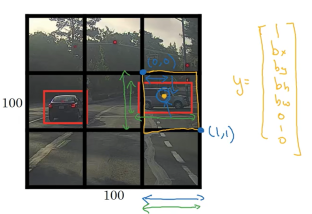
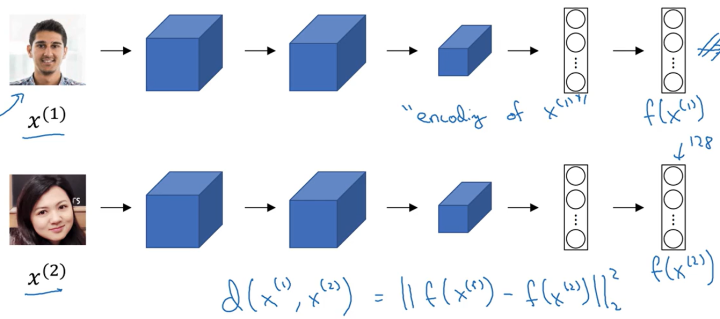

#! https://zhuanlan.zhihu.com/p/664178942
# 深度学习吴恩达老师课堂笔记（五）

这一篇是接着前面的[深度学习吴恩达老师课堂笔记（一）](https://zhuanlan.zhihu.com/p/663532574)、[深度学习吴恩达老师课堂笔记（二）](https://zhuanlan.zhihu.com/p/663689302)、[深度学习吴恩达老师课堂笔记（三）](https://zhuanlan.zhihu.com/p/663867959)和[深度学习吴恩达老师课堂笔记（四）](https://zhuanlan.zhihu.com/p/663943549)的后一部分，这一部分主要介绍一下卷积神经网络。

## 4. 卷积神经网络(Convolutional Neural Networks, CNN)

### 4.3 目标检测
目标检测首先要求网络拥有分类能力，比如想要实现图像中对于车辆的检测首先需要能够判断出图像中是否含有车辆；接下来需要完成的内容就是目标定位，即已知图像中有车辆，需要找到车辆在图像的哪个位置；最后需要解决图像中存在多个目标甚至多种不同目标的情况。

首先是分类问题，很显然这使用 Softmax 层就可以搭建网络训练出来，不再赘述。那么在此基础上开始考虑单目标定位的问题，这种定位我们期望网络输出的是目标所在四个角点的坐标——这里定义的图像坐标系是左上角为坐标原点，水平方向为 x 轴，垂直方向为 y 轴，图像右下角点坐标为 (1,1)，而需要网络输出的就是目标中心点坐标和目标占据两个坐标轴的宽度四个参数：

<!--  -->
以自动驾驶中可能需要的目标定位问题为例，这里需要网络检测的内容主要有这样三个：行人、汽车、摩托车。我们假设每张图像中最多只会出现上面的一个要素，于是构建的监督学习输出向量就是这样几个成员：
$$
\boldsymbol{y}=\begin{bmatrix} p_c\\b_x\\b_y\\b_h\\b_w\\c_1\\c_2\\c_3 \end{bmatrix}\\
$$
- $p_c$ 表征的是图像中是否出现了待检测内容（可能会出现图片中没有行人、汽车、摩托车的情况，此时网络应该在这一位输出 0）
- $b_x, b_y, b_h, b_w$ 就是被检测内容在图像中的位置
- $c_1,c_2,c_3$ 就是使用 Softmax 层输出的分类结果，指示网络的分类结果

此时如果输出参数的第一维为 0，那么剩余的变量也将毫无意义，于是我们可以将损失函数定义为：
$$
L(\boldsymbol{y},\boldsymbol{\hat y})=\begin{cases} \begin{align*} \displaystyle\sum_{i=1}^8(\boldsymbol{y}_i-\boldsymbol{\hat y}_i)^2,\quad&\text{if }\boldsymbol{y}_1=1,\\ (\boldsymbol{y}_1-\boldsymbol{\hat y}_1)^2,\quad&\text{if }\boldsymbol{y}_1=0. \end{align*} \end{cases}\\
$$
<!-- $$
L(\boldsymbol{y},\boldsymbol{\hat y})=\begin{cases}
\begin{align*}
\displaystyle\sum_{i=1}^8(\boldsymbol{y}_i-\boldsymbol{\hat y}_i)^2,\quad&\text{if
 }\boldsymbol{y}_1=1,\\
(\boldsymbol{y}_1-\boldsymbol{\hat y}_1)^2,\quad&\text{if
 }\boldsymbol{y}_1=0. \end{align*} \end{cases}\\
$$ -->
当然对于 $c_1,c_2,c_3$ 部分其实应该使用逻辑回归的方式来定义损失函数，这里就不再展开了。

相同的思路也可以用于特征点的标注检测从而可以用在其他比如表情检测、动作检测任务中。

而图像中存在多种多个目标情况的目标检测问题其实思路也很显然了，可以构造一组滑动窗口，在遍历过程中使用分类网络进行检测，不过常规滑动窗口在实现上计算成本非常高，因此有了为了优化这种思路的卷积滑动窗口实现。首先有一个观点就是全连接层其实也是一种卷积层，可以使用适当大小的卷积核将卷积层展平得到“全连接层”：

<!--  -->
接下看如何使用卷积方式实现滑动窗口，首先已经有一个网络可以处理14×14×3的图像：

<!--  -->
接下来考虑输入图像大小为 16×16×3 的情况，按照滑动窗口的思路这里需要使用 14×14×3 的窗口滑动共得到四组分类结果，但是因为这里的图像重合部分很大，所以前期卷积运算的重合度很高，因此构造出了卷积形式的滑动窗口实现：

<!--  -->
实际上由于卷积核大小远小于图像大小，在滑动窗口运算中很大一部分运算都是重复的，因此在计算第二个滑动窗口的卷积结果的时候只需要增量计算黄色部分的卷积结果，相当于相同内容不再重复计算而是共同存储共同计算，不过在最后全连接的时候这里还是按照四个不同的输入图像来进行全连接。对于更大的图像也是这样的：

<!--  -->
这样就大幅度降低了滑动窗口过程需要的计算量，但是这种方法还是会存在问题也就是位置边框的识别不够准确（滑动窗口使用的是分类网络而不是定位网络，因此找到的边界其实是滑动窗口的边界，很大概率和实际被检测目标的边框不重合），这里的解决方案就是大名鼎鼎的 YOLO 算法，它完成的内容主要就是将单张输入图像切割成非常多的小格（比如 19×19），但是并不分开检测，还是套用前面的思路只对图像进行一次卷积，但是网络的期望输出修改成 19×19×8 的矩阵，这里每个块内的 8 维向量都是前面描述的向量 $\boldsymbol{y}$，这里的创新点就是网络在观测到一个目标的时候只会在目标中心所在的方格对应的输出向量中说明，剩余的方格中则不会有额外说明：

<!--  -->
比如上面的这张图，右侧面包车只会在黄橙色中心点所在的方块输出的向量中将 pc 输出为 1，而这里的中心点坐标对应的是在小方格内的坐标，长宽信息也是相对于小方格的长款信息。而将这种方格划分得更密集可以使得一个方格内检测到两个目标**中心**的概率变得很低，从而实现每个网格输出的稳定性。

在这类任务中我们还需要找到一个能够评估网络性能指标的唯一实变量，在目标检测任务中这个变量一般定为期望标签与实际标签之间的 IoU(Intersection over Union) 也就是**交并比**，计算上就是两个图形的交集的面积和并集的面积之间的商。一般来说会认为 IoU≥0.5 的时候网络结果就是可以接受的。

在实际 YOLO 算法中，还会遇到的问题就是有可能有好几个网格都认为自己检测到了一个目标，但是实际上他们检测到的都是同一个目标，也就是一个目标可能会被多次识别：

<!--  -->
为了解决这个问题，有一种常见做法就是非极大值抑制(Non-max suppression).实际上这里用到了前面的 IoU 的概念，首先算法会对网络检测出的目标按照输出 pc 的大小（网络直接输出的向量其实是认为这里存在目标的概率）进行排序并去除所有 pc 比较小的目标，从 pc 最大值开始检测对应边框与其他边框之间的 IoU，通过这一步筛选会将重合度很高的边框全部抑制，从而使得算法最终输出的框确实是来自于不同的目标。

对于多种目标的检测，需要完成的就是按照类别分别进行多次非极大值抑制。

到此为止目标检测还有的最后一个问题就是同一个方格内存在多个目标中心的问题：

<!--  -->
针对这种问题的解决方案就是构造多种不同的边框，比如针对上面的问题，车辆一般都是扁宽的长方形而人一般都是窄高的长方形所以构造两种不同的边框，同时将网络的输出向量扩充为 16 维（两种边框分别有 8 个变量），（标注时）每当遇到一个目标的时候，将目标所在边框和前面定义好的两种边框进行 IoU 运算选择更高的一个边框填入向量，比如上面的问题就可以这样标注标签：

<!--  -->
这里的黄色标注的就是人而绿色部分标注的就是汽车。

还有一种 R-CNN 算法，就是通过图像分割算法先将图像分割成不同的部分，然后可以找到可能潜在目标的地方，可以减小无意义计算降低计算量，还能保证检测的精准性：

<!--  -->
不过这种图像分块算法的运算速度也比较低，所以近来又提出了 Fast R-CNN 算法（卷积实现）和 Faster R-CNN 算法（使用卷积网络实现图像分块），不过整体来说都比 YOLO 要慢。

### 4.4 特殊应用：人脸识别和神经风格迁移

人脸识别在门禁系统中应用的比较多，而人脸识别会遇到的比较明显的问题就是一次性学习问题——你搜集到的目标人脸可能只有一张照片，需要通过单单一张照片构建出能够识别出这个人的网络。因此直接使用输入图片输出分类的方式搭建这个系统显然是不可行的——深度学习网络需要大量数据来支撑。

这里的解决方案就是不要让网络学习人脸分类，而是学习人脸照片之间的相似度函数，需要让网络完成的就是输入两张照片，输出这两张照片是同一个人的可能性。

这里使用的就是 Siamese 网络，该网络输入一张图片输出该图片的“特征向量”，而相似度函数可以定义为两张图片的“特征向量”终点之间的距离平方（下图描述的是同一个网络对于不同输入的输出）：

<!--  -->
这里输出的特征向量 $\boldsymbol{f}(\boldsymbol{x}^{(i)})$ 就被称为输入的编码(encoding)，我们期望实现的就是当输入图片不是同一个人的时候两者输出编码差异比较大，反之比较小。首先需要明确的时候为了衡量这里的误差以及大小差异，需要同时向网络中输入三张图片（两张是同一个人的，另一张其他人的）：

<!--  -->
于是我们可以将损失函数定义为：
$$
L(\boldsymbol{A},\boldsymbol{P},\boldsymbol{N})=\max(||\boldsymbol{f}(\boldsymbol{A})-\boldsymbol{f}(\boldsymbol{P})||^2-||\boldsymbol{f}(\boldsymbol{A})-\boldsymbol{f}(\boldsymbol{N})||^2+\alpha,0)\\
$$
显然可以发现这里的损失函数是一个“三元”函数，这里的 $\alpha$ 是间隙系数，该参数主要是为了使得两个分类之间具有一定的间隙（有点像 SVM 的思路）。于是在大数据集下我们就需要划分出这样的三元组数据集，使用这些三元组数据集进行梯度下降来学习这里的编码函数。实际上如果完全随机选取这样的三元组的话这里的约束条件其实很容易达到，因为 A，P 和 N 之间的差距会比较明显，网络实际能学习到的有效内容不多，为此研究者建立了 FaceNet 系统来加大学习难度，整体而言提升了网络的学习效果。

前面的三元训练方法是一种完成该任务的方法，不过 Siamese 网络结构中直接构建二分类的方法其实也有很多，比如还是通过同一网络分别对两张图像进行卷积输出特征向量，然后在外面专门构建一组激活函数：
$$
\hat y=\sigma\left(\sum_{k=1}^N \omega_i\left|\boldsymbol{f}(\boldsymbol{x}^{(i)})_k-\boldsymbol{f}(\boldsymbol{x}^{(j)})_k\right|+b\right)\\
$$
这里 $\boldsymbol{x}^{(i)}$ 是当前人脸识别系统从相机输入的图像，$\boldsymbol{x}^{(j)}$ 是数据库中录制好的人脸图像。除了这里直接每个元素做差求和，也有采用 $\chi^2$ 判据写成：
$$
\hat y=\sigma\left[\sum_{k=1}^N \omega_i\frac{\left(\boldsymbol{f}(\boldsymbol{x}^{(i)})_k-\boldsymbol{f}(\boldsymbol{x}^{(j)})_k\right)^2}{\boldsymbol{f}(\boldsymbol{x}^{(i)})_k+\boldsymbol{f}(\boldsymbol{x}^{(j)})_k}+b\right]\\
$$
这样就可以在部署的时候将该问题作为一个二分类问题来使用。为了计算的方便，网络对于数据库中已有数据的特征向量可以预存储，而不用每次计算的时候重新用网络计算特征向量。

深度学习网络还能完成的另一项内容就是风格迁移，比如输入内容**C**和风格**S**就可以得到迁移以后的图像**G**：

<!--  -->
构建这种风格迁移网络首先需要构建代价函数来描述迁移的好坏。为了让网络自己找到内容和风格之间的平衡，这里构建的代价函数分为内容代价和风格代价两个部分：
$$
J(\boldsymbol{G})=\alpha J_{\textrm{content}}(\boldsymbol{C},\boldsymbol{G})+\beta J_{\textrm{style}}(\boldsymbol{S},\boldsymbol{G})\\
$$
这个算法的大致工作流程就是随机初始化 G 图像，然后直接使用梯度下降方法最小化 J(G)，这里梯度下降的输入变量其实是 G 图像的每一个像素点。不过现在这里最关键的还是选择合适的风格代价函数和内容代价函数。

这里使用一个预先训练好的网络（比如 VGG）来计算内容误差，分别取两张图像在该网络下输出的激活值 $\boldsymbol{a}^{[l](C)}$ 和 $\boldsymbol{a}^{[l](G)}$（是向量），于是可以将内容代价定义成这样：
$$
J_{\textrm{content}}(\boldsymbol{C},\boldsymbol{G})=||\boldsymbol{a}^{[l](C)}-\boldsymbol{a}^{[l](G)}||^2\\
$$
接下来考虑风格代价函数，这里我们还是使用一个网络来提取风格，使用两张图片在同一网络下的输出实际的相关程度来描述风格的接近程度。这里使用输出激活值的自相关矩阵（为了方便起见就不减去平均值了）来刻画相关程度，假设 $a_{i,j,k}^{[l](S)}$ 是图像 S 在网络第 l 层输出（是三维矩阵）的下标为 i,j,k 的值，那么我们可以将风格矩阵定义成这样：
$$
\boldsymbol{G}_{kk'}^{[l](S)}=\sum_{i=1}^{n_H^{[l]}}\sum_{j=1}^{n_W^{[l]}}a_{i,j,k}^{[l](S)}a_{i,j,k'}^{[l](S)}\\ \boldsymbol{G}_{kk'}^{[l](G)}=\sum_{i=1}^{n_H^{[l]}}\sum_{j=1}^{n_W^{[l]}}a_{i,j,k}^{[l](G)}a_{i,j,k'}^{[l](G)}\\
$$
而风格代价函数就是这两个矩阵按元素平方和：
$$
\begin{align*} J_{\textrm{style}}(\boldsymbol{S},\boldsymbol{G})&=\frac{1}{\left(2n_H^{[l]}n_W^{[l]}n_c^{[l]}\right)^2}||\boldsymbol{G}^{[l](S)}-\boldsymbol{G}^{[l](G)}||_F^2\\ &=\frac{1}{\left(2n_H^{[l]}n_W^{[l]}n_c^{[l]}\right)^2}\sum_k\sum_{k'}\left(\boldsymbol{G}_{kk'}^{[l](S)}-\boldsymbol{G}_{kk'}^{[l](G)}\right)^2 \end{align*}\\
$$
实际上，如果对每一层都单独计算风格代价并求和效果会更好，不过会需要更多的超参数。

到这里卷积神经网络的部分就介绍完了，下一步着手学习循环神经网络的内容。
