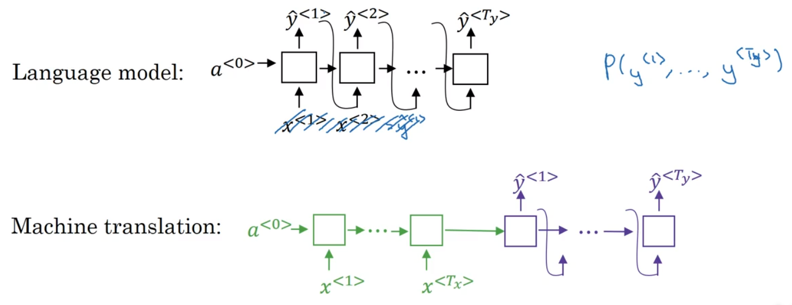
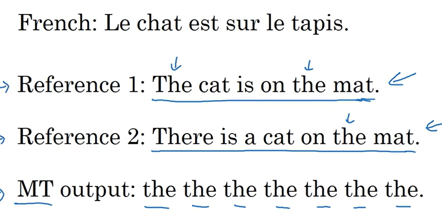
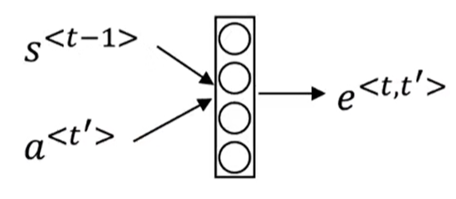

#! https://zhuanlan.zhihu.com/p/664758512
# 深度学习吴恩达老师课堂笔记（八）

前面已经记录了深度学习入门课程的七个章节笔记：[深度学习吴恩达老师课堂笔记（一）](https://zhuanlan.zhihu.com/p/663532574)、[深度学习吴恩达老师课堂笔记（二）](https://zhuanlan.zhihu.com/p/663689302)、[深度学习吴恩达老师课堂笔记（三）](https://zhuanlan.zhihu.com/p/663867959)、[深度学习吴恩达老师课堂笔记（四）](https://zhuanlan.zhihu.com/p/663943549)、[深度学习吴恩达老师课堂笔记（五）](https://zhuanlan.zhihu.com/p/664178942)、[深度学习吴恩达老师课堂笔记（六）](https://zhuanlan.zhihu.com/p/664337449)和[深度学习吴恩达老师课堂笔记（七）](https://zhuanlan.zhihu.com/p/664603536)。这一节的内容来讲深度学习课程的最后一部分，简单介绍一下注意力机制的机理。

## 5. 序列模型

### 5.3 序列模型和注意力机制

这一部分首先会讲述一些 Seq2Seq(Sequence to sequence) 模型（Seq2Seq 的典型特征就是输出序列的长度可能是不一定的，需要由网络自行决定），比如机器翻译模型，这种模型最典型的特征就是会存在编码(Encoder)网络和解码(Decoder)网络两个部分，这一点和前面讨论过的简单的语言生成模型并不一致：

<!--  -->
后者也常被称为条件语言模型(Conditional language model)，主要原因就是该模型的 Decoder 部分和语言生成模型的结构非常相似，区别就在于前者的输入是 Encoder 网络的输出，而后者的输入一般是一个零向量。

值得注意的就是神经网络的每一个输出都是一个非常大的向量，我们需要从这个向量中重构 One-hot 向量从而实现单词的输出，但是在单词的选择中并不是像前面一样每次都选择概率最高的单词，而是需要构建这样的优化模型：
$$
\max_{y^{<1>},y^{<2>},\cdots,y^{<T_y>}}P(y^{<1>},y^{<2>},\cdots,y^{<T_y>}|\boldsymbol{x})\\
$$
注意这里的最值应当取为全局的最大值，而不能按照算法中的贪心算法来选择最优解，可以来看一下下面的这个例子：

> 首先来对比一下这两个翻译例子：
>
> - Jane is visiting Africa in Sepember.
> - Jane is going to be visiting Africa in Sepember.
>
> 显然第二种结果是有点啰嗦的，所以理论上在进行选择的时候应当选择第一种翻译，但是如果使用贪心算法，由于 be going to do 的语法结构是非常常见的，所以使用贪心算法的时候会得到 $P(\textrm{"Jane is going"}|\boldsymbol{x})>P(\textrm{"Jane is visiting"}|\boldsymbol{x})$ 的结果从而直接导致寻优算法在上述两个句子的抉择中选择后者，这明显并不是我们想要的。

上面的例子其实想要说明的就是局部最优的搜索方法在机器翻译的问题中其实表现得并不好，因此需要一种方法来找到“全局最优解”，不过这里得寻找最优解的办法是近似寻优方法（毕竟不可能全部遍历）。比较常见的算法就是 Bean Search(集束搜索)算法。

集束搜索的思路其实很简单，首先需要选定一个集束宽度 B，于是针对 Encoder 网络输出（假设是 V 维的）， Decoder 网络首先会得到第一个 Softmax 以后的输出 $y^{<1>}$，接下来并不是像贪心算法一样直接选择当前状态下的最高概率单词，而是会记录下前 B 个最高概率单词 $w_1^{<1>},w_2^{<1>},\cdots,w_B^{<1>}$，接下来就需要将网络等参数复制 B 次也是分别将 $w_1^{<1>},w_2^{<1>},\cdots,w_B^{<1>}$ 作为循环网络的输入计算 $P(y^{<2>}|\boldsymbol{x},w_1^{<1>}),P(y^{<2>}|\boldsymbol{x},w_2^{<1>}),\cdots,P(y^{<2>}|\boldsymbol{x},w_B^{<1>})$ 这样就可以得到 $V\times B$ 维的输出（每一个输入向量都可以得到 V 维的输出，现在总共有 B 个输入向量）。还是从这 $V\times B$ 维输出中挑选 B 个概率值最高的结果更新为新的下一层网络的输入，以此往复即可（其实有点像改进版的贪心算法，相当于现在贪的并不是最大值，而是最大的前 B 个值，在迭代过程中反复淘汰，知道完全搜索完以后才保留最大的一个），大致的计算图就是这样：

<!--  -->
该算法的优化目标其实是：
$$
\max_{\boldsymbol{y}}P(y^{<1>},y^{<2>},\cdots,y^{<T_y>}|\boldsymbol{x})\\ \iff\max_{\boldsymbol{y}}\prod_{t=1}^{T_y}P(y^{<t>}|\boldsymbol{x},y^{<1>},\cdots,y^{<t-1>})\\ \iff\max_{\boldsymbol{y}}\sum_{t=1}^{T_y}\ln P(y^{<t>}|\boldsymbol{x},y^{<1>},\cdots,y^{<t-1>})\\
$$
不过这种优化目标存在的问题其实就是会鼓励更简短的翻译结果（甚至可能会丢失语义内容），因此需要将优化目标改成平均代价（归一化）以消除对于句子长度的惩罚：
$$
\max_{\boldsymbol{y}}\frac{1}{{T_y}^\alpha}\sum_{t=1}^{T_y}\ln P(y^{<t>}|\boldsymbol{x},y^{<1>},\cdots,y^{<t-1>})\\
$$
这里的 $\alpha$ 是一个超参数，当它取 1 的时候就是归一化的结果，取 0 就是未归一化的结果，如果取为 (0,1) 内的整数就可作为超参数调节网络性能。

值得注意的就是相比于常见的搜索算法比如深度优先、广度优先算法，这种集束搜索的算法并不总能获得最优解，但是运行速度是更快的。

接下来介绍的就是针对这种 Encoder-Decoder-Bean Search 算法结构的 RNN 网络的误差分析方法。比如对于同样一段语句，人类给出的标签是 "Jane visits Africa in Sepetember." 而网络的输出是 "Jane visited Africa last Sepetember." ，这里将人类翻译标记为 $y^*$ 而将网络输出标记为 $\hat y$，我们可以使用网络分别计算 $P(y^*|\boldsymbol{x})$ 和 $P(\hat y|\boldsymbol{x})$（如果使用了前面说的长度归一化，那么这里计算的概率就应该是归一化以后的概率而不是原始概率）:

1. 如果比较发现 $P(y^*|\boldsymbol{x})>P(\hat y|\boldsymbol{x})$ 那就意味着是 Bean Search 在搜索的时候丢弃了更优解
2. 如果比较发现 $P(y^*|\boldsymbol{x})\leqslant P(\hat y|\boldsymbol{x})$ 那就意味着是 RNN 网络本身编码或者解码过程存在问题

在进行误差分析的时候需要遍历观察验证集（或者测试集）中的每一条数据来判断翻译结果是由搜索算法造成的问题还是 RNN 网络造成的问题，在统计出这两种问题分别占的比例以后再去做针对性的改进。

机器翻译问题中还有一个非常典型的问题就是针对同一个输入，可能有很多相似的句子作为翻译结果都是一样好的，因此在构造评价指标的时候最好是可以将这些类型的翻译结果都考虑进去。这就引入 BLeu 得分(Bolingual evalution understudy)的概念，它的核心理念就是统计机器翻译结果的单词在人工翻译结果里面出现的次数。不过直接这样定义指标会出现问题：

<!--  -->
上图中最后一行 MT 输出就是网络的输出，从计算上来看，这个输出中的每一个单词 "the" 都在人工翻译的结果中出现了，因此按照上述指标这段翻译的准确率是 100%，这显然是不合理的，所以需要针对上述指标进行改进。我们把每个单词的计分上限都改成在标签中出现的次数，比如单词 "the" 在标签中最多只出现了两次，因此该单词最多只能被记作出现了两次也就是这种情况下的得分为 $\displaystyle\frac{2}{7}\times100\%=28.6\%$.

这种统计对于词组也同样适用：

<!--  -->
于是可以给出这种改进计分法的公式化表达：
$$
p_n=\frac{\displaystyle\sum_{\textrm{n-gram}\in y^*}\textrm{Count}_{\textrm{flip}}(\textrm{n-gram})}{\displaystyle\sum_{\textrm{n-gram}\in \hat y}\textrm{Count}(\textrm{n-gram})}\\
$$
这里的 $\textrm{n-gram}$ 表示的就是 n 元词组，而 $p_n$ 表示的就是 n 元词组对应的正确率。因此我们就可以构造出若干正确率 $p_1,p_2,p_3,\dots$，通常可以使用他们的平均正确率来描述一般翻译指标：
$$
\frac{1}{4}\sum_{i=1}^4p_i\\
$$
但是这种机制还会存在的缺陷就是可能会鼓励简短语句，因此还要单独对简短的内容增加惩罚项：
$$
BP=\begin{cases}\begin{aligned}     1&,         \textrm{if length(MT}\_\textrm{output)>length(reference}\_\textrm{output)},\\     \exp\left(1-\displaystyle\frac{\textrm{length(MT}\_\textrm{output)}}{\textrm{length(reference}\_\textrm{output)}}\right)&,         \textrm{if length(MT}\_\textrm{output)}\leqslant\textrm{length(reference}\_\textrm{output)}. \end{aligned}\end{cases}\\
$$
<!-- $$
BP=\begin{cases}\begin{aligned}
    1&,
        \textrm{if length(MT\_output)>length(reference\_output)},\\
    \exp\left(1-\displaystyle\frac{\textrm{length(MT\_output)}}{\textrm{length(reference\_output)}}\right)&,
        \textrm{if length(MT\_output)}\leqslant\textrm{length(reference\_output)}.
\end{aligned}\end{cases}
$$ -->
最终的指标就可以定义为：
$$
BLeu=BP\cdot\exp\left(\frac{1}{4}\sum_{i=1}^4p_i\right)\\
$$
于是这样就给机器翻译系统构建了一个唯一确定的实数指标来评价机器学习系统的好坏，构建单一实数评价指标的好处这里就不再赘述了。

前面讲述的网络其实还是很难实现对长句子的准确翻译（比如通篇文章内的上下文对应关系），具体表现就是网络在翻译大段内容的时候，针对前面的几个小句子的翻译性能还不错但是随着上下文联系的逐渐增多网络的翻译性能逐渐开始下降：

<!--  -->
这一点可以通过向网络中引入注意力机制(Attention)来改善。首先还是从最基础的双向 RNN 开始考虑：

<!--  -->
这种结构存在的问题就是很难让网络存在对于特定信息的专注，因此在这一层网络之上重新引入了一层 RNN 网络来提供注意力机制。首先这两层 RNN 网络之间的联系是类似于全连接层的连接关系，这里引入了权重 $\alpha^{<t,t'>}$，该权重表征的就是时间步 t 的输出 $\boldsymbol{y}^{<t>}$ 需要在时间步 $t'$ 的激活值 $\boldsymbol{a}^{<t'>}$ （注意这里的激活值其实已经是将 ${\mathop{\boldsymbol{a}}\limits^{\leftarrow}}^{<t>}$ 和 ${\mathop{\boldsymbol{a}}\limits^{\rightarrow}}^{<t>}$ 融合形成一个向量的结果）上关注的注意力，值得注意的就是该权重是归一化过的：
$$
\alpha^{<t,t'>}=\frac{\exp\left(e^{<t,t'>}\right)}{\displaystyle\sum_{t''=1}^{T_x}\exp\left(e^{<t,t''>}\right)}\\
$$
而后每个时间步上 Bi-RNN 的输出就可以通过这个权重矩阵变换成注意力层神经网络的输入：

<!--  -->
而这里的注意力权重其实是通过一个单独的小的神经网络计算出来的：

<!--  -->
这样就可以使得神经网络自主判断该在什么时候提高对于哪一部分信息的专注度从而实现比较好的前后文联系能力。不过该算法的计算量比较大，只是在机器翻译领域这种计算量是可以被接受的。

最后来讨论一下 Seq2Seq 在语音识别上做出的成就。这种任务主要就是需要从一段音频中识别出一段文字（语音转文字），在以往的机器学习中这种问题会设计几个单独的机器学习算法来实现，比如首先将语音划分成若干个音位，然后通过分类网络单独识别音位，最后将音位组合成单词，在这期间比较常见的数据预处理方法就是将音频信号转化成一张声谱图（横轴是时间，纵轴是声谱（由颜色表示能量））或者伪空白输出等等。而在端对端的深度学习网络出现以后这种做法就不常见了。

这种问题可以使用注意力模型来很好解决，就是不同时间步的输入通过 Bi-RNN 网络编码以后通过注意力机制输出到 Decoder 中输出单词或者字母构成语句。

还有一种比较好的做法就是使用 CTC(Connectionist temporal classification) 损失法，主要思路就是强制延长神经网络的输出长度（语音信号识别问题中通常输入信号长度远长于输出信号长度，因为输入的音频通常是高频采样的，一段 10s 的采样频率 100Hz 的信号可能就有 1000 个输入，但是可能其中只有 4 个单词）：

<!--  -->
就像上图描述的一样，该算法允许网络输出重复字符以及空格、空白等信息来延长网络的输出信号长度来构建比较有效的语音识别系统。

语音识别中还有一种比较常见的需求就是触发词检测（比如语音 "Hey Siri" 可以直接唤醒 Siri 这种）。首先一种非常简单的算法就是通过 RNN 构建二分类模型，在语音信号对应的标注中直接标注过去一小段时间内是否出现过对应的触发词来训练一个分类网络：

<!--  -->
最后不过这种方式会存在的问题就是标签中 0 比 1 多太多了。一种比较简单粗暴的做法就是让网络在听到对应触发词以后的一段时间内都输出 1 而不是只输出一次 1，这样就有助于稍微平衡标签中 0 和 1 的数量。

至此深度学习课程就全部看完了（完结撒花），接下来可能会继续学习一些关于 Transformer 的内容。
