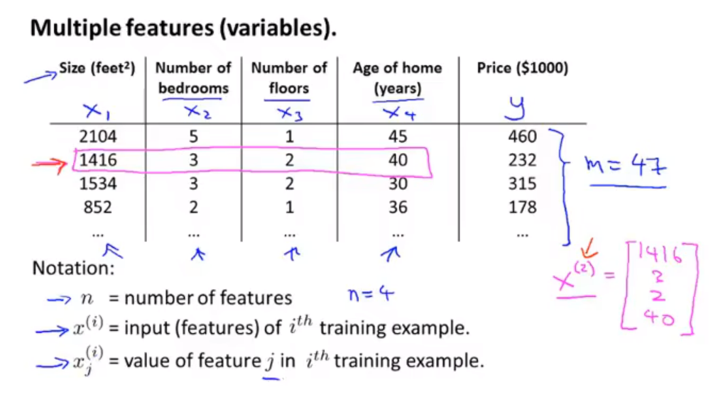
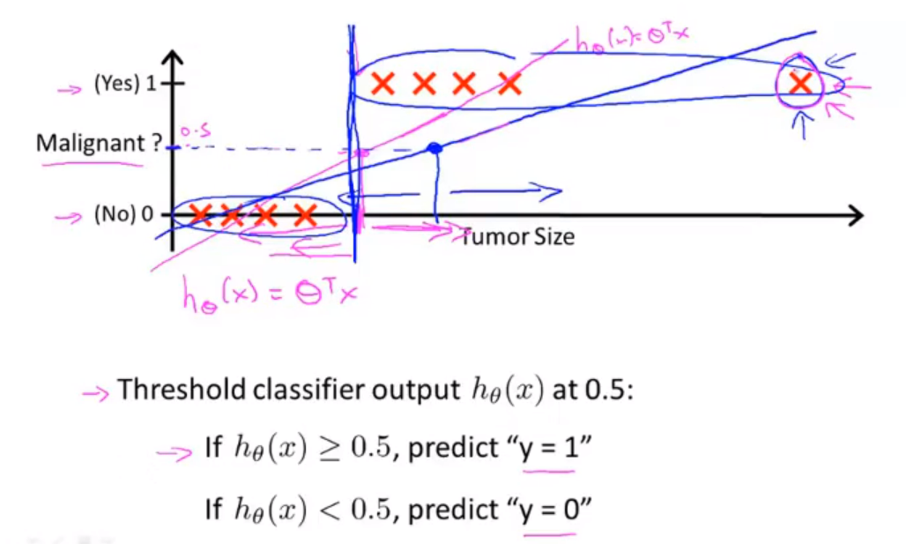
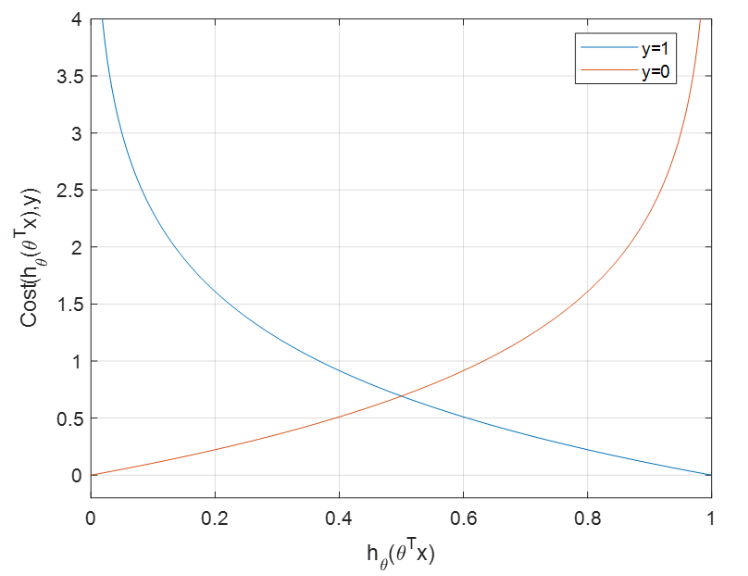
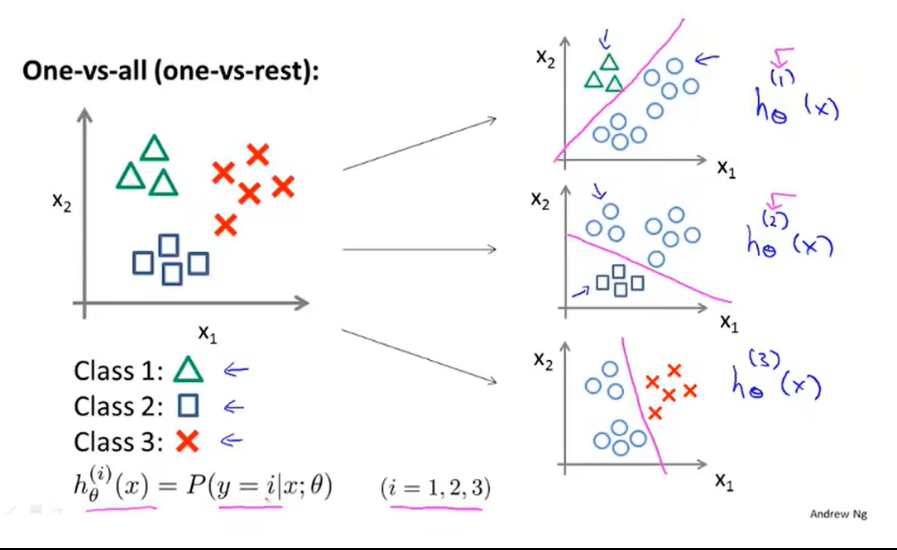
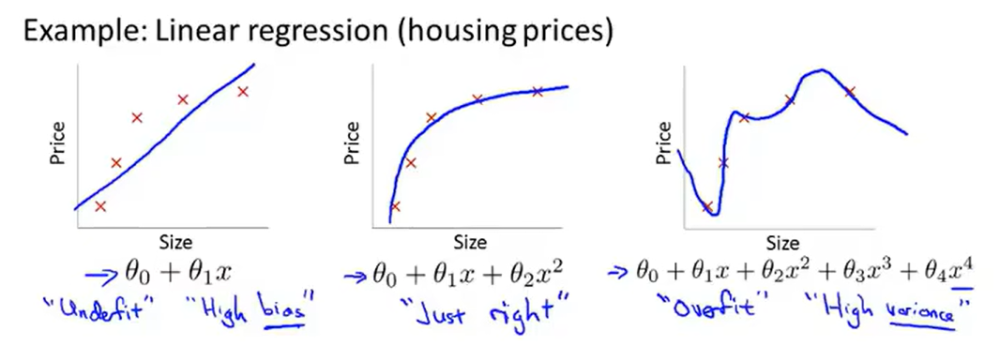
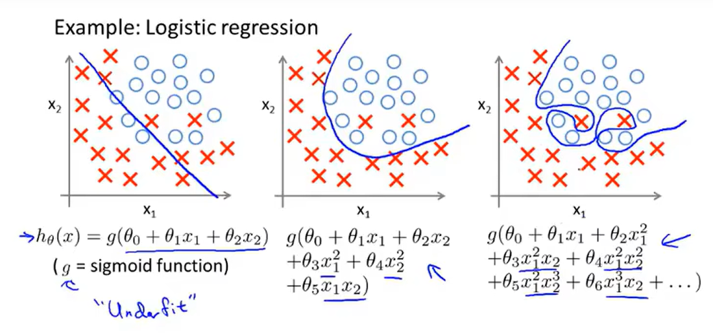

#! https://zhuanlan.zhihu.com/p/662873124
# 机器学习吴恩达老师课堂笔记（一）

最近正在看吴恩达老师的机器学习课程，因此做了一系列课程笔记，个人能力有限可能写得不是很清楚，若有意见也望各位看官多多指出。

## 1. 引入

机器学习的定义：

Field of study that gives computers the ability to learn without being explicitly programmed.——Arthur Samuel(1959)

A computer program is said to learrn from experience E with respect to some task T and some performance measure P, if its performance on T, as measured by P, improveswith experience E.——Tom Mitchell (1998)

机器学习的主要算法分类

- 监督学习 Supervised Learning：用得最多发展最快
   - 关键特征：给定输入的同时给定期望的正确输出（标签）
   - 典型应用：回归问题（连续输出）、分类问题（离散输出）
- 无监督学习 Unsupervised Learning
   - 关键特征：给定输入的同时没有给定期望的正确输出（无标签或全都是相同标签）
   - 典型应用：聚类问题（可能分成很多类，到底是多少类不知道）
- 其他，比如强化学习 Reinforcement Learning

这里插一张其他博客中见到的图，我觉得很不错：

<!--  -->
> 总的来说，机器学习都是用数据或者以往的经验来得到一个模型，然后做分类、预测等特定任务的建模，所以现在我们所说的人工智能都叫**基于数据驱动的人工智能**。

这里配置了一下 Jupyter Notebook：[最详尽使用指南：超快上手Jupyter Notebook](https://zhuanlan.zhihu.com/p/32320214)、[jupyter notebook的默认文件夹位置_jupyter notebook在哪个文件夹-CSDN博客](https://blog.csdn.net/limanjihe/article/details/106317245)

## 2. 有监督学习

### 2.1 线性回归模型

符号说明：

- m——输入数据集的数据量
- x——输入变量/输入特征
- y——输出变量/目标变量
- (x,y)——一个训练样本（泛指任意一组）
- $(x^{(i)},y^{(i)})$——第i个特定的训练样本

想要通过数据集训练出的实际上是一个从输入特征 x's 到目标变量 y's 之间的映射 h(hypothesis)，在线性回归当中我们会把h写成输入变量的线性函数，比如 $h_{\boldsymbol{\theta}}(x)=\theta_0+\theta_1x$ 就是非常典型的一元线性回归(Univariate linear regression).对于这样的一个一元线性回归而言，显然可以建立一个最小二乘模型为：
$$
\theta_0^*,\theta_1^*=\arg\min_{\theta_0,\theta_1}\frac{1}{2m}\sum_{i=0}^m(h_{\boldsymbol{\theta}}(x^{(i)})-y^{(i)})^2\\
$$
这就是进行线性回归的目标，而从这里还能定义出代价函数(Cost Function)为：
$$
J(\theta_0,\theta_1)=\frac{1}{2m}\sum_{i=1}^m(h_{\boldsymbol{\theta}}(x^{(i)})-y^{(i)})^2\\
$$
有时也把这种代价函数称为平方误差代价函数(Square Error Cost Function)，大多数情况下这是解决回归问题最常用的手段。

为了求解代价函数的最小值，引入了梯度下降(Gradient Descent)方法（会停留在局部最优解），就是按照这个公式反复迭代直至收敛：
$$
\boldsymbol{\theta}:=\boldsymbol{\theta}-\alpha\frac{\partial J(\boldsymbol{\theta})}{\partial \boldsymbol{\theta}}\\
$$
这里的$:=$符号的含义就是赋值，主要为了区分相等逻辑运算符$=$；这里的$\alpha$对应的就是学习率，描述的是梯度下降的时候的步长大小。于是对于前面给出的一元线性回归模型来说，代价函数的梯度可以被写为：
$$
\begin{align*} \frac{\partial J(\theta_0,\theta_1)}{\partial\theta_j}&=\frac{\partial}{\partial\theta_j}\frac{1}{2m}\sum_{i=1}^m(h(x^{(i)})-y^{(i)})^2\\ &=\frac{1}{2m}\sum_{i=1}^m\frac{\partial}{\partial\theta_j}(\theta_0+\theta_1x^{(i)}-y^{(i)})^2\\ \end{align*}\\
$$
<!-- $$
\begin{align*}
\frac{\partial J(\theta_0,\theta_1)}{\partial\theta_j}&=\frac{\partial}{\partial\theta_j}\frac{1}{2m}\sum_{i=1}^m(h(x^{(i)})-y^{(i)})^2\\
&=\frac{1}{2m}\sum_{i=1}^m\frac{\partial}{\partial\theta_j}(\theta_0+\theta_1x^{(i)}-y^{(i)})^2\\
\end{align*}
$$ -->
分别计算对于 $\theta_0$ 和 $\theta_1$ 的偏导数可以得到：
$$
\begin{cases} \displaystyle\frac{\partial J(\theta_0,\theta_1)}{\partial\theta_0}=\frac{1}{m}\sum_{i=1}^m(h_{\boldsymbol{\theta}}(x^{(i)})-y^{(i)})\\ \displaystyle\frac{\partial J(\theta_0,\theta_1)}{\partial\theta_1}=\frac{1}{m}\sum_{i=1}^m(h_{\boldsymbol{\theta}}(x^{(i)})-y^{(i)})x^{(i)} \end{cases}\\
$$
也就是迭代过程的程序可以写作：
$$
\begin{cases} \theta_0:=\theta_0-\alpha\displaystyle\frac{1}{m}\sum_{i=1}^m(h_{\boldsymbol{\theta}}(x^{(i)})-y^{(i)})\\ \theta_1:=\theta_1-\alpha\displaystyle\frac{1}{m}\sum_{i=1}^m(h_{\boldsymbol{\theta}}(x^{(i)})-y^{(i)})x^{(i)} \end{cases}\\
$$
<!-- $$
\begin{cases}
\theta_0:=\theta_0-\alpha\displaystyle\frac{1}{m}\sum_{i=1}^m(h_{\boldsymbol{\theta}}(x^{(i)})-y^{(i)})\\
\theta_1:=\theta_1-\alpha\displaystyle\frac{1}{m}\sum_{i=1}^m(h_{\boldsymbol{\theta}}(x^{(i)})-y^{(i)})x^{(i)}
\end{cases}
$$ -->
上面的算法也称为 "Batch"梯度下降("Batch" Gradient Descent)，意味着每一步的梯度下降都使用了所有的样本测试数据。

接下来考虑多特征情况的线性回归，对于多种特征类型的情况需要定义更多的符号：

- n——输入的特征量的数目
- x~j~——某一具体特征 j 的实际取值（相比较前面的训练样本来看，训练样本是一行数据，特征值是一列数据）

<!--  -->
于是多元线性回归时的映射 h 被表述为：
$$
h_{\boldsymbol{\theta}}(x)=\theta_0+\theta_1x_1+\theta_2x_2+\cdots+\theta_nx_n\\
$$
为了表述的方便，我们会在样本中新增一个特征量记为 $x_0^{(i)}=1,(i=1,2,\cdots,n)$，在此情况下只需要定义这样的两个向量：
$$
\boldsymbol{x}=\begin{bmatrix} x_0 \\ x_1 \\ x_2 \\ \vdots \\ x_n \end{bmatrix}\in\mathbb{R}^{n+1}, \boldsymbol{\theta}=\begin{bmatrix} \theta_0 \\ \theta_1 \\ \theta_2 \\ \vdots \\ \theta_n \end{bmatrix}\in\mathbb{R}^{n+1}\\
$$
<!-- $$
\boldsymbol{x}=\begin{bmatrix}
x_0 \\ x_1 \\ x_2 \\ \vdots \\ x_n
\end{bmatrix}\in\mathbb{R}^{n+1}, \boldsymbol{\theta}=\begin{bmatrix}
\theta_0 \\ \theta_1 \\ \theta_2 \\ \vdots \\ \theta_n
\end{bmatrix}\in\mathbb{R}^{n+1}
$$ -->
就可以将前面的映射表述为向量内积的形式：
$$
h_{\boldsymbol{\theta}}(\boldsymbol{x})=\boldsymbol{\theta}^T\boldsymbol{x}\\
$$
这也就是多元线性回归(Multivariate linear regression)的一般形式。我们同样也可以定义在多元线性回归下的代价函数：
$$
J(\boldsymbol{\theta})=J(\theta_0,\theta_1,\cdots,\theta_n)=\frac{1}{2m}\sum_{i=1}^m(h_{\boldsymbol{\theta}}(x^{(i)})-y^{(i)})^2\\
$$
于是可以写出多元线性回归情况下的梯度下降方法：
$$
\theta_j:=\theta_j-\alpha\frac{1}{m}\sum_{i=1}^m(h_{\boldsymbol{\theta}}(x^{(i)})-y^{(i)})x_j^{(i)}\\
$$
由于多个特征值的引入，为了回归的方便（方便进行梯度下降），这里需要引入**特征缩放(Feature Scaling)**的概念，一般来说就是**将所有特征都约束到 [-1,1] 区间之内**（一般来说只要不差数量级其实都还行），这样可以使得梯度下降的时候每隔特征对于梯度的贡献量相近从而使得梯度下降的时候在空间中的路径相对比较平直，加快梯度下降的速度。

有的时候还会在此基础上进行均值标准化(Mean normalization)，就是将每个变量都减去样本均值然后再归一化（除以样本最大值与最小值之间的差）到相同区间内（注意不要对 $x_0$ 进行这样的操作）：
$$
x_j:=\frac{x_j-\mu_j}{\max x_j-\min x_j}\\
$$
检查梯度下降算法是否正常收敛的典型方法：

- 在训练过程中绘制代价函数-迭代次数曲线，当该曲线进入比较平坦的阶段的时候就说明梯度下降基本已经收敛
- 设置自动收敛测试：如果一次迭代中代价函数的变化率小于 10^-3^ 就自动判定为已经收敛。【但是这个阈值的选取比较困难】

学习率的调整：

- 学习率太小——梯度下降太慢
- 学习率太大——代价函数可能不收敛甚至发散

所以可以在训练前期试凑学习率来选择一个下降速率比较合适的学习率进行正常训练，比如......0.001,0.003,0.01,0.03,0.1,0.3,1,3,......

有的时候也可以根据实际的模型构造新的特征，比如可以将映射函数定义成这样：
$$
h_{\boldsymbol{\theta}}(\boldsymbol{x})=\theta_0x_0+\theta_1x_1+\theta_2x_1^2+\theta_3x_1^3\\
$$
这个时候就相当于构造了新的特征为 $x_2=x_1^2,x_3=x_1^3$，不过在进行这种操作的时候注意**特征缩放**会变得更加有必要。

前面一直在讨论的梯度下降方法其实是在以迭代的方式计算，实际上，对于线性回归问题还有直接的正规方程计算最优解的办法。假设一个一元线性回归的表达式是：
$$
y_i=\boldsymbol{\theta}^T\boldsymbol{x}^{(i)}=(\boldsymbol{x}^{(i)})^T\boldsymbol{\theta}\\
$$
在多组训练样本下上面方程可以扩展为向量方程：
$$
\boldsymbol{y}=\boldsymbol{X}\boldsymbol{\theta}\\
$$
那么可以写出这个方程的正规方程解（不需要特征缩放）为：
$$
\begin{align*} &\quad\boldsymbol{X}^T\boldsymbol{y}=\boldsymbol{X}^T\boldsymbol{X}\boldsymbol{\theta}\\ &\Rightarrow\boldsymbol{\theta}=(\boldsymbol{X}^T\boldsymbol{X})^{-1}\boldsymbol{X}^T\boldsymbol{y} \end{align*}\\
$$
<!-- $$
\begin{align*}
&\quad\boldsymbol{X}^T\boldsymbol{y}=\boldsymbol{X}^T\boldsymbol{X}\boldsymbol{\theta}\\
&\Rightarrow\boldsymbol{\theta}=(\boldsymbol{X}^T\boldsymbol{X})^{-1}\boldsymbol{X}^T\boldsymbol{y}
\end{align*}
$$ -->
这里的设计矩阵(design matrix)$\boldsymbol{X}$ 实际上就是把输入特诊转置以后叠放在一起：
$$
\boldsymbol{X}=\begin{bmatrix} (\boldsymbol{x}^{(1)})^T \\ (\boldsymbol{x}^{(2)})^T \\ \vdots \\ (\boldsymbol{x}^{(m)})^T \end{bmatrix}\in\mathbb{R}^{m\times(n+1)}, \text{where }\boldsymbol{x}^{(i)}=\begin{bmatrix} x_0^{(i)} \\ x_1^{(i)} \\ \vdots \\ x_n^{(i)} \end{bmatrix}\in\mathbb{R}^{n+1}\\
$$
<!-- $$
\boldsymbol{X}=\begin{bmatrix}
(\boldsymbol{x}^{(1)})^T \\ (\boldsymbol{x}^{(2)})^T \\ \vdots \\ (\boldsymbol{x}^{(m)})^T
\end{bmatrix}\in\mathbb{R}^{m\times(n+1)}, \text{where }\boldsymbol{x}^{(i)}=\begin{bmatrix}
x_0^{(i)} \\ x_1^{(i)} \\ \vdots \\ x_n^{(i)}
\end{bmatrix}\in\mathbb{R}^{n+1}
$$ -->
梯度下降与正规方程求解最优解的对比：

- 梯度下降需要选择合适的学习率才能正常运行，同时需要很多次的迭代才能收敛出正确的结果；而正规方程没有这些约束，只需要一轮计算就可以正常得出答案。
- 梯度下降在特征量n很多的时候也能工作得很好，但是正规方程法在特征量n很大的时候在计算$(\boldsymbol{X}^T\boldsymbol{X})^{-1}$这一步的时候会很慢（矩阵求逆的运算会随着矩阵阶数的增长呈$o(n^3)$复杂度）所以需要很长时间来计算。

### 2.2 分类问题

典型二分类问题的输出只有两种，即$y\in\{0,1\}$，一般情况下"0"代表没有某一类特征，记作负类(Neagtive Class)；而"1"代表具有某类特征，记作正类(Positive Class).

前面提到的线性回归一般情况下不能直接应用到分类问题中，因为回归问题最终拟合出来的函数的值域一般而言是无穷集合，很难做好两者之间体面的映射，即使使用阈值也有可能受到极限样本点的影响而导致效果非常差：

<!--  -->
逻辑回归模型(Logistic Regression Model)的输出满足条件$0\leqslant h_{\boldsymbol{\theta}}(x)\leqslant1$，因此可以考虑在线性回归的映射外面加一层有界函数，这里选定为Logistic函数或者称Sigmoid函数：
$$
h_{\boldsymbol{\theta}}(\boldsymbol{x})=g(\boldsymbol{\theta}^T\boldsymbol{x})\text{ where }g(z)=\frac{1}{1+e^{-z}},z\in\mathbb{R}\\
$$
这个函数的图像是这样的：

<!--  -->
此时要将分类器的输出理解为**当前输入下输出y=1的可能性**。

实际使用的时候可以使用一个阈值来分割这个概率，如果输出不大于一个数就认为分类器将其分类为1反之将其分类为0。如果将这里的阈值选定为0.5，那么分类器输出为1就意味着线性表达式$\boldsymbol{\theta}^T\boldsymbol{x}\geqslant0$反之意味着$\boldsymbol{\theta}^T\boldsymbol{x}<0$。从这里我们就可以定义出决策边界(Decision boundary)为$\boldsymbol{\theta}^T\boldsymbol{x}=0$，注意决策边界是假设函数的属性而不是数据集的属性。

接下来讨论逻辑回归的代价函数，在给定训练集$\{(\boldsymbol{x}^{(1)},y^{(1)}),(\boldsymbol{x}^{(2)},y^{(2)}),\cdots,(\boldsymbol{x}^{(m)},y^{(m)})\}$中共有m个训练样本，每个训练样本有n个特征：
$$
\boldsymbol{x}\in\begin{bmatrix} x_0\\x_1\\ \vdots \\ x_n \end{bmatrix}\in\mathbb{R}^{n+1},x_0=1,y\in\{0,1\}\\
$$
<!-- $$
\boldsymbol{x}\in\begin{bmatrix}
x_0\\x_1\\ \vdots \\ x_n
\end{bmatrix}\in\mathbb{R}^{n+1},x_0=1,y\in\{0,1\}
$$ -->
因为线性回归中使用的代价函数不能直接用到逻辑回归中（同样的代价函数在逻辑回归的场景下是一个**非凸函数**所以不能使用梯度下降），所以需要额外寻找，这里将代价函数定义成这样：
$$
\textrm{Cost}(h_{\boldsymbol{\theta}}(x),y)=\begin{cases} \begin{align*} -\log(h_{\boldsymbol{\theta}}(x))&,\quad\text{if }y=1\\ -\log(1-h_{\boldsymbol{\theta}}(x))&,\quad\text{if }y=0 \end{align*} \end{cases}\\ J(\boldsymbol{\theta})=\frac{1}{m}\sum_{i=1}^m\textrm{Cost}(h_{\boldsymbol{\theta}}(\boldsymbol{x}^{(i)}),y^{(i)})\\
$$
<!-- $$
\textrm{Cost}(h_{\boldsymbol{\theta}}(x),y)=\begin{cases}
\begin{align*}
-\log(h_{\boldsymbol{\theta}}(x))&,\quad\text{if }y=1\\
-\log(1-h_{\boldsymbol{\theta}}(x))&,\quad\text{if }y=0
\end{align*}
\end{cases}\\
J(\boldsymbol{\theta})=\frac{1}{m}\sum_{i=1}^m\textrm{Cost}(h_{\boldsymbol{\theta}}(\boldsymbol{x}^{(i)}),y^{(i)})
$$ -->
可以看一下这个代价函数的图像含义：

<!--  -->
说明代价函数在假设函数与标签差距越远的时候越大，这很合理，而由于这里的输出y不是0就是1所以我们可以进一步将代价函数写成这种形式：
$$
J(\boldsymbol{\theta})=-\frac{1}{m}\sum_{i=1}^m\left[y^{(i)}\log(h_{\boldsymbol{\theta}}(\boldsymbol{x}^{(i)}))+(1-y^{(i)})\log(1-h_{\boldsymbol{\theta}}(\boldsymbol{x}^{(i)}))\right]\\
$$
接下来还是一样的使用梯度下降算法进行收敛，首先计算梯度（这里是偏导数）：
$$
\begin{align*} &\frac{\partial}{\partial \theta_j}J(\boldsymbol{\theta})\\ =&-\frac{1}{m}\sum_{i=1}^m\left[\frac{y^{(i)}}{h_{\boldsymbol{\theta}}(\boldsymbol{x}^{(i)})}\frac{\partial h_{\boldsymbol{\theta}}(\boldsymbol{x}^{(i)})}{\partial \theta_j}-\frac{1-y^{(i)}}{1-h_{\boldsymbol{\theta}}(\boldsymbol{x}^{(i)})}\frac{\partial h_{\boldsymbol{\theta}}(\boldsymbol{x}^{(i)})}{\partial \theta_j}\right]\\ =&-\frac{1}{m}\sum_{i=1}^m\left[\left(\frac{y^{(i)}}{h_{\boldsymbol{\theta}}(\boldsymbol{x}^{(i)})}-\frac{1-y^{(i)}}{1-h_{\boldsymbol{\theta}}(\boldsymbol{x}^{(i)})}\right)\frac{\partial h_{\boldsymbol{\theta}}(\boldsymbol{x}^{(i)})}{\partial \theta_j}\right]\\ =&-\frac{1}{m}\sum_{i=1}^m\left(\frac{y^{(i)}-h_{\boldsymbol{\theta}}(\boldsymbol{x}^{(i)})}{h_{\boldsymbol{\theta}}(\boldsymbol{x}^{(i)})(1-h_{\boldsymbol{\theta}}(\boldsymbol{x}^{(i)}))}\frac{\textrm{d}g(\boldsymbol{\theta}^T\boldsymbol{x}^{(i)})}{\textrm{d}\boldsymbol{\theta}^T\boldsymbol{x}^{(i)}}\frac{\partial \boldsymbol{\theta}^T\boldsymbol{x}^{(i)}}{\partial\theta_j}\right)\\ =&-\frac{1}{m}\sum_{i=1}^m\left(\frac{\left(y^{(i)}-h_{\boldsymbol{\theta}}(\boldsymbol{x}^{(i)})\right)\left(1-e^{-\boldsymbol{\theta}^T\boldsymbol{x}^{(i)}}\right)^2}{e^{-\boldsymbol{\theta}^T\boldsymbol{x}^{(i)}}}\frac{-e^{-\boldsymbol{\theta}^T\boldsymbol{x}^{(i)}}}{\left(1-e^{-\boldsymbol{\theta}^T\boldsymbol{x}^{(i)}}\right)^2}x_j^{(i)}\right)\\ =&\frac{1}{m}\sum_{i=1}^m\left(y^{(i)}-h_{\boldsymbol{\theta}}(\boldsymbol{x}^{(i)})\right)x_j^{(i)} \end{align*}\\
$$
<!-- $$
\begin{align*}
&\frac{\partial}{\partial \theta_j}J(\boldsymbol{\theta})\\
=&-\frac{1}{m}\sum_{i=1}^m\left[\frac{y^{(i)}}{h_{\boldsymbol{\theta}}(\boldsymbol{x}^{(i)})}\frac{\partial h_{\boldsymbol{\theta}}(\boldsymbol{x}^{(i)})}{\partial \theta_j}-\frac{1-y^{(i)}}{1-h_{\boldsymbol{\theta}}(\boldsymbol{x}^{(i)})}\frac{\partial h_{\boldsymbol{\theta}}(\boldsymbol{x}^{(i)})}{\partial \theta_j}\right]\\
=&-\frac{1}{m}\sum_{i=1}^m\left[\left(\frac{y^{(i)}}{h_{\boldsymbol{\theta}}(\boldsymbol{x}^{(i)})}-\frac{1-y^{(i)}}{1-h_{\boldsymbol{\theta}}(\boldsymbol{x}^{(i)})}\right)\frac{\partial h_{\boldsymbol{\theta}}(\boldsymbol{x}^{(i)})}{\partial \theta_j}\right]\\
=&-\frac{1}{m}\sum_{i=1}^m\left(\frac{y^{(i)}-h_{\boldsymbol{\theta}}(\boldsymbol{x}^{(i)})}{h_{\boldsymbol{\theta}}(\boldsymbol{x}^{(i)})(1-h_{\boldsymbol{\theta}}(\boldsymbol{x}^{(i)}))}\frac{\textrm{d}g(\boldsymbol{\theta}^T\boldsymbol{x}^{(i)})}{\textrm{d}\boldsymbol{\theta}^T\boldsymbol{x}^{(i)}}\frac{\partial \boldsymbol{\theta}^T\boldsymbol{x}^{(i)}}{\partial\theta_j}\right)\\
=&-\frac{1}{m}\sum_{i=1}^m\left(\frac{\left(y^{(i)}-h_{\boldsymbol{\theta}}(\boldsymbol{x}^{(i)})\right)\left(1-e^{-\boldsymbol{\theta}^T\boldsymbol{x}^{(i)}}\right)^2}{e^{-\boldsymbol{\theta}^T\boldsymbol{x}^{(i)}}}\frac{-e^{-\boldsymbol{\theta}^T\boldsymbol{x}^{(i)}}}{\left(1-e^{-\boldsymbol{\theta}^T\boldsymbol{x}^{(i)}}\right)^2}x_j^{(i)}\right)\\
=&\frac{1}{m}\sum_{i=1}^m\left(y^{(i)}-h_{\boldsymbol{\theta}}(\boldsymbol{x}^{(i)})\right)x_j^{(i)}
\end{align*}
$$ -->
于是梯度下降的内容就是（很神奇，这和前面线性回归的时候是一样的）：
$$
\theta_j:=\theta_j-\alpha\frac{1}{m}\sum_{i=1}^m\left(y^{(i)}-h_{\boldsymbol{\theta}}(\boldsymbol{x}^{(i)})\right)x_j^{(i)}\\
$$
和前面一样，**特征缩放**也同样适用于帮助加快逻辑回归的梯度下降。

除了使用梯度下降法收敛最优值以外，还有其他的一些收敛方法，比如共轭梯度法(Conjugate gradient)、BFGS、L-BFGS等算法，这里就不介绍了，一般而言这些算法不需要手动选择学习率且收敛速度比梯度下降法要快，但是会更加复杂。

多分类问题的解决思路就是将问题拆分为多个二分类问题来解决，比如三分类问题的时候就需要分别将每个类别分别作为正类、将剩余所有类一起作为负类然后分别训练出决策边界，比如下面这种三分类问题就可以这样得到三个决策边界：

<!--  -->
总的来说，对于一个多分类问题，我们需要对每一个类i都单独训练一个逻辑回归分类器$h_{\boldsymbol{\theta}}^{(i)}(\boldsymbol{x})$来预测样本属于该类的概率$P\{y=i\}$，分类器的输出结果的最大值$\max_i h_{\boldsymbol{\theta}}^{(i)}(\boldsymbol{x})$所对应的类别就是多分类分类器最终的分类结果。

### 2.3 过拟合与正则化

> 过拟合：随着模型的训练，模型在训练集上的表现越来越好，但是在验证集上的表现却越来越差，也就是说对训练集的拟合程度过高，导致模型的泛化能力降低。通常是由于训练数据过少、模型复杂度过大等问题导致的。
> 欠拟合：模型在训练集上也无法达到满意的精度。通常是由于模型表征能力不足、数据量过大导致的，刚好和过拟合相反。
> 来自[【深度学习基础知识 - 04】过拟合和欠拟合的概念及解决方案_resnet过拟合解决方法_雁宇up的博客-CSDN博客](https://blog.csdn.net/yanyuxiangtoday/article/details/119790029)

这就是典型例子：

<!--  -->

<!--  -->
过拟合问题的一般解决思路：

1. 减少特征数量（要从训练样本的角度考虑特征数量是不是过多）
   - 人为丢弃一些特征不参与学习或者使用专门的模型选择算法帮助判断哪些变量可以被删除
   - 丢弃变量的同时可能也会丢弃原本我们希望模型提取到的特征
2. 正则化(Regularization)，也就是后面要提到的内容

正则化的思路也比较简单，我们不希望丢弃特征但是我们也不希望高次项的复杂特征在最终决策中占据太高比例，所以可以在不减少特征数量的情况下修改代价函数，在其中加入正则化惩罚项，比如在上面例子中的多项式回归问题中：
$$
h_{\boldsymbol{\theta}}(x)=\theta_0+\theta_1x+\theta_2x^2+\theta_3x^3+\theta_4x^4\\
$$
假设函数中的$\theta_3$与$\theta_4$所在项有可能会因为复杂度较高而在拟合过程中出现过拟合，我们也并不希望这两个特征在最终结果中有太高的权重，所以可以将使用的代价函数写成：
$$
J(\boldsymbol{\theta})=\frac{1}{2m}\sum_{i=1}^m\left(h_{\boldsymbol{\theta}}(x^{(i)})-y^{(i)}\right)^2+1000\theta_3^2+1000\theta_4^2\\
$$
这就是正则化的思路——尽量减小参数的数值以期望获得更加简单的模型从而避免过拟合，因而加入正则项的代价函数的一般形式就是：
$$
J(\boldsymbol{\theta})=\frac{1}{2m}\left[\sum_{i=1}^m\left(h_{\boldsymbol{\theta}}(x^{(i)})-y^{(i)}\right)^2+\lambda\sum_{j=1}^n\theta_j^2\right]\\
$$
这里的$\lambda$就是正则化参数(regularization parameter)，用于控制两个目标之间的取舍。值得注意的就是这里在对参数进行惩罚的时候并没有对$\theta_0$进行惩罚，因为它的确不会引起模型的过拟合。正则化参数的选择会影响最终正则化的结果——过小可能还是会引起过拟合，过大则会引起欠拟合。

#### 2.3.1 正则化线性回归

加入正则化项以后的线性回归代价函数就是：
$$
J(\boldsymbol{\theta})=\frac{1}{2m}\left[\sum_{i=1}^m\left(h_{\boldsymbol{\theta}}(x^{(i)})-y^{(i)}\right)^2+\lambda\sum_{j=1}^n\theta_j^2\right]\\
$$
于是需要重新推导在加入正则化项以后梯度下降的公式：
$$
\begin{align*} &\frac{\partial}{\partial \theta_j}J(\boldsymbol{\theta})\\ =&\frac{1}{2m}\left[\sum_{i=1}^m\frac{\partial}{\partial \theta_j}\left(h_{\boldsymbol{\theta}}(x^{(i)})-y^{(i)}\right)^2+\lambda\sum_{i=1}^n\frac{\partial}{\partial \theta_j}\theta_i^2\right]\\ =&\frac{1}{2m}\left[\sum_{i=1}^m2\left(h_{\boldsymbol{\theta}}(x^{(i)})-y^{(i)}\right)x_j^{(i)}+2\lambda\theta_j\right]\\ =&\frac{1}{m}\left[\sum_{i=1}^m\left(h_{\boldsymbol{\theta}}(x^{(i)})-y^{(i)}\right)x_j^{(i)}+\lambda\theta_j\right] \end{align*}\\
$$
<!-- $$
\begin{align*}
&\frac{\partial}{\partial \theta_j}J(\boldsymbol{\theta})\\
=&\frac{1}{2m}\left[\sum_{i=1}^m\frac{\partial}{\partial \theta_j}\left(h_{\boldsymbol{\theta}}(x^{(i)})-y^{(i)}\right)^2+\lambda\sum_{i=1}^n\frac{\partial}{\partial \theta_j}\theta_i^2\right]\\
=&\frac{1}{2m}\left[\sum_{i=1}^m2\left(h_{\boldsymbol{\theta}}(x^{(i)})-y^{(i)}\right)x_j^{(i)}+2\lambda\theta_j\right]\\
=&\frac{1}{m}\left[\sum_{i=1}^m\left(h_{\boldsymbol{\theta}}(x^{(i)})-y^{(i)}\right)x_j^{(i)}+\lambda\theta_j\right]
\end{align*}
$$ -->
注意我们在正则化项中并没有惩罚$\theta_0$所以上面的偏导数在j=0的时候也不存在正则化项，最终梯度下降的公式可以被写作：
$$
\begin{cases} \theta_0:=\theta_0-\alpha\displaystyle\frac{1}{m}\sum_{i=1}^m\left(h_{\boldsymbol{\theta}}(x^{(i)})-y^{(i)}\right)x_0^{(i)}\\ \theta_j:=\theta_j-\alpha\displaystyle\frac{1}{m}\left[\sum_{i=1}^m\left(h_{\boldsymbol{\theta}}(x^{(i)})-y^{(i)}\right)x_j^{(i)}+\lambda\theta_j\right],(j=1,2,\cdots,n) \end{cases}\\
$$
<!-- $$
\begin{cases}
\theta_0:=\theta_0-\alpha\displaystyle\frac{1}{m}\sum_{i=1}^m\left(h_{\boldsymbol{\theta}}(x^{(i)})-y^{(i)}\right)x_0^{(i)}\\
\theta_j:=\theta_j-\alpha\displaystyle\frac{1}{m}\left[\sum_{i=1}^m\left(h_{\boldsymbol{\theta}}(x^{(i)})-y^{(i)}\right)x_j^{(i)}+\lambda\theta_j\right],(j=1,2,\cdots,n)
\end{cases}\\
$$ -->
对这里的第二个数字合并同类项就可以得到：
$$
\theta_j:=(1-\alpha\frac{\lambda}{m})\theta_j-\alpha\displaystyle\frac{1}{m}\sum_{i=1}^m\left(h_{\boldsymbol{\theta}}(x^{(i)})-y^{(i)}\right)x_j^{(i)},(j=1,2,\cdots,n)\\
$$
总的来说，在加入正则化项以后每次迭代都会给参数乘以一个略小于1的系数来尽量减小参数的大小。

同样的，在加入正则化项以后可以写出新的正规方程为：
$$
\boldsymbol{\theta}=\left(\boldsymbol{X}^T\boldsymbol{X}+\lambda\begin{bmatrix} 0 & & & &\\ & 1 & & &\\ & & 1 & &\\ & & & \ddots &\\ & & & & 1 \end{bmatrix}\right)^{-1}\boldsymbol{X}\boldsymbol{y}\\
$$
<!-- $$
\boldsymbol{\theta}=\left(\boldsymbol{X}^T\boldsymbol{X}+\lambda\begin{bmatrix}
0 & & & &\\
& 1 & & &\\
& & 1 & &\\
& & & \ddots &\\
& & & & 1
\end{bmatrix}\right)^{-1}\boldsymbol{X}\boldsymbol{y}
$$ -->
相比前面讨论的一般线性回归模型的正规方程而言，可以证明的就是正则化以后的正规方程中第一项的逆矩阵一定是存在的。

#### 2.3.1 正则化逻辑回归

和前面一样，需要改写代价函数在里面新增正则项：
$$
J(\boldsymbol{\theta})=-\frac{1}{m}\sum_{i=1}^m\left[y^{(i)}\log(h_{\boldsymbol{\theta}}(\boldsymbol{x}^{(i)}))+(1-y^{(i)})\log(1-h_{\boldsymbol{\theta}}(\boldsymbol{x}^{(i)}))\right]+\frac{\lambda}{2m}\sum_{j=1}^n\theta_j^2\\
$$
同样对其求偏导数可以得到：
$$
\frac{\partial}{\partial \theta_j}J(\boldsymbol{\theta}) =\frac{1}{m}\sum_{i=1}^m\left(y^{(i)}-h_{\boldsymbol{\theta}}(\boldsymbol{x}^{(i)})\right)x_j^{(i)}+\frac{\lambda}{m}\theta_j,(j\neq0)\\
$$
因此梯度下降的公式和线性回归一样可以被写作：
$$
\begin{cases} \theta_0:=\theta_0-\alpha\displaystyle\frac{1}{m}\sum_{i=1}^m\left(h_{\boldsymbol{\theta}}(x^{(i)})-y^{(i)}\right)x_0^{(i)}\\ \theta_j:=\theta_j-\alpha\displaystyle\frac{1}{m}\left[\sum_{i=1}^m\left(h_{\boldsymbol{\theta}}(x^{(i)})-y^{(i)}\right)x_j^{(i)}+\lambda\theta_j\right],(j=1,2,\cdots,n) \end{cases}\\
$$
<!-- $$
\begin{cases}
\theta_0:=\theta_0-\alpha\displaystyle\frac{1}{m}\sum_{i=1}^m\left(h_{\boldsymbol{\theta}}(x^{(i)})-y^{(i)}\right)x_0^{(i)}\\
\theta_j:=\theta_j-\alpha\displaystyle\frac{1}{m}\left[\sum_{i=1}^m\left(h_{\boldsymbol{\theta}}(x^{(i)})-y^{(i)}\right)x_j^{(i)}+\lambda\theta_j\right],(j=1,2,\cdots,n)
\end{cases}
$$ -->

受文章长度限制，暂时先整理到这里，后面的等下一篇再继续。
