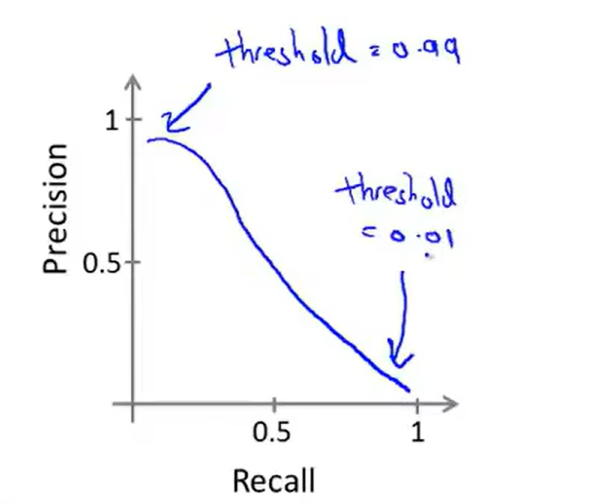
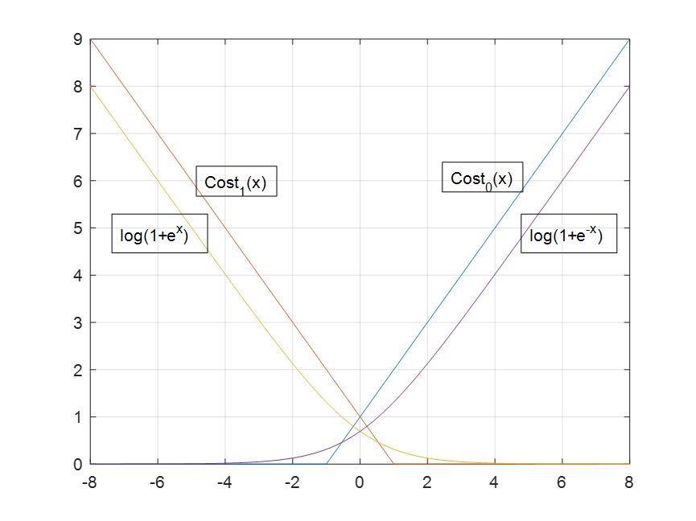
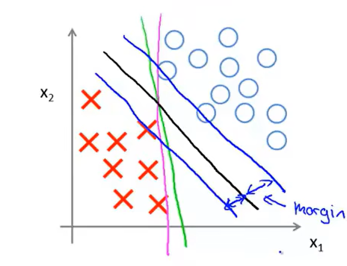
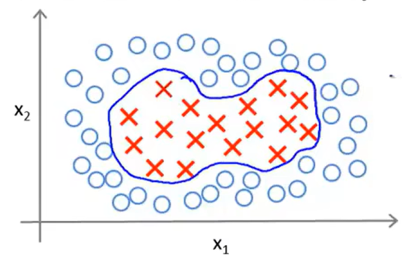
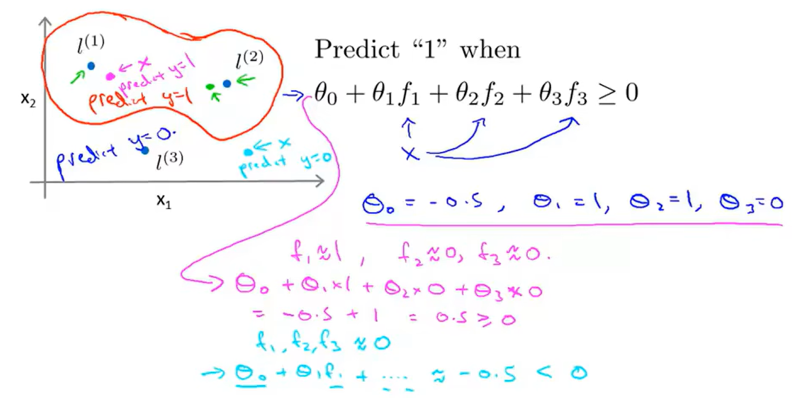

#! https://zhuanlan.zhihu.com/p/663114735
# 机器学习吴恩达老师课堂笔记（三）

前文[机器学习吴恩达老师课堂笔记（一）](https://zhuanlan.zhihu.com/p/662873124)和[机器学习吴恩达老师课堂笔记（二）](https://zhuanlan.zhihu.com/p/662954666)讲述了基础的回归模型和神经网络结构，本文在此基础上继续讨论监督学习的最后一部分——支持向量机。

## 2. 有监督学习（续）
### 2.6 机器学习系统设计

在项目开始的时候只快速构建一个简单的模型并开始测试，观察此次测试的学习曲线决定是否需要更多的训练集更多特征等，然后进行误差分析——检查**验证集**（注意不是测试集）中被误分类的样本查看是否存在典型未被学习到的特征或者没有考虑到的特征等。根据这些分析考虑系统的优化方向等。这种快速demo的实现有利于找到这个问题中最难处理的部分以集中精力攻克。

其次最好需要构建能够体现学习系统性能的指标来直观表述学习效果，因为有些时候误差分析对于部分问题的处理并不是很得力，这个时候就需要数值上的指标来观测系统性能。

数值指标的引入对于解决偏斜类问题(Skewed classes)有比较大的帮助。偏斜类问题的典型特征就是在分类过程中有一类数据的样本数相比其他类而言多得多，在此情况下非机器学习的“盲猜”行为可能会表现得非常好，因此在这种问题中不能简单地使用分类正确率作为评价指标，因此引出了精确度(Precision)和召回率(Recall)的概念。以典型的二分类问题为例，假如某个问题的输出只有0和1两种情况，那么就可以根据实际真实期望输出和学习网络给出的输出分类为四种情况：

- 真阳性(True Positive)——实际期望输出为1，网络输出为1
- 假阳性(False Positive)——实际期望输出为0，网络输出为1
- 真阴性(True Negative)——实际期望输出为0，网络输出为0
- 假阴性(False Positive)——实际期望输出为1，网络输出为0

于是可以将精确度定义为`真阳性样本数 / (真阳性样本数 + 假阳性样本数)`也就是`真阳性样本数 / 网络输出阳性样本数`；而将召回率定义为`真阳性样本数 / (真阳性样本数 + 真阴性样本数)`也就是`真阳性样本数 / 实际阳性样本数`。通过计算网络的精确度和召回率我们可以更好地评估分类网络的性能尤其是偏斜分类的性能。

有一句很有意思的话说明这两个指标的实际作用：高Precision：宁可放过一百也不错杀一个。高Recall：宁可错杀一百也不放过一个。在分类问题中可以通过修改分类阈值来实现模型对于精确度和召回率的取舍：

<!--  -->
但是这样就引入了两个评价指标，这就导致相似模型很难做出决策，解决方案就是定义一个新的变量，这个标准就是F1值(F1 Score OR F Score)，这个参量的定义就是召回率和精确度的“并联”（实际上是调和平均数）：
$$
F_1=\frac{2PR}{P+R}\\
$$
接下来讨论数据集对于机器学习系统的作用。假设在某个机器学习任务中，现在有的特征$\boldsymbol{x}\in\mathbb{R}^{n+1}$已经足够用于精确预测输出y了，而在学习算法中也有了足够多的参数，在此情况下使用一个足够大的训练集就可以让学习算法有比较好的表现。

### 2.7 支持向量机(Support Vector Machine, SVM)

在逻辑回归中，我们一般会将回归目标写成这样：
$$
\begin{align*} &\min_{\boldsymbol{\theta}}\left\{-\frac{1}{m}\sum_{i=1}^m\left[y^{(i)}\log h_{\boldsymbol{\theta}}(\boldsymbol{x}^{(i)})+(1-y^{(i)})\log(1-h_{\boldsymbol{\theta}}(\boldsymbol{x}^{(i)}))\right]+\frac{\lambda}{2m}\sum_{j=1}^n\theta_j^2\right\}\\ =&\min_{\boldsymbol{\theta}}\left\{\frac{1}{m}\sum_{i=1}^m\left[y^{(i)}\left(-\log h_{\boldsymbol{\theta}}(\boldsymbol{x}^{(i)})\right)+(1-y^{(i)})\left(-\log(1-h_{\boldsymbol{\theta}}(\boldsymbol{x}^{(i)})\right)\right]+\frac{\lambda}{2m}\sum_{j=1}^n\theta_j^2\right\}\\ =&\min_{\boldsymbol{\theta}}\left\{\frac{1}{m}\sum_{i=1}^m\left[y^{(i)}\left(\log (1+e^{-\boldsymbol{\theta}^T\boldsymbol{x}^{(i)}})\right)+(1-y^{(i)})\left(\log(1+e^{\boldsymbol{\theta}^T\boldsymbol{x}^{(i)}})\right)\right]+\frac{\lambda}{2m}\sum_{j=1}^n\theta_j^2\right\} \end{align*}\\
$$
这里可以对两项带对数的内容进行变换使之具有更少的计算量，我们将带有对数的部分替换为新定义的代价函数：
$$
\min_{\boldsymbol{\theta}}\left\{\sum_{i=1}^m\left[y^{(\textit{i})}\rm{Cost}_1\left(\boldsymbol{\theta}^T\boldsymbol{x}^{(\textit{i})}\right)+(1-\textit{y}^{(\textit{i})})\rm{Cost}_0\left(\boldsymbol{\theta}^T\boldsymbol{x}^{(\textit{i})}\right)\right]+\frac{\lambda}{2}\sum_{j=1}^n\theta_j^2\right\}\\
$$
这里的$\rm{Cost}_0$和$\rm{Cost}_1$函数分别是：
$$
\textrm{Cost}_0(x)=\begin{cases} \begin{align*} x+1 \ &,x\geqslant-1,\\ 0 \ &,x<-1. \end{align*} \end{cases}\\
$$
$$
\textrm{Cost}_1(x)=\begin{cases} \begin{align*} -x+1 \ &,x\leqslant1,\\ 0 \ &,x>1. \end{align*} \end{cases}\\
$$
通过图像可以发现这两组函数其实是比较接近的：

<!--  -->
这样就可以得到支持向量机的总体优化目标为：
$$
\min_{\boldsymbol{\theta}}\left\{C\sum_{i=1}^m\left[y^{(\textit{i})}\rm{Cost}_1\left(\boldsymbol{\theta}^T\boldsymbol{x}^{(\textit{i})}\right)+(1-\textit{y}^{(\textit{i})})\rm{Cost}_0\left(\boldsymbol{\theta}^T\boldsymbol{x}^{(\textit{i})}\right)\right]+\frac{1}{2}\sum_{j=1}^n\theta_j^2\right\}\\
$$
与逻辑回归不同的是，支持向量机的输出并不是概率，而是分类结果，即
$$
h_{\boldsymbol{\theta}}(x)=\begin{cases} 1,\quad x\geqslant0,\\ 0,\quad x<0. \end{cases}\\
$$
有的时候支持向量机也会被称为大间距分类器，可以来看这里的代价函数，不难发现，对于一个负样本输入$y=0$，只有当支持向量机的输出$\boldsymbol{\theta}^T\boldsymbol{x}\leqslant-1$（不只是小于0）的时候代价函数才会保持为0；同样的对于正样本输入$y=1$，只有当支持向量机的输出$\boldsymbol{\theta}^T\boldsymbol{x}\geqslant-1$（不只是大于0）的时候代价函数才会保持为0。也就是在SVM中我们人为构造了安全因子来保证分类结果的稳健性。也就是在SVM中，只要我们将参数C选得足够大，我们就可以得到一个两类之间存在比较大间隔的决策边界的分类器，这也是为什么他被称为**大间距分类器**：

<!--  -->
但是上图画出的这种大间距分类器可能并不是很容易就能获得，首先这会要求代价函数中选取的常数C足够大，其次这种大间距分类器分类出来的决策边界对于少数异常点也会比较敏感。因此实际应用的时候可能会选取不那么大的常数C，这样SVM对于少数不线性可分的样本数据也能做到比较好的预测分类。

在进行非线性SVM分类的时候，比如想要解决这样的非线性决策边界问题：

<!--  -->
比较常规的思路就是使用多项式决策边界：
$$
\theta_0+\theta_1x_1+\theta_2x_2+\theta_3x_1x_2+\theta_4x_1^2+\theta_5x_2^2+\cdots=0\\
$$
为了更加方便地表述，这里引入新的符号：
$$
\begin{align*} f_1&=x_1\\ f_2&=x_2\\ f_3&=x_1x_2\\ f_4&=x_1^2\\ f_5&=x_2^2\\ \vdots \end{align*}\\ \Rightarrow\theta_0+\theta_1f_1+\theta_2f_2+\theta_3f_3+\theta_4f_4+\theta_5f_5+\cdots=0\\
$$
接下来引入相似度的概念，从上面来看$f$实质上就是构造了新的特征变量，比如我们可以在这个平面上随机指定若干个（这里是三个）标记点$\boldsymbol{l}^{(1)},\boldsymbol{l}^{(2)},\boldsymbol{l}^{(3)}$，那么我们就已经定义了平面上任意点的三个特征变量，因为此时平面上任意点$\boldsymbol{x}$和这三个点的相似度可以被写作：
$$
f_1=\textrm{similarity}(\boldsymbol{x},\boldsymbol{l}^{(1)})=\exp\left(-\frac{||\boldsymbol{x}-\boldsymbol{l}^{(1)}||}{2\sigma^2}\right)\\ \textrm{}\\ f_2=\textrm{similarity}(\boldsymbol{x},\boldsymbol{l}^{(2)})=\exp\left(-\frac{||\boldsymbol{x}-\boldsymbol{l}^{(2)}||}{2\sigma^2}\right)\\ \textrm{}\\ f_3=\textrm{similarity}(\boldsymbol{x},\boldsymbol{l}^{(3)})=\exp\left(-\frac{||\boldsymbol{x}-\boldsymbol{l}^{(3)}||}{2\sigma^2}\right)\\
$$
这里的相似度函数$\textrm{similarity}$也被称作**核函数(Kernel function)**，等号右边写的是核函数中的高斯核函数(Gaussian Kernels)，而在本小结开始的时候展示的SVM使用的表达式里使用的就是线性核(Linear kernel)或者也会称为**无核 SVM**。可以拆分观察一下核函数实际上实现的内容：
$$
f_i=\textrm{similarity}(\boldsymbol{x},\boldsymbol{l}^{(i)})=\exp\left(-\frac{1}{2\sigma^2}\sum_{j=1}^n\left(x_j-l_j^{(i)}\right)^2\right)\\
$$
值得注意的是这里在计算距离的时候实际上没有计算第一维元素之间的距离，因为第一维一般固定定义为1。从数学上来说，如果$\boldsymbol{x}\approx\boldsymbol{l}^{(i)}$，那么两者计算出来的相似度应当基本就是1；相反地，如果两者的差距比较远，那么相似度就是0.利用核函数的这种可以定义出假设函数为：
$$
h_{\boldsymbol{\theta}}(x)=\begin{cases} 1,\quad\theta_0+\theta_1f_1+\theta_2f_2+\theta_3f_3\geqslant0,\\ 0,\quad\theta_0+\theta_1f_1+\theta_2f_2+\theta_3f_3<0.\end{cases}\\
$$
于是这样的SVM可以通过自己指定标记点和相似度函数参数从而训练出出下面的这种复杂非线性决策边界：

<!--  -->
前面只是大致说明一下SVM处理复杂边界的时候的大致思路，在实际应用的时候直接会遇到的问题就是针对一个给定的数据集，如何选择标记点以及选择几个标记点。在实际应用中，直接将训练集中的所有样本点全部作为标记点是比较常见的做法，也就是整体的计算流程大致是这样：

1. 给定训练集为$(\boldsymbol{x}^{(1)},y^{(1)}),(\boldsymbol{x}^{(2)},y^{(2)}),\cdots,(\boldsymbol{x}^{(m)},y^{(m)})$
2. 选择样本点$\boldsymbol{l}^{(1)}=\boldsymbol{x}^{(1)},\boldsymbol{l}^{(2)}=\boldsymbol{x}^{(2)},\cdots,\boldsymbol{l}^{(m)}=\boldsymbol{x}^{(m)}$
3. 对于任意一个给定的数据点$\boldsymbol{x}$可以计算出计算新的特征变量
$$
f_1=\textrm{similarity}(\boldsymbol{x},\boldsymbol{l}^{(1)})\\ f_2=\textrm{similarity}(\boldsymbol{x},\boldsymbol{l}^{(2)})\\ \quad\vdots\\ f_n=\textrm{similarity}(\boldsymbol{x},\boldsymbol{l}^{(n)})\\
$$
从而构造新的特征向量
$$
\boldsymbol{f}=\begin{bmatrix}f_0 \\ f_1 \\ f_2 \\ \vdots \\ f_m \end{bmatrix}\in\mathbb{R}^{m+1}\text{ where }f_0=1\\
$$
也就是构造了一组特征变量之间的映射关系
4. 设定假设函数为
$$
h_{\boldsymbol{\theta}}(x)=\begin{cases} 1,\quad\boldsymbol{\theta}^T\boldsymbol{f}\geqslant0,\\ 0,\quad\boldsymbol{\theta}^T\boldsymbol{f}<0. \end{cases}\\
$$
5. 此时选定下面的总体优化目标并进行训练（因为这里选定标记点的个数就是训练集样本数所以n和m实际上就是一个数）：
$$
\min_{\boldsymbol{\theta}}\left\{C\sum_{i=1}^m\left[y^{(\textit{i})}\rm{Cost}_1\left(\boldsymbol{\theta}^T\boldsymbol{f}^{(\textit{i})}\right)+(1-\textit{y}^{(\textit{i})})\rm{Cost}_0\left(\boldsymbol{\theta}^T\boldsymbol{f}^{(\textit{i})}\right)\right]+\frac{1}{2}\boldsymbol{\theta}^T\boldsymbol{\theta}\right\}\\
$$
然后可以来说明一下SVM算法中的超参数选择，在这个算法中有两个超参数——常数C和核函数参数$\sigma$：

1. 在理解的时候可以将常数C按照线性回归问题中正则化参数$\lambda$的倒数来理解，所以过大的C会引起高方差低偏差（过拟合）问题而过小的C会引起低方差高偏差（欠拟合）问题；
2. 不难发现这里选用的高斯核函数的$\sigma$作用影响的是相似度函数的变化剧烈程度，因此如果选用一个比较大的$\sigma$会导致特征变量随误差的变化更加不敏感而最终遇到低方差高偏差（欠拟合）问题，反之如果选用一个比较小的$\sigma$会导致特征变量随误差的变化更加敏感而最终遇到高方差低偏差（过拟合）问题。

在实现核函数之前记得要进行特征缩放！除了高斯核和线性核，其实还有一些其他的核函数可供选择，但是并不是任意写一个函数都可以作为SVM的核函数，这是因为成品的SVM数值优化算法里面对于核函数而言需要满足塞默尔定理(Mercer's Theorem)，否则SVM的数值优化就体现不出优势，这里还有一些其他的核函数：

- 多项式核函数(Polynomial kernel)$k(\boldsymbol{x},\boldsymbol{l})=(\boldsymbol{x}^T\boldsymbol{l}+\textrm{constant})^{\textrm{degree}}$，这里的常数和指数都是该核函数的超参数，这种核函数一般只在两个输入点都严格非负的时候会使用
- 字符串核函数、卡方核函数、直方正交核函数等等

SVM在面对多分类问题时，一般可以直接调用大多数运算包内直接集成好的多分类核函数，或者也可以参考之前在逻辑回归中提到的给K分类问题训练K个不同的SVM实现单独的分类。

由前面的内容不难发现SVM其实只是扩展版本的逻辑回归模型，所以来讨论一下SVM和逻辑回归模型的选择问题：

1. 如果特征变量数n很大（相对于训练样本数m而言），可以使用逻辑回归或者线性核的SVM
2. 如果特征变量数n比较小，样本数m数量也比较适中，可以使用高斯核SVM
3. 如果特征变量数n比较小，样本数m数量很大，那么高斯核SVM的计算速度会很慢，可以创造更多的特征变量然后使用逻辑回归或者线性核SVM

有监督学习的内容到此位置就全部结束了，下一篇开始讲无监督学习。
