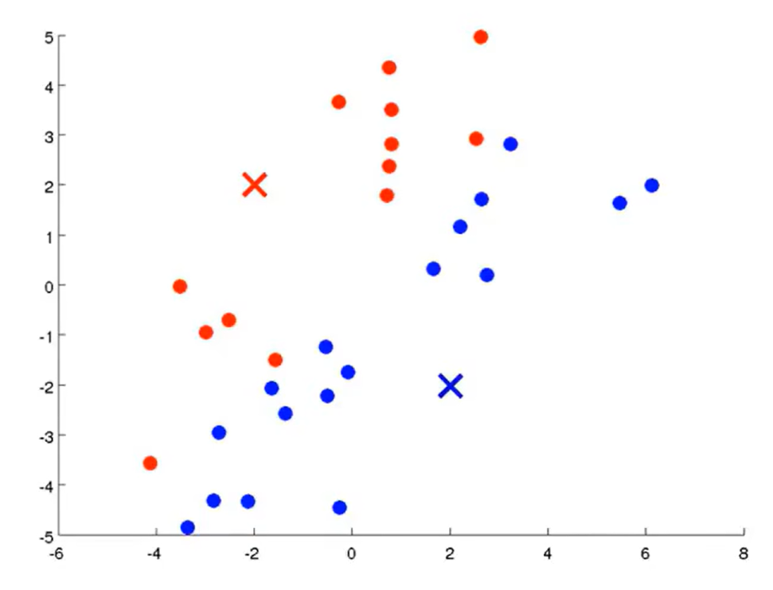
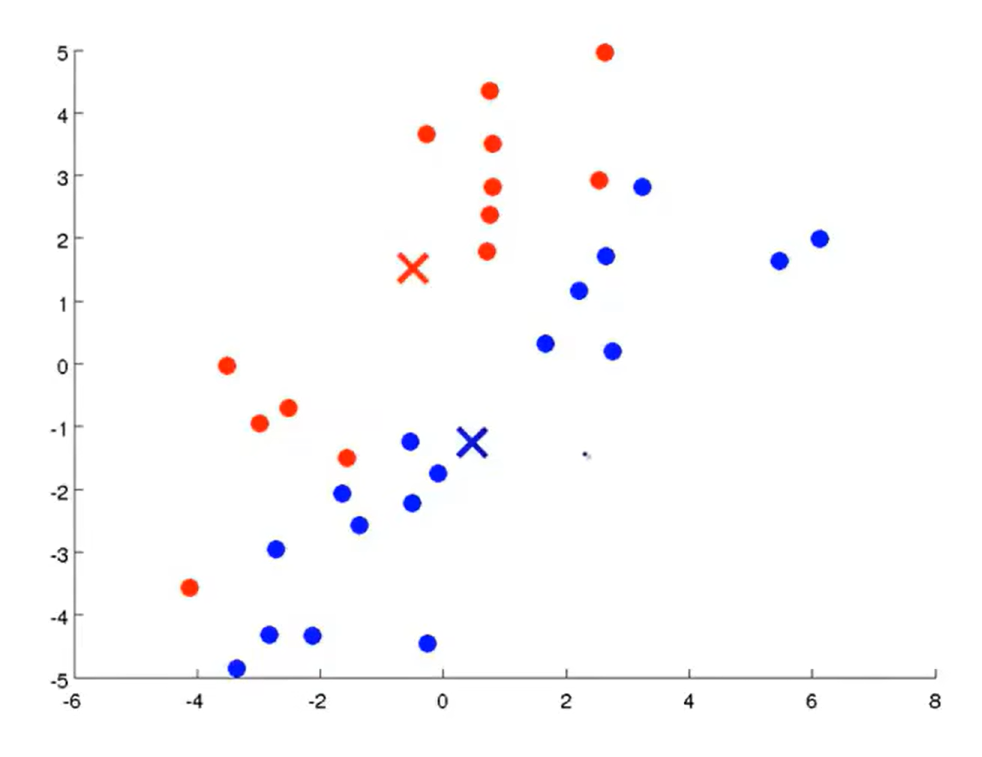
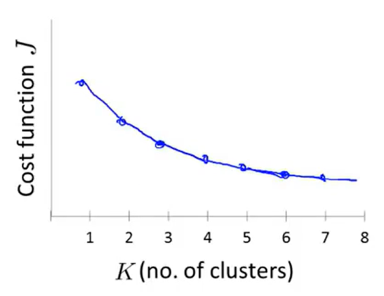

#! https://zhuanlan.zhihu.com/p/663225012
# 机器学习吴恩达老师课堂笔记（四）
本文续[机器学习吴恩达老师课堂笔记（一）](https://zhuanlan.zhihu.com/p/662873124)、[机器学习吴恩达老师课堂笔记（二）](https://zhuanlan.zhihu.com/p/662954666)和[机器学习吴恩达老师课堂笔记（三）](https://zhuanlan.zhihu.com/p/663114735)之后继续开始学习无监督学习的内容。
## 3. 无监督学习
### 3.1 聚类算法(K-Means算法)
无监督学习给出的训练数据是没有标签的，期望使用无监督学习方法找到数据中隐藏的模式，比如聚类算法主要就是用于获得数据中的聚类信息，它可以将原始数据划分成一系列的点簇(Clusters)。

K-Means算法是最常见的聚类算法，这是一个迭代算法，它主要分为两个部分——簇分配和移动聚类重心。

比如现在想要将若干个数据点分类为两个部分，于是可以在数据空间中随机选取两个点作为初始的聚类中心，接下来遍历每一个样本点，计算样本点到两个聚类中心的距离，于是每个样本点可以通过这种方法被划分到距离最近的一个类中：（下图中叉是选择的聚类重心，红蓝点就是第一次分配聚类中心的结果）

<!---->
接下来针对每一个类中的所有点计算这一类点的重心，更新为新的聚类重心：

<!--  -->
然后重新遍历所有样本点按照上述方式重新分配簇反复迭代就可以得到最终的聚类结果。该算法的输入主要是两个部分，也就是期望聚类的类数K和训练集$\left\{\boldsymbol{x}^{(1)},\boldsymbol{x}^{(2)},\dots,\boldsymbol{x}^{(m)}\right\}\text{ where }\boldsymbol{x}^{(i)}\in\mathbb{R}^n$（因为没有标签所以这里训练集不需要额外补充1），接下来该算法主要进行了这样的操作：

- 首先随机地初始化K个聚类中心$\boldsymbol{\mu}_1,\boldsymbol{\mu}_2,\dots,\boldsymbol{\mu}_K\in\mathbb{R}^n$然后重复下面的步骤：

  1. 遍历所有样本点计算距离该样本点最近的聚类中心下标$c^{(i)}:=\arg\min_{k=1,2,\dots,K}||\boldsymbol{x}^{(i)}-\boldsymbol{\mu}_k||^2$
  2. 遍历所有类计算该类中所有点的重心

$$
\boldsymbol{\mu}_k:=\frac{1}{N_k}\sum_{j=1}^{N_k}\boldsymbol{x}^{(i_{kj})}\in\mathbb{R}^n,(k=1,2,\dots,K)\text{ where }c^{(i_{kj})}=k\\
$$

计算的时候可能会出现某个聚类中没有点的情况，大多数的处理就是直接移除这个聚类（输出的聚类数变少），不过也可以直接随机初始化这个聚类中心（聚类数不变）。

定义聚类问题的代价函数(Distortion cost function,  失真代价函数)为：
$$
J(c^{(1)},c^{(2)},\dots,c^{(m)},\boldsymbol{\mu}_1,\boldsymbol{\mu}_2,\dots,\boldsymbol{\mu}_K)=\frac{1}{m}\sum_{i=1}^m||\boldsymbol{x}^{(i)}-\boldsymbol{\mu}_{c^{(i)}}||^2\\
$$
进而可以得出聚类问题的优化目标：
$$
\mathop{\min_{c^{(1)},c^{(2)},\dots,c^{(m)}\atop\boldsymbol{\mu}_1,\boldsymbol{\mu}_2,\dots,\boldsymbol{\mu}_K}}J(c^{(1)},c^{(2)},\dots,c^{(m)},\boldsymbol{\mu}_1,\boldsymbol{\mu}_2,\dots,\boldsymbol{\mu}_K)\\
$$
从这个角度来看，K-means算法的第一步迭代主要就是在完成
$$
\min_{c^{(1)},c^{(2)},\dots,c^{(m)}}J(c^{(1)},c^{(2)},\dots,c^{(m)},\boldsymbol{\mu}_1,\boldsymbol{\mu}_2,\dots,\boldsymbol{\mu}_K)\\
$$
而第二部分迭代主要是在完成$\min_{\boldsymbol{\mu}_1,\boldsymbol{\mu}_2,\dots,\boldsymbol{\mu}_K}J(c^{(1)},c^{(2)},\dots,c^{(m)},\boldsymbol{\mu}_1,\boldsymbol{\mu}_2,\dots,\boldsymbol{\mu}_K)$。也就是上述的迭代过程实质上就是分两步对目标任务进行优化。

下面来讨论K-means算法中的随机初始化问题，首先为了保证聚类算法的正常运行，我们需要保证聚类数目K小于原始样本点数m，然后可以从原始样本点中随机挑选K个训练样本作为聚类中心的初始值。为了避免聚类算法陷入局部最优解，一般可以尝试多次随机初值并多次运行K-means聚类，大致的算法流程是这样的：

- 外循环100次（一般取在50~1000之间）
  - 随机初始化K-means聚类中心
  - 运行K-means算法得到$c^{(1)},c^{(2)},\dots,c^{(m)},\boldsymbol{\mu}_1,\boldsymbol{\mu}_2,\dots,\boldsymbol{\mu}_K$
  - 计算此时的代价函数$J(c^{(1)},c^{(2)},\dots,c^{(m)},\boldsymbol{\mu}_1,\boldsymbol{\mu}_2,\dots,\boldsymbol{\mu}_K)$
- 找到最小的代价函数所对应的聚类中心和分类方法即为聚类算法的运行结果

这种随机初始化方法在聚类结果比较少（K=2~10）的时候有比较好的效果，而当期望的聚类结果大于10个的话这种随机初始化带来的收益就不怎么明显了。

接下来讨论如何选取一个比较合适的分类数量K，不过其实现行比较有效的办法仍然是人为观察手动选择聚类数目。有一种“肘部法则(Elbow method)”可以用于解决一部分的聚类数目，它的大致表述就是画出聚类数目关于代价函数的曲线找到斜率变化最明显的点就是合理的聚类划分点（比如下面这张图就是取K=3比较合理）：

<!--  -->
不过这个方法也会遇到问题，比如很多情况下代价函数的下降都比较平滑，此时就不能按照肘部法则找到比较合理的聚类值：

<!--  -->

### 3.2 数据降维(Dimensionality Reduction)——主成分分析(Principal Components Analysis, PCA)
数据降维主要有两个方面的应用——数据压缩和可视化，这里主要介绍主成分分析。

如果想将数据从n维降到k维，那么就需要找到k个n维正交向量$\boldsymbol{u}^{(1)},\boldsymbol{u}^{(2)},\cdots,\boldsymbol{u}^{(k)}$来最小化投影误差。注意这里要区别一下PCA和线性回归——PCA定义的误差是垂直投影误差而线性回归定义的误差是竖直误差，线性回归会区分自变量和应变量而PCA则不会对变量做任何区分，所有变量在地位上都是等价的。

在进行PCA之前首先需要对数据进行预处理也就是特征缩放使得所有数据均值为0且尺度差不多。下面是PCA的原理推导（参考[主成分分析(PCA)原理及推导_主成分分析csdn-CSDN博客](https://blog.csdn.net/zhongkejingwang/article/details/42264479)）：

#### 主成分分析原理推导
考虑正交基中的向量$\boldsymbol{u}_i$，我们希望投影误差最小等价于所有向量在基上投影最长，因此期望的优化式是：
$$
\begin{align*} \max_{\boldsymbol{u}_i}\frac{1}{m}\sum_{j=1}^m||\boldsymbol{x}_j^T\boldsymbol{u}_i||^2 &=\max_{\boldsymbol{u}_i}\frac{1}{m}\sum_{j=1}^m(\boldsymbol{x}_j^T\boldsymbol{u}_i)^T(\boldsymbol{x}_j^T\boldsymbol{u}_i)\\ &=\max_{\boldsymbol{u}_i}\frac{1}{m}\sum_{j=1}^m\boldsymbol{u}_i^T\boldsymbol{x}_j\boldsymbol{x}_j^T\boldsymbol{u}_i\\ &=\max_{\boldsymbol{u}_i}\frac{\boldsymbol{u}_i^T\boldsymbol{X}\boldsymbol{X}^T\boldsymbol{u}_i}{m} \end{align*}\\ \text{where }\boldsymbol{X}=\begin{bmatrix} \boldsymbol{x}_1  & \boldsymbol{x}_2 & \cdots & \boldsymbol{x}_m \end{bmatrix}\\
$$
很显然这是一个标准二次型，接下来考察该二次型的正定性，假设该矩阵$\boldsymbol{X}\boldsymbol{X}^T$存在特征值$\boldsymbol{\xi}$（实对称矩阵一定存在实特征值和特征向量），那么：
$$
\boldsymbol{X}\boldsymbol{X}^T\boldsymbol{\xi}=\lambda\boldsymbol{\xi}\\ \Rightarrow(\boldsymbol{X}\boldsymbol{X}^T\boldsymbol{\xi})^T\boldsymbol{\xi}=\lambda\boldsymbol{\xi}^T\boldsymbol{\xi}\\ \Rightarrow||\boldsymbol{X}^T\boldsymbol{\xi}||^2=\lambda||\boldsymbol{\xi}||^2\geqslant0\\ \Rightarrow \lambda\geqslant0\\
$$
也就是说该矩阵是半正定的。这是一个条件最值问题，可以使用拉格朗日乘数法来解决：
$$
\begin{cases} \displaystyle\max_{\boldsymbol{u}_i}\boldsymbol{u}_i^T\boldsymbol{X}\boldsymbol{X}^T\boldsymbol{u}_i\\ \boldsymbol{u}_i^T\boldsymbol{u}_i=1 \end{cases}\\
$$
构造拉格朗日函数为：
$$
L(\boldsymbol{u}_i,\mu)=\max_{\boldsymbol{u}_i}\boldsymbol{u}_i^T\boldsymbol{X}\boldsymbol{X}^T\boldsymbol{u}_i+\mu(\boldsymbol{u}_i^T\boldsymbol{u}_i-1)\\
$$
然后进行求导：
$$
\frac{\partial L}{\partial \boldsymbol{u}_i}=2\boldsymbol{X}\boldsymbol{X}^T\boldsymbol{u}_i-2\mu\boldsymbol{u}_i=0\\ \Rightarrow\boldsymbol{X}\boldsymbol{X}^T\boldsymbol{u}_i=\mu\boldsymbol{u}_i\\ \boldsymbol{u}_i^T\boldsymbol{X}\boldsymbol{X}^T\boldsymbol{u}_i=\mu\\
$$
还需要判断一下二阶导数是否能保证该点取到极大值：
$$
\frac{\partial^2L}{\partial\boldsymbol{u}_i^2}=2(\boldsymbol{X}\boldsymbol{X}^T-\mu\boldsymbol{I})\\
$$
这是一个半负定矩阵所以在极点能取到函数最大值。因此待求的向量实际上就是矩阵$\boldsymbol{X}\boldsymbol{X}^T$的单位特征向量。而想要最终表达式最大，只需要取最大特征值对应的特征向量就可以了。

因此最终得到的第一主轴方向即为第一大特征值对应的特征向量方向，第二主轴方向为第二大特征值对应的特征向量方向……

#### 数据降维
讲完了主成分分析的基本原理，接下来说明一下实际部署的时候的计算流程：

首先计算输入的n维数据之间的协方差矩阵：
$$
\boldsymbol{\Sigma}=\frac{1}{m}\sum_{i=1}^n\left(\boldsymbol{x}^{(i)}\right)\left(\boldsymbol{x}^{(i)}\right)^T\\
$$
接下来对该协方差矩阵进行奇异值分解：
$$
\boldsymbol{\Sigma}=\boldsymbol{U}\boldsymbol{S}\boldsymbol{V}^T\\
$$
从获得的$\boldsymbol{U}$中取前k个列向量得到新的降维矩阵$\boldsymbol{U}_{\textrm{reduce}}$，这是一个$n\times k$的矩阵，我们可以通过该矩阵将输入变量变换降维得到$\boldsymbol{z}^{(i)}=\boldsymbol{U}_{\textrm{reduce}}^T\boldsymbol{x}^{(i)}$，这样就已经实现了数据降维。

接下来还需要讨论一下数据重构的问题，也就是如何将已经被降维的k维数据重新恢复到n维空间内，其实也比较简单，也就是继续使用前面用到的降维矩阵$\boldsymbol{U}_{\textrm{reduce}}$来恢复：
$$
\boldsymbol{x}_\textrm{approx}^{(i)}=\boldsymbol{U}_{\textrm{reduce}}\boldsymbol{z}^{(i)}\\
$$
这样的先压缩再恢复实际上会造成数据丢失，但是因为我们选取的是主成分所以丢失的内容不是很多。

接下来需要做的就是讨论一下PCA中降维以后数据维数或者说主成分个数k的选取，实际上PCA的最终目标是最小化平均投影误差，即：
$$
\min\frac{1}{m}||\boldsymbol{x}^{(i)}-\boldsymbol{x}_{\textrm{approx}}^{(i)}||^2\\
$$
这里我们将数据总方差定义为$\displaystyle\frac{1}{m}\sum_{i=1}^m||\boldsymbol{x}^{(i)}||^2$，这个变量描述的是输入变量与原点的接近程度，一般来说，为了保留原始数据中尽可能多（典型描述为保留99%的方差特性）的特征，我们需要满足：
$$
\frac{\displaystyle\frac{1}{m}||\boldsymbol{x}^{(i)}-\boldsymbol{x}_{\textrm{approx}}^{(i)}||^2}{\displaystyle\frac{1}{m}\sum_{i=1}^m||\boldsymbol{x}^{(i)}||^2} \leqslant1\%\\
$$
实际部署的时候可以使用奇异值分解的返回值，奇异值分解得到的$\boldsymbol{S}$矩阵是一个实对角矩阵，可以证明的是，对于每一个给定的维数k，上面的这个计算式其实可以用$\boldsymbol{S}$矩阵比较容易地表示出来：
$$
\frac{\displaystyle\frac{1}{m}||\boldsymbol{x}^{(i)}-\boldsymbol{x}_{\textrm{approx}}^{(i)}||^2}{\displaystyle\frac{1}{m}\sum_{i=1}^m||\boldsymbol{x}^{(i)}||^2}=1-\frac{1}{\textrm{tr}\boldsymbol{S}}\sum_{i=1}^k\boldsymbol{S}_{ii}\leqslant1\%\\
$$
这样就只需要计算一次奇异值分解就可以计算出比较合适的降维以后数据维数k了。

PCA同样可以在有监督学习中使用来加快学习速度，比如可以在有监督学习模型之前使用PCA降低数据集维度以降低学习过程的运算量，不过要注意PCA参数的计算应当只在训练集上进行，而选定降维矩阵以后**不重复在验证集、测试集上重新计算**。

【TIPS】使用PCA来防止过拟合实际上是一种不好的做法，如果PCA能保留大部分特征则正则化效果应当不会弱于PCA，但是如果PCA会损失很多特征那么网络最终效果会大打折扣。

### 3.3 异常检测问题
异常检测问题实际上主要就是参数估计问题，比如通过观测产品的一系列性能指标来估计是否存在异常等。这里讨论的异常检测问题都认为异常情况是一个随机变量，相对于特征变量满足高斯分布，于是典型的异常检测算法主要有这样的几个步骤（假设检验思路）：

1. 选择若干个可能会指示出异常的特征变量（需要在算法上做出独立假设，实际上不一定需要独立）
2. 根据收集到的数据拟合出需要的分布参数：

$$
\mu_j=\frac{1}{m}\sum_{i=1}^mx_j^{(i)}\\ \sigma_j^2=\frac{1}{m}\sum_{i=1}^m(x_j^{(i)}-\mu_j)^2\\
$$

3. 根据给定的新样本计算异常概率：

$$
p(\boldsymbol{x})=\prod_{j=1}^n p(x_j;\mu_j,\sigma_j^2)=\prod_{j=1}^n \frac{1}{\sqrt{2\pi}\sigma_j}\exp\left(-\frac{(x_j-\mu_j)^2}{2\sigma_j^2}\right)\\
$$

4. 如果根据之前的假设计算出来的正常情况下出现新样本的概率$p(\boldsymbol{x})<\varepsilon$就认为样本异常。

在实际进行操作的时候，由于异常检测问题的工作场景限制，一般而言所有样本数据中异常样本的占比实很低的（典型偏斜类问题），所以在训练的时候可以视为无监督学习来处理——训练集全部都是正常样本，然后使用无监督学习来学习参数，然后在交叉验证集和测试集中掺杂异常样本，通过调节阈值参数使得网络可以识别出异常样本：

- 在训练集$\{\boldsymbol{x}^{(1)},\boldsymbol{x}^{(2)},\cdots,\boldsymbol{x}^{(m)}\}$中拟合用于分类的$p(\boldsymbol{x})$
- 在交叉验证集或者测试集中使用的分类数据$y=\begin{cases}
1\quad,\text{ if }p(\boldsymbol{x})<\varepsilon,\\
0\quad,\text{ if }p(\boldsymbol{x})\geqslant\varepsilon.
\end{cases}$
- 对于偏斜类数据使用的指标可以是F-score（计算召回率和精确度的调和平均数）
- 可以通过观察交叉验证集的表现来调整超参数$\varepsilon$

这里解释一下为什么这里给出的原始数据样本是由标签的但是仍然考虑使用无监督学习而不是有监督学习。首先已经说明过这里的异常检测问题大概率是一个**偏斜类问题**，也就是正样本数目是严重不足的，因此网络很难从极少数的正样本中提取到正确信息（比如造成故障的原因可能有很多，样本**很难覆盖全面**，即使覆盖全面也有可能在未来遇到截然不同的异常方式）；而对于常规分类问题而言，正负样本数都比较平均，也不太可能会出现未来遇到从没见过的正样本类型的情况。综上原因在异常检测问题中倾向于选择无监督学习。

然后就是特征变量的选择问题，前面已经说过这里假设了特征变量服从于高斯分布，因此在进行学习之前可以先绘制一下特征变量的直方图，可以通过一系列代数变换（试凑）将直方图变成和高斯分布的钟形曲线比较类似的形状然后再进行学习。剩下的就和前面一样，需要进行误差分析试图提取新的特征变量。

前面的这种一元高斯分布存在的假设就是特征变量之间相互独立，这种假设可能会导致网络在学习过程中不能很好地学习到变量之间存在的联系从而可能导致误判，因此这里需要拓展出多元高斯分布。对于给定的特征向量$\boldsymbol{x}\in\mathbb{R}^n$，我们不再分别拟合$p(x_1),p(x_2),\dots,p(x_n)$而是直接拟合$p(\boldsymbol{x})$，于是就会产生两组待拟合参数$\boldsymbol{\mu}\in\mathbb{R}^n,\boldsymbol{\Sigma}\in\mathbb{R}^{n\times n}$，多元高斯分布的概率密度函数可以写作：
$$
p(\boldsymbol{x};\boldsymbol{\mu},\boldsymbol{\Sigma})=\frac{1}{(2\pi)^{n/2}|\boldsymbol{\Sigma}|^{1/2}}\exp\left(-\frac{(\boldsymbol{x}-\boldsymbol{\mu})^T\boldsymbol{\Sigma}^{-1}(\boldsymbol{x}-\boldsymbol{\mu})}{2}\right)\\
$$
使用这种多元高斯分布来做参数估计实际上和前面一样只需要两个公式：
$$
\boldsymbol{\mu}=\frac{1}{m}\sum_{i=1}^m\boldsymbol{x}^{(i)}\\ \boldsymbol{\Sigma}=\frac{1}{m}\sum_{i=1}^m(\boldsymbol{x}^{(i)}-\mu)(\boldsymbol{x}^{(i)}-\mu)^T\\
$$
剩下的推理流程都和前面一元高斯分布保持一致。

一元高斯分布的优点就是计算比较简单，即使特征量很多也不会导致计算量存在数量级上的提升，但是多元高斯分布能够适应的特征变量的数目就相对而言比较少，因为需要进行n维的矩阵运算。而且多元高斯分布需要满足样本数m大于特征变量数n（一般来说需要大一个数量级以上），否则协方差矩阵不可逆。

至此无监督学习的内容也结束了，下一篇文档会着手介绍一些特殊的机器学习算法。
