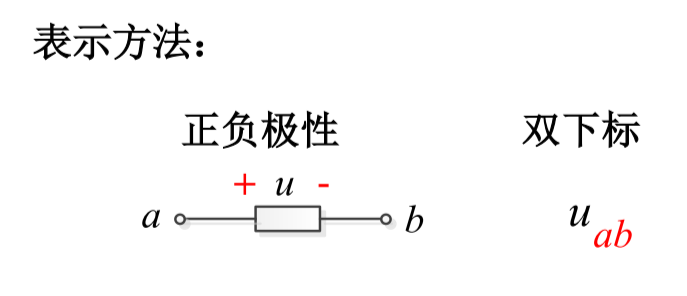
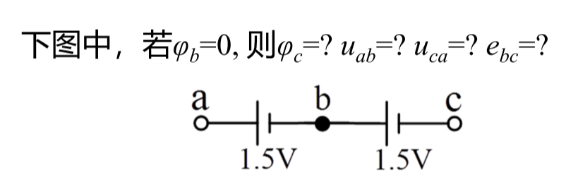
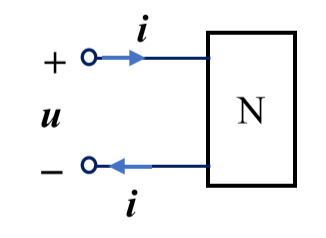

# 电路笔记（一）

## 0. 绪论

### 0.1 电路的概念
实际电路通常是由电源、负载和传输控制设备连接组成的**电流通路**。电路又常称为**电网络**或简称网络，现在有广泛使用系统这一概念。

### 0.2 电路理论学习内容
电路理论课程的学习内容主要是通过电路模型的分析，学习电路的基本定理、概念和基本分析方法。

<!--  -->
电路模型：把实际电路的本质特征抽象出来所形成的理想化了的电路，是由理想的电路元件连接组成的电流通路。

电路元件（$\neq$ 器件）：电路中种类不多的，具有特定电磁特性的基本单元。元件的电磁特性可用**参数**、**特性方程**、**特性曲线**来表示。

> 以电阻元件为例：
> 它的电磁特性主要可以描述为将电能转化为热能
> 参数是阻值 $R$
> 特性方程是 $u=Ri$
> 特性曲线就是一条过原点的直线：
> 
<!-- >  -->

但是，**实际物理世界中的实际电路抽象出我们一般讨论的集总参数电路模型是需要满足条件的**：

首先我们想讨论的**集总参数系统**中的元件称为**集总参数元件**。可见，集总系统是由集总元件互连组成的。并且**在集总系统内集总元件之间的电磁场相互无影响，系统与外部也无电磁交换，是电磁能量独立的系统**。

1. 选择元件边界，使得在任意时刻，经过元件外的任意闭合路径满足 $\displaystyle\frac{\partial \Psi}{\partial t}=0$.
   根据麦克斯韦方程组可以转化为：$\displaystyle\frac{\partial \Psi}{\partial t}=-\oint\boldsymbol{E}\textrm{d}\boldsymbol{l}=0$，所以这一条件其实是在说明任意时刻元件表面的点之间的电势差是定值，而元件外电场是无旋的（或者说元件不向外辐射电磁波），也就是说需要元件外的电场基本是一个静电场。
2. 选择元件边界，使得在任意时刻元件内无时变总电荷 $\displaystyle\frac{\partial q}{\partial t}=0$.
   同理根据麦克斯韦方程组 $\displaystyle\frac{\partial q}{\partial t}=-\oint\boldsymbol{J}\textrm{d}\boldsymbol{S}=0$，由于这里选择的是元件边界，所以上述方程描述的是在任意固定时刻流入元件和流出元件的净电流和为零。
3. 元件尺寸远小于工作频率下的电磁波波长 $\lambda$，电磁波可看作瞬间通过集总元件，忽略传输延迟.集总元件简化为一个质点，忽略其长度、形状、大小及位置。
   这一点我们可以计算两个问题，首先如果工作频率是工频50Hz，该频率电磁波的波长是
   $$
   \lambda=\frac{c}{f}=\frac{3\times10^8\textrm{m/s}}{50\textrm{Hz}}=6000\textrm{km}\\
   $$
   也就是我们想要让处于工频下的电路不满足上面的第三条条件，电路的尺度必须非常大（比如超远距离信号传输）。而如果我们的电路的尺度是 0.1m 左右，而波长为 0.1m 的电磁波的频率是：
   $$
   f=\frac{c}{\lambda}=\frac{3\times10^8\textrm{m/s}}{0.1\textrm{m}}=3\textrm{GHz}\\
   $$
   也就是想让我们常见的产品电路板不满足该条件，电路的工作频率应当在GHz级别，我们的电脑主板的工作频率就是这个范畴。

上面的三个条件常称为**集总参数电路的抽象原则**，有兴趣的可以看一下这篇文章：
> 姚缨英,李海红.关于集总参数电路抽象原则的一点思考[J].电气电子教学学报, 2015.DOI:JournalArticle/5b3bccf6c095d70f00906b09.

同时我也在 github 上放了这篇论文[关于集总参数电路抽象原则的一点思考.pdf](https://github.com/HeLi-Control/Circuits_LearningNotes/tree/main/CircuitAnalysis/关于集总参数电路抽象原则的一点思考.pdf)
<!-- [关于集总参数电路抽象原则的一点思考.pdf](../关于集总参数电路抽象原则的一点思考.pdf) -->

于是电路元件就可以按照不同标准进行分类：

1. 按照是否可以分类为集总参数元件和分布参数元件；
2. 按照特性方程是否是线性的可以分类为线性元件和非线性元件；
3. 按照参数是否随时间变化可以分类为定常元件和时变元件。

此课程主要讨论的就是**集总参数线性定常元件**。

## 1. 电路元件与电路基本定律

### 1.1 电流、电压与电功率

电路分析的基本目的是要确定电路的行为。电路的行为常用*电路变量*来表征。电路的主要变量有电流、电压、电荷和磁链。

#### 1.1.1 电流

定义——电荷 q 的定向运动（荷电质点的有序运动）。

大小—— $i(t)\overset{\textrm{def}}=\displaystyle\lim_{\Delta t\to 0}\frac{\Delta q}{\Delta t}=\frac{\textrm{d}q}{\textrm{d}t}$

单位：A, mA, μA……

方向——正电荷的运动方向。

- 电流正方向的表示方法：$i_{ab}$（双下标表示法）一般代表从 a 节点流向 b 节点的电流，标注的时候就是在导线上标注一个和电流正方向相同的箭头

但是因为实际上电流的实际方向很难确定，我们在分析电路的时候会*假定一个真实方向*作为**参考方向**。当参考方向和真实方向保持一致时，电流取为“+”，反之取为“-”。

> **注意：**
>
> - 标注参考方向是电路分析的规范，即分析过程使用的电路变量必须标注参考方向，否则无法分析，结果也无意义；
> - 参考方向可任意选取，即使一看便知的实际方向，也可以选择参考方向与实际方向不一致，使用箭头或双下标，一旦选取不可改变；
> - 若对同一电流参考方向取得不同，则i~ab~=-i~ba~。

电流按照方向可以分为：

1. 直流（恒定）电流：大小和方向不随时间变化的电流(DC)。
2. 交流电流：***随时间周期性变化***且***平均值为零***的电流(AC)。
3. 任意电流：i(t)

通常用大写字母 $I$ 表示直流电流，用小写字母 $i$ 或者 $i(t)$ 表示量值或方向随时间变化的电流。

#### 1.1.2 电压（电位差）

定义—— $u_{ab}\overset{\textrm{def}}=\displaystyle\frac{\textrm{d}W_{ab}}{\textrm{d}t}$.

大小—— $u_{ab}=\displaystyle\int_a^b\boldsymbol{E}_c\textrm{d}\boldsymbol{l}
=\frac{1}{q}\int_a^b\boldsymbol{F}_c\textrm{d}\boldsymbol{l}$，1V=1J/C

**电位**：在系统中选取任一点为参考点，参考点电位为 0（零电位点，常用 $\bot$ 符号表示）， 电路中某点到参考点之间的电压称为该点的电位 $\varphi$。而两点之间的电位差可以表示为：
$$
\begin{aligned} \red{u_{ab}}&=\int_a^b\boldsymbol{E}_c\textrm{d}\boldsymbol{l} =\int_a^c\boldsymbol{E}_c\textrm{d}\boldsymbol{l} +\int_c^b\boldsymbol{E}_c\textrm{d}\boldsymbol{l}\\ &=\int_a^c\boldsymbol{E}_c\textrm{d}\boldsymbol{l} -\int_b^c\boldsymbol{E}_c\textrm{d}\boldsymbol{l} =\red{\varphi_a-\varphi_b} \end{aligned}\\
$$
<!-- $$
\begin{aligned}
\red{u_{ab}}&=\int_a^b\boldsymbol{E}_c\textrm{d}\boldsymbol{l}
=\int_a^c\boldsymbol{E}_c\textrm{d}\boldsymbol{l}
+\int_c^b\boldsymbol{E}_c\textrm{d}\boldsymbol{l}\\
&=\int_a^c\boldsymbol{E}_c\textrm{d}\boldsymbol{l}
-\int_b^c\boldsymbol{E}_c\textrm{d}\boldsymbol{l}
=\red{\varphi_a-\varphi_b}
\end{aligned}
$$ -->
电压方向——规定为电位降低的方向（电位降）。

<!--  -->
当电压和电流的参考方向一致时，我们说选取的是**关联参考方向**，否则就是**非关联参考方向**。

#### 1.1.3 电动势
定义—— $e_{\red{ba}}=\displaystyle\frac{\textrm{d}W}{\textrm{d}t}=\int_b^a(\boldsymbol{E}_i+\boldsymbol{E}_e)\textrm{d}\boldsymbol{l}
=\frac{1}{q}\int_b^a(\boldsymbol{F}_i+\boldsymbol{F}_e)\textrm{d}\boldsymbol{l}$，这里的 ***E**~i~* 是感应场强，***E**~e~* 是感应场强是局外场强，在定义中两者一般只存在一个，但是都可以被算作电动势。

方向：电位升高的方向（==***与电压方向定义相反***==）。

【例题】

<!--  -->
【答案】$\phi_c$=-1.5V, u~ab~=1.5V, u~ca~=-3V, e~bc~=-1.5V

#### 1.1.4 电功率

定义——电能的转换或传输速率 $P=\displaystyle\frac{\textrm{d}W}{\textrm{d}t}=\frac{u\textrm{d}q}{\textrm{d}t}=\red{ui}$

单位：W, mW, kW…… 1W=1J/s

电能—— $W(t)=\displaystyle\int_{t_0}^t p(\zeta)\textrm{d}\zeta$

单位：J, kWh……

> **如何判断功率的吸收和发出？**
>
> - 根据U、I的实际方向：
>    - 电阻上U、I方向相同，吸收电能（功率）；
>    - 电源上U、I方向相反，发出电能（功率）。
> - 根据参考方向结合计算结果：
>    - 关联参考方向：“吸收”功率 p=ui
>       - p>0代表实际吸收功率
>       - p<0代表实际发出功率
>    - 非关联参考方向：“发出”功率 p=ui，“吸收”功率p=-ui
>       - p>0代表实际发出功率
>       - p<0代表实际吸收功率

端口 ——**流入流出电流相等**的一对端子。

<!--  -->
该端口的 u 与 i 为关联参考方向（==向内关联==），则吸收功率为 p=ui

### 1.2 电阻元件
