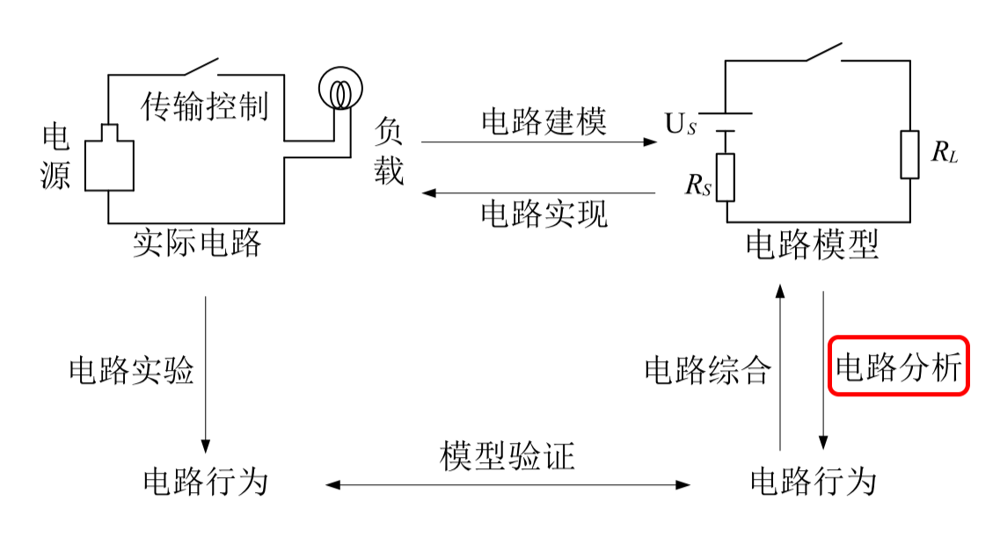
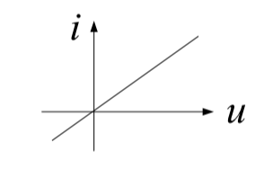

# 电路笔记（一）

## 0. 绪论

### 0.1 电路的概念
实际电路通常是由电源、负载和传输控制设备连接组成的**电流通路**。电路又常称为**电网络**或简称网络，现在有广泛使用系统这一概念。

### 0.2 电路理论学习内容
电路理论课程的学习内容主要是通过电路模型的分析，学习电路的基本定理、概念和基本分析方法。

<!--  -->
电路模型：把实际电路的本质特征抽象出来所形成的理想化了的电路，是由理想的电路元件连接组成的电流通路。

电路元件（$\neq$ 器件）：电路中种类不多的，具有特定电磁特性的基本单元。元件的电磁特性可用**参数**、**特性方程**、**特性曲线**来表示。

> 以电阻元件为例：
> 它的电磁特性主要可以描述为将电能转化为热能
> 参数是阻值 $R$
> 特性方程是 $u=Ri$
> 特性曲线就是一条过原点的直线：
> 
<!-- >  -->

但是，**实际物理世界中的实际电路抽象出我们一般讨论的集总参数电路模型是需要满足条件的**：

首先我们想讨论的**集总参数系统**中的元件称为**集总参数元件**。可见，集总系统是由集总元件互连组成的。并且**在集总系统内集总元件之间的电磁场相互无影响，系统与外部也无电磁交换，是电磁能量独立的系统**。

1. 选择元件边界，使得在任意时刻，经过元件外的任意闭合路径满足 $\displaystyle\frac{\partial \Psi}{\partial t}=0$.
   根据麦克斯韦方程组可以转化为：$\displaystyle\frac{\partial \Psi}{\partial t}=-\oint\boldsymbol{E}\textrm{d}\boldsymbol{l}=0$，所以这一条件其实是在说明任意时刻元件表面的点之间的电势差是定值，而元件外电场是无旋的（或者说元件不向外辐射电磁波），也就是说需要元件外的电场基本是一个静电场。
2. 选择元件边界，使得在任意时刻元件内无时变总电荷 $\displaystyle\frac{\partial q}{\partial t}=0$.
   同理根据麦克斯韦方程组 $\displaystyle\frac{\partial q}{\partial t}=-\oint\boldsymbol{J}\textrm{d}\boldsymbol{S}=0$，由于这里选择的是元件边界，所以上述方程描述的是在任意固定时刻流入元件和流出元件的净电流和为零。
3. 元件尺寸远小于工作频率下的电磁波波长 $\lambda$，电磁波可看作瞬间通过集总元件，忽略传输延迟.集总元件简化为一个质点，忽略其长度、形状、大小及位置。
   这一点我们可以计算两个问题，首先如果工作频率是工频50Hz，该频率电磁波的波长是
   $$
   \lambda=\frac{c}{f}=\frac{3\times10^8\textrm{m/s}}{50\textrm{Hz}}=6000\textrm{km}\\
   $$
   也就是我们想要让处于工频下的电路不满足上面的第三条条件，电路的尺度必须非常大（比如超远距离信号传输）。而如果我们的电路的尺度是 0.1m 左右，而波长为 0.1m 的电磁波的频率是：
   $$
   f=\frac{c}{\lambda}=\frac{3\times10^8\textrm{m/s}}{0.1\textrm{m}}=3\textrm{GHz}\\
   $$
   也就是想让我们常见的产品电路板不满足该条件，电路的工作频率应当在GHz级别，我们的电脑主板的工作频率就是这个范畴。

上面的三个条件常称为**集总参数电路的抽象原则**，有兴趣的可以看一下这篇文章：
> 姚缨英,李海红.关于集总参数电路抽象原则的一点思考[J].电气电子教学学报, 2015.DOI:JournalArticle/5b3bccf6c095d70f00906b09.

同时我也在 github 上放了这篇论文[关于集总参数电路抽象原则的一点思考.pdf](https://github.com/HeLi-Control/Circuits_LearningNotes/tree/main/CircuitAnalysis/关于集总参数电路抽象原则的一点思考.pdf)
<!-- [关于集总参数电路抽象原则的一点思考.pdf](../关于集总参数电路抽象原则的一点思考.pdf) -->

于是电路元件就可以按照不同标准进行分类：

1. 按照是否可以分类为集总参数元件和分布参数元件；
2. 按照特性方程是否是线性的可以分类为线性元件和非线性元件；
3. 按照参数是否随时间变化可以分类为定常元件和时变元件。

此课程主要讨论的就是**集总参数线性定常元件**。
