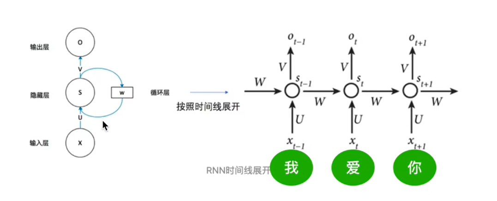
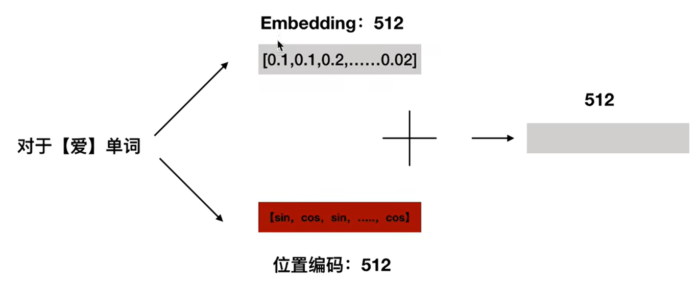
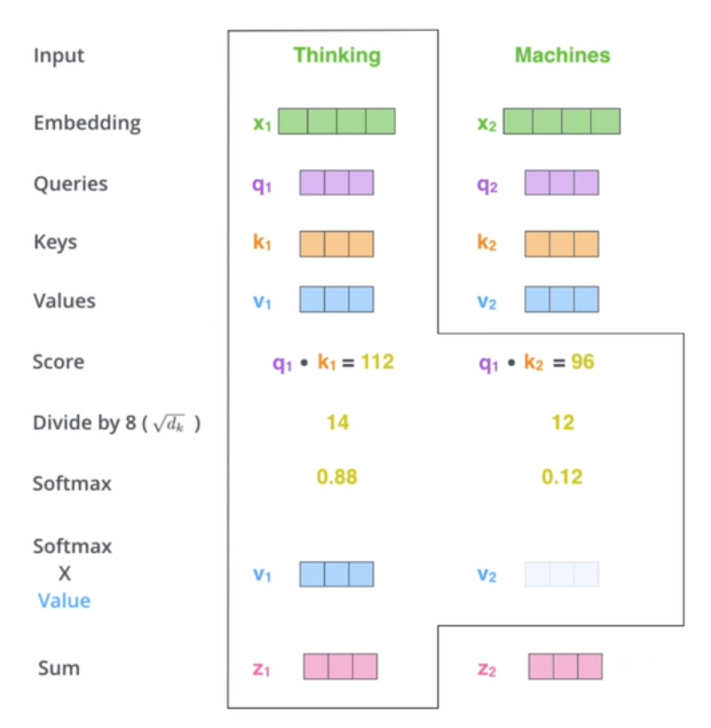
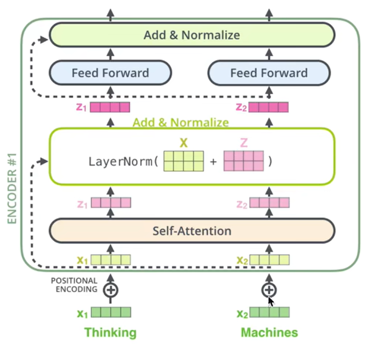
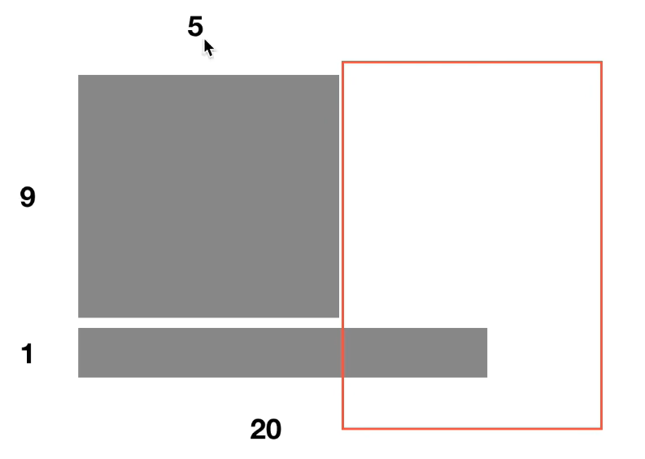
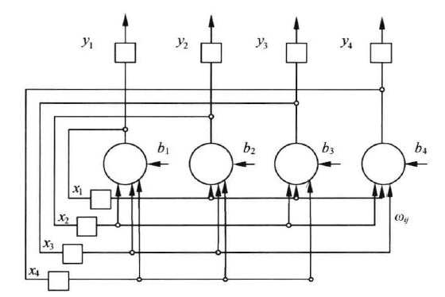
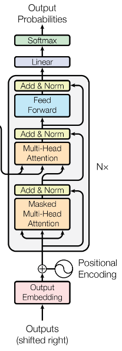
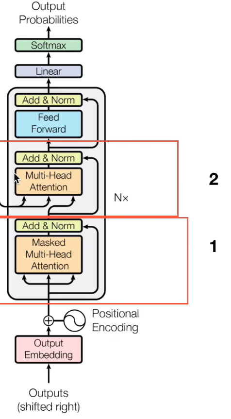
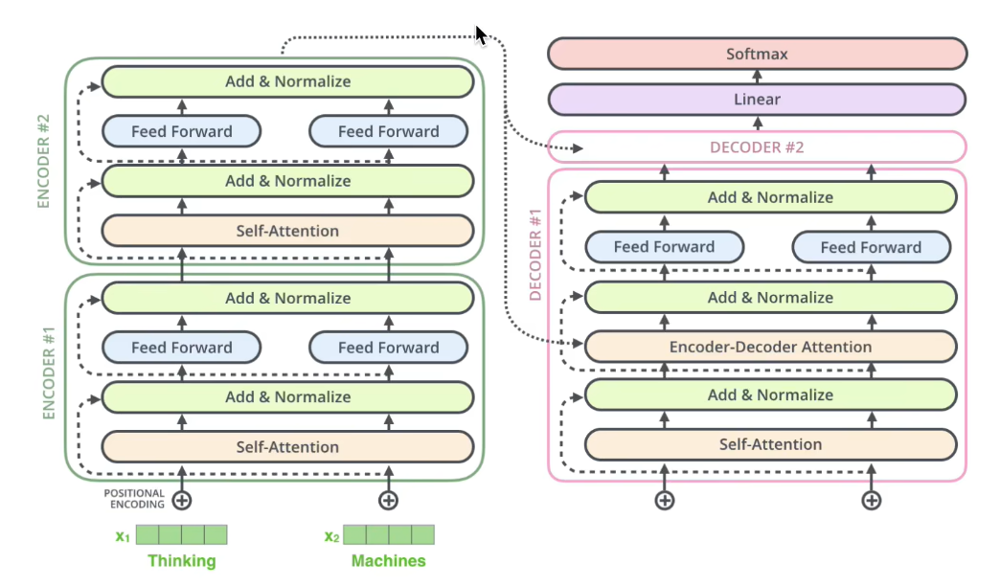

# Transformer 学习笔记

这一部分学习主要使用的学习资料有这样几个（排序区分先后，就是学习顺序）：
1. B 站视频[Transformer从零详细解读(可能是你见过最通俗易懂的讲解)](https://www.bilibili.com/video/BV1Di4y1c7Zm/?spm_id_from=333.337.search-card.all.click&vd_source=1163cf8c6b67cb487398d52f85ef21a4)
2. Google 关于 Transformer 的原论文（这里就不贴了，大家自己去找吧）
3.B 站视频[超硬核Transformer细节全梳理！对不起面试官你问的我都见过…](https://www.bilibili.com/video/BV1AU4y1d7nT/?share_source=copy_web&vd_source=b63a44f1679af4831a1d01b79555ac1d)

本人在此前已经学习了吴恩达老师的机器学习和深度学习套件，学习笔记也可以放在这里（引个流hhh）：

1. [机器学习吴恩达老师课堂笔记（一）](https://zhuanlan.zhihu.com/p/662873124)、[机器学习吴恩达老师课堂笔记（二）](https://zhuanlan.zhihu.com/p/662954666)、[机器学习吴恩达老师课堂笔记（三）](https://zhuanlan.zhihu.com/p/663114735)、[机器学习吴恩达老师课堂笔记（四）](https://zhuanlan.zhihu.com/p/663225012)和[机器学习吴恩达老师课堂笔记（五）](https://zhuanlan.zhihu.com/p/663246516)
2. [深度学习吴恩达老师课堂笔记（一）](https://zhuanlan.zhihu.com/p/663532574)、[深度学习吴恩达老师课堂笔记（二）](https://zhuanlan.zhihu.com/p/663689302)、[深度学习吴恩达老师课堂笔记（三）](https://zhuanlan.zhihu.com/p/663867959)

首先可以来说一下 Transformer 的优势，他最早是在 NLP 领域被时提出的，在上下文语义信息（包含*方向*和*距离*）提取过程中研究者们提出了 Encoder 的概念，就是使用网络对语义信息编码，而在这个语义信息提取过程中人们发现 RNN 只能对句子进行单向编码而 CNN 只能对短句进行编码，而Transformer 通过设计结构实现了**同时对双向语义进行编码还能抽取句子中的长距离特征**，从而在特征抽取方面比 RNN 和 CNN 都要表现得更好。不过 Transformer 在处理句子的序列顺序问题上还是弱于 RNN（尤其是长距离），在计算速度方面又弱于 CNN（强于 RNN 是因为 RNN 无法并行运算）。整体来说，Transformer 在速度和效果上都有一定优势，所以被应用得非常广泛。

接下来就进入正题开始讲 Transformer 了。这一部分和深度学习的最后一部分 NLP 可以连接上，比如想要完成机器翻译任务就可以借鉴这种 Encoder-Decoder 的格式来构建网络：

<!--  -->
比较常见的实现方式就是深度网络模型，这里的 Encoder 和 Decoder **分别**（就是 Encoder 之间互相结构相同，Decoder 之间互相结构相同，但是 Encoder 和 Decoder 之间结构不相同）都是结构完全相同但是*参数不相同*的网络层（注意这里是不同的层而不是在讲 RNN 循环神经网络）：

<!--  -->
接下来可以看一下 Transformer 原论文中的网络结构：

<!--  -->
首先图的左半部分就是 Encdoer 网络而右半部分就是 Decoder 网络，首先可以看到网络结构的左半部分和右半部分都有 $\times N$ 的符号，对应的就是上一张图中的多个结构完全相同的层；接下来的第二个发现就是 Encoder 网络和 Decoder 网络的结构其实是不相同的，这一点后面会继续说明。

下面分别来看这个网络的 Encoder 和 Decoder 部分展开来讲：

## 1. Encoder 部分
首先单独来看 Encoder 部分，它主要分为`输入部分`、`注意力机制`和`前馈神经网络`三个部分。：

<!--  -->

### 1.1 输入部分

输入部分主要又分为两个小部分也就是单词嵌入和位置嵌入。单词嵌入这就不再多说了，可以按照深度学习的时候的 Word2Vec 部分。接下来讨论一下位置嵌入的必要性：前面在讲 RNN 的时候已经说过，对于所有时间步上的输入而言，它的网络参数(下图中的 U,V,W)是共享的：

<!--  -->
这里也插一下 up 主在视频中专门提到的一个点：对于 RNN 网络而言，梯度消失问题体现在网络链比较长的时候梯度由于连乘效应**变为零**这个说法并不准确；对于 RNN 网络而言，它的梯度其实被定义为各个时间步上的梯度和，因此正确的说法应该是体现为**梯度下降过程被近距离梯度阻挡、远距离梯度被忽略不计**。也正是由于这个特性，RNN 网络在处理数据上具有天然的时间特性。但是这一特性对于 Transformer 网络而言是非常致命的也是我们想要消除的，因此 Transformer 在 Encoder 中使用了多头注意力机制实现多个输入的并行处理，但是这样就加快了网络的计算速度但同时*丢失了语句先后顺序信息*。为了避免这个信息损失对于网络性能造成的影响，Transformer 使用了位置编码层作为网络的输入层，而这个位置编码层的关键就是构造了这样的一组位置编码向量：

<!--  -->
这个向量的奇数位置使用 $\sin$ 函数来进行编码而偶数位置使用 $\cos$ 函数进行编码得到了一组包含位置信息的和输入数据等维度的向量，再将这个位置编码向量和输入单词的嵌入向量(Word2Vec)相加得到了一个新向量作为下一层多头注意力机制层的输入，至此输入层已经搭建完成：

<!--  -->
这里可以来提一下为什么在这个问题中引入位置编码是有效的。根据正余弦三角函数的和差公式我们可以得到：
$$
\begin{cases} \begin{align*} PE(pos+k,2i)&=\sin(\displaystyle\frac{pos+k}{10000^{2i/d_{model}}})=\sin(\displaystyle\frac{pos}{10000^{2i/d_{model}}}+\displaystyle\frac{k}{10000^{2i/d_{model}}})\\ &=PE(pos,2i)\times PE(k,2i+1)+PE(pos,2i+1)\times PE(k,2i)\\ PE(pos+k,2i+1)&=\cos(\displaystyle\frac{pos+k}{10000^{2i/d_{model}}})=\cos(\displaystyle\frac{pos}{10000^{2i/d_{model}}}+\displaystyle\frac{k}{10000^{2i/d_{model}}})\\ &=PE(pos,2i+1)\times PE(k,2i+1)-PE(pos,2i)\times PE(k,2i) \end{align*} \end{cases}\\
$$
<!-- $$
\begin{cases}
\begin{align*}
PE(pos+k,2i)&=\sin(\displaystyle\frac{pos+k}{10000^{2i/d_{model}}})=\sin(\displaystyle\frac{pos}{10000^{2i/d_{model}}}+\displaystyle\frac{k}{10000^{2i/d_{model}}})\\
&=PE(pos,2i)\times PE(k,2i+1)+PE(pos,2i+1)\times PE(k,2i)\\
PE(pos+k,2i+1)&=\cos(\displaystyle\frac{pos+k}{10000^{2i/d_{model}}})=\cos(\displaystyle\frac{pos}{10000^{2i/d_{model}}}+\displaystyle\frac{k}{10000^{2i/d_{model}}})\\
&=PE(pos,2i+1)\times PE(k,2i+1)-PE(pos,2i)\times PE(k,2i)
\end{align*}
\end{cases}
$$ -->
可以看出，对于 pos+k 位置上的位置嵌入向量的某一维 2i 和 2i+1 而言，他都可以表示为 pos 位置和 k 位置的位置向量的 2i 和 2i+1 维的线性组合。这样的线性组合意味着位置嵌入向量中蕴含了输入数据的相对位置信息，这种信息的加入是有利于网络知晓输入向量的先后关系的。

### 1.2 多头注意力机制(Multi-head Attention)

接下来讨论注意力机制。注意力机制最核心的问题就是借鉴了人类在认识事物的时候存在侧重点的思路，因此在处理问题的时候网络不应该像之前的网络一样对于每一个输入信息都基于相同的“注意力”，而是应该着重关注输入信息的某几个部分而更少关注输入信息的其他部分，就像下面这张图中我们在得到提问“婴儿在看什么”之后在看的时候就会着重关注画红色的部分：

<!--  -->
接下来可以看一下注意力机制的实现，在原论文中这是通过三个矩阵 **Q**,**K**,**V** 来实现的：
$$
\textrm{Attention}(\boldsymbol{Q},\boldsymbol{K},\boldsymbol{V})=\textrm{softmax}(\displaystyle\frac{\boldsymbol{Q}\boldsymbol{K}^T}{\sqrt{d_k}})\boldsymbol{V}\\
$$
这里的直观理解就是计算的是 **Q** 的各列向量和 **K** 矩阵的各列向量之间的相似度的 Softmax 结果与 **V** 矩阵之间的相似程度。这么说还是有点抽象，可以举个例子看看，比如现在的输入问题 **Q** 是“爱”，得到的文本 **K** 就是“我不爱你”，于是首先通过第一个相似度函数 F(**Q**,**K**) 计算得到 **S~1~**,**S~2~**,**S~3~**,**S~4~** 作为输出的相似度，经过 Softmax 归一化以后得到归一化的相似度 **a~1~**,**a~2~**,**a~3~**,**a~4~**，最终的结果和最后一组输入矩阵 **V** 相乘以后就得到了网络的输出。

<!--  -->
前面只是大致描述了如果使用 **Q**,**K**,**V** 三个矩阵实现 Transformer 中的注意力机制，接下来需要讨论在 Transformer 中以文字处理为例如何从单词向量（已经经过输入层 Embedding 和 Position Encoding 过了的）获得这三个矩阵。其实思路也很简单，就是分别训练三个权重矩阵 **W^Q^**,**W^K^**,**W^V^** 和输入向量进行乘法运算以后就可以获得 **Q**,**K**,**V** 三个向量：

<!--  -->
那么对于多个输入单词的计算方式就是这样了：

<!--  -->
接下来可以说明一下为什么这里的 **Q** 与 **K** 之间的点乘结果需要除以 $\sqrt{d_k}$，这其实是 Transformer 对于梯度爆炸-梯度消失问题的改善，为了防止过大的点乘数值使得 Softmax 层输出类似于 One-hot 向量的结果。至于这里为什么除以 $\sqrt{d_k}$ 而不是  $d_k$ 等其他值，原因在于除以 $\sqrt{d_k}$ 以后可以保证输出方差保持为 1，这一点和 BN(Batch Normalization) 的思路是很相似的。而实际部署的时候就是和机器学习一样将向量扩充成矩阵运算来实现并行训练：

<!--  -->
这就是注意力机制的基本实现，但是实际上在 Transformer 中我们使用的并不是简单的注意力机制而是“**多头注意力机制**”(**Multi-head Attention**)，实际上就是在计算的时候并不只是使用了一组权重矩阵 **W^Q^**,**W^K^**,**W^V^**，而是分别训练了多组权重矩阵 **W^Q^~0~**,**W^K^~0~**,**W^V^~0~**,**W^Q^~1~**,**W^K^~1~**,**W^V^~1~**...并在计算的时候分别计算出多组 **Q**,**K**,**V** 矩阵：

<!--  -->
至于为什么考虑使用多头注意力机制，论文原作者提到原因是测试发现效果比较好，而可能的解释就是多头注意力机制将输入特征变换到了不同的空间中从而保证 Transformer 可以同时注意到不同子空间的信息使得注意力机制的表现更好。

最后，显然通过这种多头注意力机制得到的输出是独立的若干个输出矩阵 **Z~i~**, 而这里算法采用的处理办法就是将这几个输出矩阵直接连接并统一乘以一个权重矩阵 **W^O^** 得到最终的输出**Z**：
$$
\boldsymbol{Z}_i=F(\boldsymbol{Q}_i,\boldsymbol{K}_i,\boldsymbol{V}_i)\\ \textrm{MultiHead}(\boldsymbol{Q},\boldsymbol{K},\boldsymbol{V})=\textrm{Contact}(\boldsymbol{Z}_0,\boldsymbol{Z}_1,\dots)\boldsymbol{W}^O\\
$$

<!--  -->

### 1.3 残差、 Layer Normalization 和前馈神经网络

可以看一下下面的这张 Encoder 结构图，可以看到在注意力机制以后有一层 Layer Normalization，而这一部分的输入其实将多个输入词向量放到一起构成了矩阵：

<!--  -->
这里的矩阵其实就是简单地将输入向量拼接，不过要注意这里输入向量在拼接的时候并不是拼接的原始输入向量，而**是经过单词嵌入和位置编码以后的词向量**。然后将这里算出来的 **X** 矩阵和 **Z** 矩阵相加就作为这一部分残差（至于为什么是残差可以回去看一下[深度学习](https://zhuanlan.zhihu.com/p/663943549)的时候提到过的 ResNet 残差神经网络，其实就是 Skip Connection 的引入让网络在拟合恒等函数这件事情上变得更加容易、在梯度下降过程中也更难陷入梯度消失进而加快网络训练速度）。

讲完残差机制以后这里来讨论一下为什么这里使用 Layer Normalization 而不是之前用过的 Batch Normalization。实际上，在 NLP 场景中，很少会有网络继续使用 BN，更多的大家都是使用 LN，主要原因简单来说其实就是 BN 在 NLP 中的效果很差而 LN 的效果非常不错。可以回忆一下 BN 的操作其实是在对输入信号的**同一维度**上的特征数据进行处理（比如将一个 Batch 中的体重、身高等单独做 BN），这个操作的优势就是可以解决内部协变量的偏移同时缓解梯度饱和问题加快训练速度，淡然也是存在缺点的。那就是 BN 在 Batch size 比较小的时候效果比较差，同时**在 RNN 中的表现效果比较差**。还是以 NLP 的应用场景为例，输入数据的长度其实是会发生变化的，特别长或者特别短的输入语句出现的频次都会比较低，比如下面这个 Batch 中就只存在一个长句子：

<!--  -->
那么这种情况下前 5 个单词的均值和方差都可以使用整个 Batch 中的 10 个句子算出来，但是对于第 6~20 个单词，在整个 Batch 中只出现了一次，所以显然此时使用 BN 计算出来的均值和方差并不具有代表性从而就不能发挥 BN 该有的效果（其实就是等价于前面的 Batch size 比较小的情况下 BN 效果不好的问题）。

那么接下来就讨论一下 LN 进行的操作，LN 考虑到在 RNN 中处于同一位置的元素并不携带相同特征因而做对于相同输入位置上的元素进行归一化没有意义，因此 LN 在进行归一化的时候是**针对每个输入序列单独做归一化的**（实际操作上是对每个词向量的各个分量单独归一化），这一部分的考量就是因为一句话的不同单词处于同一语境中，因此就对该语境下的单词进行归一化。

而前馈神经网络(Feedforward Neural Network, FNN)其实是一个非常大的概念，简单来说就是从吴恩达机器学习课程到深度学习课程结束介绍的 CNN 以及 GAN 等等都属于前馈神经网络，而 RNN 则属于典型的反馈神经网络。

> 在此种神经网络中，各神经元从输入层开始，接收前一级输入，并输入到下一级，直至输出层。整个网络中无反馈，可用一个有向无环图表示。

与前馈神经网络相对应的概念就是反馈神经网络(FeedBackNN)又称递归网络、回归网络，是一种将输出经过一步时移再接入到输入层的神经网络系统。这类网络中，神经元可以互连，有些神经元的输出会被反馈至同层甚至前层的神经元。常见的比如最近经常讨论的 RNN 以及 Hopfield 神经网络:

<!--  -->
这一部分感觉[神经网络算法详解 04：反馈神经网络（Hopfield、BAM、BM、RBM）](https://blog.csdn.net/weixin_39653948/article/details/105161038)讲得比较好，有兴趣可以看看。

最后再来贴一下 Encoder 的大致流程结构，可以发现这一部分的计算其实已经比较明确了：

<!--  -->
最后就是还是需要注意一下，实际的 Encoder 部分是由很多个这样的单元叠加而成的，每个 Encoder 都会互不干扰地输出自己的编码结果给对应的 Decoder.

## 2. Decoder 部分

看完了 Encoder 以后来看 Decoder 其实结构是比较清晰的，因为两者确实是比较相似：

<!--  -->
因此这里着重关注的内容就是 Decoder 部分的前两层注意力机制，第一层就是被掩盖的多头注意力机制(Masked Multi-Head Attention)层，而第二部分就是交互层也就是图中画出来的第二层多头注意力层：

<!--  -->

首先还是来看这里所谓的 `Masked` 体现在代码上实际就是屏蔽一部分信息，具体一点就是将当前单词和之后的单词进行屏蔽。这是因为训练的时候因为是并行输入，解码端预测的时候是一个个解码，看不到当前单词之后的信息，所以在训练的时候需要把这个信息抹掉，保证训练和测试过程的一致性。

接下来就是 Encoder 和 Decoder 交接的关键部分也就是交互层，在这一层 Encoder 与 Decoder 之间会构建类似于全连接的连接关系：

<!--  -->
这一层的交互实质上也是使用注意力机制搭建起来的，不同的就是，这一层注意力机制的 **Q** 矩阵都是由 Decoder 提供的而 **K** 和 **V** 都是由 Encoder 提供的。接下来就可以看一下完整的 Transformer 的结构了：

<!--  -->
