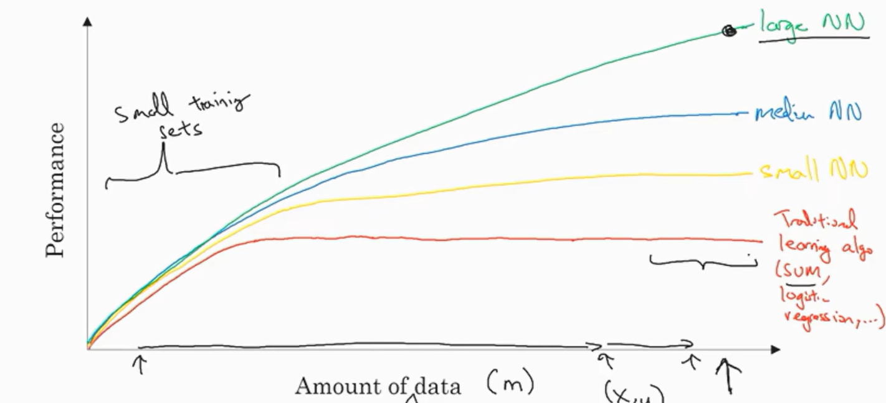
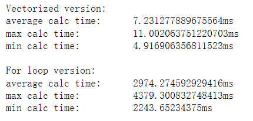
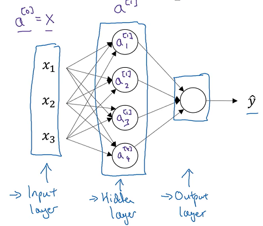
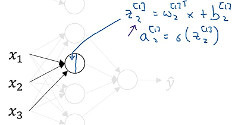
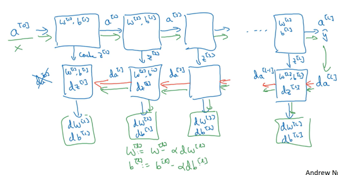

#! https://zhuanlan.zhihu.com/p/663532574
# 深度学习吴恩达老师课堂笔记（一）

主要都是自己上课做的笔记，目录结构参考了[完结撒花！吴恩达DeepLearning.ai《深度学习》课程笔记目录总集_深度学习笔记 吴恩达-CSDN博客](https://blog.csdn.net/koala_tree/article/details/79913655).不过这个博主的笔记也记得挺详细的，这里给点个赞<!---->

## 1. 神经网络和深度学习

【主要都是在讲一些机器学习的内容，所以这里不再重复做笔记了，只记录一些零散的知识点】


ReLU函数(Rectified Linear Unit, 修正线性单元)$\textrm{ReLU}(x)=\max\{x,0\}$，用于替代传统机器学习中的Sigmoid函数，主要用于加快网络的训练速度——sigmoid函数在自变量比较大的时候斜率趋于零因而梯度下降的收敛速度会变慢，而当x大于0的时候ReLU函数的导数一直保持为1，这就大大加快了梯度下降算法的收敛速度。


结构化数据和非结构化数据：

- 一类信息能够用数据或统一的结构加以表示，我们称之为结构化数据，如数字、符号等；
- 而另一类信息无法用数字或统一的结构表示，如文本、图像、声音、网页等，我们称之为非结构化数据。

结构化数据是计算机很容易理解的，相反，计算机对于非结构化数据不知所措；而人类相反地对非结构化数据有很强的适应和解释能力。计算机想要理解非结构化数据还是需要依赖于深度学习网络。


深度学习在最近几年快速发展的原因——人类遇到的数据规模不断提升，传统机器学习在面对超大规模数据时显得捉襟见肘，所以需要更大的网络规模和数据规模来提升网络性能。所以总体来说还是规模带动了深度学习的发展：

<!--  -->
上图说明在数据量比较小的时候各种算法的优劣性能主要来源于算法设计本身，而当数据规模不断上升的时候大网络展现出的能力逐渐开始优于其他算法。


一般将一个数据样本写为$(\boldsymbol{x},y)$，这里我们将**x**中元素的个数（特征变量数）记作$n_x$，将样本数记作m，将数据样本总体写作矩阵**X**：
$$
\boldsymbol{X}=\begin{bmatrix} \boldsymbol{x}^{(1)} & \boldsymbol{x}^{(2)} & \cdots & \boldsymbol{x}^{(m)} \end{bmatrix}\in\mathbb{R}^{n_x\times m}\\
$$
<!-- $$
\boldsymbol{X}=\begin{bmatrix}
\boldsymbol{x}^{(1)} & \boldsymbol{x}^{(2)} & \cdots & \boldsymbol{x}^{(m)}
\end{bmatrix}\in\mathbb{R}^{n_x\times m}
$$ -->
同时将标签y的集合记作矩阵**Y**：
$$
\boldsymbol{Y}=\begin{bmatrix} y^{(1)} & y^{(2)} & \cdots & y^{(m)} \end{bmatrix}\in\mathbb{R}^{1\times m}\\
$$
<!-- $$
\boldsymbol{Y}=\begin{bmatrix}
y^{(1)} & y^{(2)} & \cdots & y^{(m)}
\end{bmatrix}\in\mathbb{R}^{1\times m}
$$ -->
在逻辑回归中，想要完成二分类任务，需要构建参数$\boldsymbol{\omega}\in\mathbb{R}^{n_x},b\in\mathbb{R}$使得输出为：
$$
\hat y=\textrm{Sigmoid}(\boldsymbol{\omega}^T\boldsymbol{x}+b)=P(y=1|\boldsymbol{x})\text{ where }\textrm{Sigmoid}(z)=\frac{1}{1+e^{-z}}\\
$$
这里变量z和之前的定义一样：
$$
z=\boldsymbol{\omega}^T\boldsymbol{x}+b\\
$$
【注意这里的符号习惯于机器学习不一样，机器学习习惯采用整个的$\boldsymbol{\theta}$同时表示偏置和特征变量增益，而这里将$\boldsymbol{\omega}$与$b$分开分别看成两个变量】


为了保证损失函数是凸函数，这里定义的损失函数并不是常规在线性回归中使用的误差平方模型，而是对数模型（其实这就是从二项分布的极大似然函数里面推导出来的$P(y|\boldsymbol{x})=\hat y^y(1-\hat y)^{1-y}$，我们希望这个似然函数越大越好，因此将损失函数取为它的负对数就是下面这个结果）：
$$
L(\hat y,y)=-y\ln\hat y-(1-y)\ln(1-\hat y)\\
$$
而整个模型的**代价函数**就表述为各个样本**损失函数**之和：
$$
J(\boldsymbol{\omega},b)=\frac{1}{m}\sum_{i=1}^m L\left(\hat y^{(i)},y^{(i)}\right)=-\frac{1}{m}\sum_{i=1}^m\left[y^{(i)}\ln\hat y^{(i)}+(1-y^{(i)})\ln(1-\hat y^{(i)})\right]\\
$$
在写代码的时候一般会规定将$\displaystyle\frac{\textrm{d}J}{\textrm{d}var}$命名为“dvar”。


值得注意的就是大多数现成的运算库能实现比较高速度的向量运算，下面这段代码的最终运行结果表明，使用numpy自带的向量点乘相比直接调用python的for循环进行向量点乘在速度上有数量级的提升：
```python
import time
import numpy as np
costTim=[[],[]]
dataLen=10000000
maxRange=45

for i in range(0,maxRange):
    a=np.random.rand(dataLen,1)
    b=np.random.rand(dataLen,1)

    tic=time.time()
    c=np.dot(a.T,b)
    toc=time.time()

    costTim[0].append((toc-tic)*1000)

    c=0
    a=a.tolist()
    b=b.tolist()
    tic=time.time()
    for j in range(dataLen):
        c+=a[j][0]*b[j][0]
    toc=time.time()

    costTim[1].append((toc-tic)*1000)

    print(str((i+1)/maxRange*100)+"%")

for index in [0,1]:
    if index == 0:
        print("Vectorized version:")
    elif index == 1:
        print("For loop version:")
    meanTim = np.mean(costTim[index])
    maxTim = np.max(costTim[index])
    minTim = np.min(costTim[index])
    print("average calc time:\t"+str(meanTim)+"ms")
    print("max calc time:\t\t"+str(maxTim)+"ms")
    print("min calc time:\t\t"+str(minTim)+"ms\n")
```

<!--  -->
这给我们的启示就是在编写新的算法的程序的时候可以用向量计算代替for循环的地方就尽可能使用向量计算，这也是为什么在机器学习中大力推崇运算的向量化的原因。


使用向量化的思路，正向传播的程序就是两行：
```python
Z = np.dot(w.T, X) + b
A = sigmoid(Z)
```
同样的，梯度计算也是可以向量化实现的：
```python
dZ = A - Y
db = np.sum(dZ) / m
dX = np.dot(X, dZ.T) / m
```
反向传播更是不同再赘述了。


这里值得一提的就是python中的广播机制，这里的广播机制描述的就是numpy可以对数学上不完全能运算的矩阵进行自动联想运算。比如现在有一个m×n的矩阵想要和1×n（也可以是m×1）的矩阵进行相加/减/乘（按元素）/除（按元素），numpy会自动将维数不够的矩阵进行复制填充（在这个例子里面就是对后者复制m行）以满足正常运算，这就是广播机制。


还有就是numpy中的一些神奇操作，比如在使用random创建数组的时候，如果使用`np.random.rand(N)`语句得到的实际上是一个“一秩数组”，有些情况下它的行为和行向量、列向量并不一致（比如获得大小、类型、向量运算等），所以建议在创建的时候使用`np.random.rand(N,1)`这种写法，可以避免bug的出现。如果不知道定义的数据类型，可以在程序中使用断言`assert(a.shape == (N,1))`，当然必要的时候也可以使用`a=a.reshape(N,1)`进行转换。


在神经网络参数描述中，深度学习习惯使用方括号来说明参数所在网络层数，比如$\boldsymbol{W}^{[1]}$就说明这是第一层神经网络的参数矩阵：

<!--  -->
习惯上来说，我们会将上面的这个神经网络称为两层的神经网络（一般不把输入层看作标准的一层网络），但是每个神经元内进行的运算实际上是和逻辑回归是完全一致的：

<!--  -->

<!--  -->
接下来将上述运算向量化，上面的方程实际上说明的是这样的运算：
$$ \boldsymbol{z}^{[1]}=\begin{bmatrix} z^{[1]}_1 \\ z^{[1]}_2 \\ z^{[1]}_3 \\ z^{[1]}_4 \end{bmatrix}=\begin{bmatrix} \left(\boldsymbol{w}^{[1]}_1\right)^T \\ \left(\boldsymbol{w}^{[1]}_2\right)^T \\ \vdots\\ \left(\boldsymbol{w}^{[1]}_4\right)^T \\ \end{bmatrix}\begin{bmatrix} x_1 \\ x_2 \\ x_3 \end{bmatrix}+\begin{bmatrix} b^{[1]}_1 \\ b^{[1]}_2 \\ b^{[1]}_3 \\ b^{[1]}_4 \end{bmatrix}=\begin{bmatrix} \left(\boldsymbol{w}^{[1]}_1\right)^T\boldsymbol{x}+b^{[1]}_1 \\ \left(\boldsymbol{w}^{[1]}_2\right)^T\boldsymbol{x}+b^{[1]}_2 \\ \left(\boldsymbol{w}^{[1]}_3\right)^T\boldsymbol{x}+b^{[1]}_3 \\ \left(\boldsymbol{w}^{[1]}_4\right)^T\boldsymbol{x}+b^{[1]}_4 \end{bmatrix}\\
$$
<!-- $$
\boldsymbol{z}^{[1]}=\begin{bmatrix}
z^{[1]}_1 \\ z^{[1]}_2 \\ z^{[1]}_3 \\ z^{[1]}_4
\end{bmatrix}=\begin{bmatrix}
\left(\boldsymbol{w}^{[1]}_1\right)^T \\
\left(\boldsymbol{w}^{[1]}_2\right)^T \\
\vdots\\
\left(\boldsymbol{w}^{[1]}_4\right)^T \\
\end{bmatrix}\begin{bmatrix}
x_1 \\ x_2 \\ x_3
\end{bmatrix}+\begin{bmatrix}
b^{[1]}_1 \\ b^{[1]}_2 \\ b^{[1]}_3 \\ b^{[1]}_4
\end{bmatrix}=\begin{bmatrix}
\left(\boldsymbol{w}^{[1]}_1\right)^T\boldsymbol{x}+b^{[1]}_1 \\
\left(\boldsymbol{w}^{[1]}_2\right)^T\boldsymbol{x}+b^{[1]}_2 \\
\left(\boldsymbol{w}^{[1]}_3\right)^T\boldsymbol{x}+b^{[1]}_3 \\
\left(\boldsymbol{w}^{[1]}_4\right)^T\boldsymbol{x}+b^{[1]}_4
\end{bmatrix}
$$ -->
这里将参数矩阵定义为（注意这里有转置）：
$$
\boldsymbol{W}^{[1]}=\begin{bmatrix} \left(\boldsymbol{w}^{[1]}_1\right)^T \\ \left(\boldsymbol{w}^{[1]}_2\right)^T \\ \vdots\\ \left(\boldsymbol{w}^{[1]}_4\right)^T \\ \end{bmatrix}\\
$$
<!-- $$
\boldsymbol{W}^{[1]}=\begin{bmatrix}
\left(\boldsymbol{w}^{[1]}_1\right)^T \\
\left(\boldsymbol{w}^{[1]}_2\right)^T \\
\vdots\\
\left(\boldsymbol{w}^{[1]}_4\right)^T \\
\end{bmatrix}
$$ -->
所以对于每一层神经网络都可以写出向量化的表示：
$$
\boldsymbol{z}^{[i]}=\boldsymbol{W}^{[i]}\boldsymbol{a}^{[i-1]}+\boldsymbol{b}^{[i]}\\ \boldsymbol{a}^{[i]}=\sigma(\boldsymbol{z}^{[i]})\\
$$
值得注意的就是这里的计算式实际上只是对一个数据样本而言的，如果要同时计算多个数据样本，那就还要继续向量化【这里没有将b的维数进行扩充实际上借用了一下numpy的广播机制】：
$$
\boldsymbol{Z}^{[i]}=\boldsymbol{W}^{[i]}\boldsymbol{A}^{[i-1]}+\boldsymbol{b}^{[i]}\\ \boldsymbol{A}^{[i]}=\sigma(\boldsymbol{Z}^{[i]})\\
$$
这里将小写字母更换为大写字母的意义就在于按照输入样本，我们将输入向量$\boldsymbol{x}^{(i)}$扩充为了输入矩阵$\boldsymbol{X}$，所以上述矩阵就是纯矩阵运算了。


然后讨论激活函数的选择。**在几乎所有场合下**，使用双曲正切函数$g(x)=\tanh z=\frac{e^{z}-e^{-z}}{e^{z}+e^{-z}}$作为激活函数的网络的表现都比Sigmoid函数要好，但是后者只是前者的拉伸-平移变换，究其原因可能是前者更好地保证了激活过程的零均值性。但是对于二分类问题而言，如果想要把输出层作为分类依据，还是采用Sigmoid比较合理（这基本也就是深度学习中Sigmoid唯一会被使用到的地方）——这也就意味着每一层神经网络的激活函数可以选得不一样，可以在隐藏层中使用双曲正切函数作为激活函数而在输出层中使用Sigmoid函数作为激活函数。不过这两个函数都存在的问题就是当输入变量太大或者太小的时候函数的导数变化太慢，这会给梯度下降带来困难，因此在深度学习中还有一个广泛使用的激活函数就是修正线性单元ReLU函数。由于ReLU函数带来的计算速度的优越性，这基本已经是深度学习界的默认选项了。不过有的时候因为ReLU函数在负半轴上导数为零，也有人会选择Leaky ReLU函数，在负半轴上存在一个微小的衰减速度：$\textrm{Leaky ReLU}(z)=\max\{0.01z,z\}$


接下来看一下几个典型激活函数的导数：
$$
\frac{\textrm{d}}{\textrm{d}z}\textrm{Sigmoid}(z)=\textrm{Sigmoid}(z)\left(1-\textrm{Sigmoid}(z)\right)\\ \begin{align*} \frac{\textrm{d}}{\textrm{d}z}\tanh(z)&=\frac{\textrm{d}}{\textrm{d}z}\left[1-2\textrm{Sigmoid}(2z)\right]\\ &=1-\left(2\textrm{Sigmoid}(2z)-1\right)^2\\ &=1-\tanh^2z \end{align*}\\ \frac{\textrm{d}}{\textrm{d}z}\textrm{ReLU}(z)=\begin{cases} 1\quad,\text{  if }z>0\\ 0\quad,\text{  if }z\leqslant0 \end{cases}\\ \frac{\textrm{d}}{\textrm{d}z}\textrm{Leaky ReLU}(z)=\begin{cases} 1 \  \ \quad,\text{  if }z>0\\ 0.01 \ ,\text{  if }z\leqslant0 \end{cases}\\
$$
<!-- $$
\frac{\textrm{d}}{\textrm{d}z}\textrm{Sigmoid}(z)=\textrm{Sigmoid}(z)\left(1-\textrm{Sigmoid}(z)\right)\\
\begin{align*}
\frac{\textrm{d}}{\textrm{d}z}\tanh(z)&=\frac{\textrm{d}}{\textrm{d}z}\left[1-2\textrm{Sigmoid}(2z)\right]\\
&=1-\left(2\textrm{Sigmoid}(2z)-1\right)^2\\
&=1-\tanh^2z
\end{align*}\\
\frac{\textrm{d}}{\textrm{d}z}\textrm{ReLU}(z)=\begin{cases}
1\quad,\text{  if }z>0\\
0\quad,\text{  if }z\leqslant0
\end{cases}\\
\frac{\textrm{d}}{\textrm{d}z}\textrm{Leaky ReLU}(z)=\begin{cases}
1 \  \ \quad,\text{  if }z>0\\
0.01 \ ,\text{  if }z\leqslant0
\end{cases}
$$ -->
这里两个导函数不存在的点实际上因为计算机的数值计算基本不可能出现，实现的时候可以任意定义将其划分在分段函数的任意一端。


为加深印象这里重新推导一下反向传播的算法（一上面的这个两层神经网络为例，使用的激活函数是Sigmoid函数）：对于每一个数据样本i而言都需要经历如下的反向传播过程
$$
\begin{align*} \frac{\partial L^{(i)}}{\partial a^{[2](i)}}&=-\frac{y^{(i)}}{a^{[2](i)}}+\frac{1-y^{(i)}}{1-a^{[2](i)}}=\frac{a^{[2](i)}-y^{(i)}}{a^{[2](i)}\left(1-a^{[2](i)}\right)}\\ \frac{\partial L^{(i)}}{\partial z^{[2](i)}}&=\frac{\partial L^{(i)}}{\partial a^{[2](i)}}\frac{\partial a^{[2](i)}}{\partial z^{[2](i)}}\\ &=\frac{a^{[2](i)}-y^{(i)}}{a^{[2](i)}\left(1-a^{[2](i)}\right)}a^{[2](i)}\left(1-a^{[2](i)}\right)\\ &=a^{[2](i)}-y^{(i)}\\ \frac{\partial L^{(i)}}{\partial \boldsymbol{W}^{[2]}}&=\frac{\partial L^{(i)}}{\partial z^{[2](i)}}\frac{\partial z^{[2](i)}}{\partial \boldsymbol{W}^{[2]}}\\ &=\left(a^{[2](i)}-y^{(i)}\right)\left(\boldsymbol{a}^{[1](i)}\right)^T\\ \frac{\partial L^{(i)}}{\partial b^{[2]}}&=\frac{\partial L^{(i)}}{\partial z^{[2](i)}}\frac{\partial z^{[2](i)}}{\partial b^{[2]}}=a^{[2](i)}-y^{(i)}\\ \frac{\partial L^{(i)}}{\partial \boldsymbol{z}^{[1](i)}}&=\frac{\partial L^{(i)}}{\partial z^{[2](i)}}\frac{\partial z^{[2](i)}}{\partial \boldsymbol{z}^{[1](i)}}\\ &=\left(a^{[2](i)}_j-y^{(i)}_j\right)\frac{\partial }{\partial \boldsymbol{z}^{[1](i)}}\left[\boldsymbol{W}^{[2]}\textrm{Sigmoid}(\boldsymbol{z}^{[1](i)})+b^{[2]}\right]\\ &=\left(a^{[2](i)}_j-y^{(i)}_j\right)\left(\boldsymbol{W}^{[2]}\right)^Tg^{[1]'}(\boldsymbol{z}^{[1](i)})\\ \frac{\partial L^{(i)}}{\partial \boldsymbol{W}^{[1]}}&=\frac{\partial L^{(i)}}{\partial z^{[1](i)}}\frac{\partial z^{[1](i)}}{\partial \boldsymbol{W}^{[1]}}\\ &=\frac{\partial L^{(i)}}{\partial z^{[1](i)}}\left(\boldsymbol{x}^{(i)}\right)^T\\ \frac{\partial L^{(i)}}{\partial b^{[1]}}&=\frac{\partial L^{(i)}}{\partial z^{[1](i)}}\frac{\partial z^{[1](i)}}{\partial b^{[1]}}=\frac{\partial L^{(i)}}{\partial z^{[1](i)}} \end{align*}\\
$$
<!-- $$
\begin{align*}
\frac{\partial L^{(i)}}{\partial a^{[2](i)}}&=-\frac{y^{(i)}}{a^{[2](i)}}+\frac{1-y^{(i)}}{1-a^{[2](i)}}=\frac{a^{[2](i)}-y^{(i)}}{a^{[2](i)}\left(1-a^{[2](i)}\right)}\\
\frac{\partial L^{(i)}}{\partial z^{[2](i)}}&=\frac{\partial L^{(i)}}{\partial a^{[2](i)}}\frac{\partial a^{[2](i)}}{\partial z^{[2](i)}}\\
&=\frac{a^{[2](i)}-y^{(i)}}{a^{[2](i)}\left(1-a^{[2](i)}\right)}a^{[2](i)}\left(1-a^{[2](i)}\right)\\
&=a^{[2](i)}-y^{(i)}\\
\frac{\partial L^{(i)}}{\partial \boldsymbol{W}^{[2]}}&=\frac{\partial L^{(i)}}{\partial z^{[2](i)}}\frac{\partial z^{[2](i)}}{\partial \boldsymbol{W}^{[2]}}\\
&=\left(a^{[2](i)}-y^{(i)}\right)\left(\boldsymbol{a}^{[1](i)}\right)^T\\
\frac{\partial L^{(i)}}{\partial b^{[2]}}&=\frac{\partial L^{(i)}}{\partial z^{[2](i)}}\frac{\partial z^{[2](i)}}{\partial b^{[2]}}=a^{[2](i)}-y^{(i)}\\
\frac{\partial L^{(i)}}{\partial \boldsymbol{z}^{[1](i)}}&=\frac{\partial L^{(i)}}{\partial z^{[2](i)}}\frac{\partial z^{[2](i)}}{\partial \boldsymbol{z}^{[1](i)}}\\
&=\left(a^{[2](i)}_j-y^{(i)}_j\right)\frac{\partial }{\partial \boldsymbol{z}^{[1](i)}}\left[\boldsymbol{W}^{[2]}\textrm{Sigmoid}(\boldsymbol{z}^{[1](i)})+b^{[2]}\right]\\
&=\left(a^{[2](i)}_j-y^{(i)}_j\right)\left(\boldsymbol{W}^{[2]}\right)^Tg^{[1]'}(\boldsymbol{z}^{[1](i)})\\
\frac{\partial L^{(i)}}{\partial \boldsymbol{W}^{[1]}}&=\frac{\partial L^{(i)}}{\partial z^{[1](i)}}\frac{\partial z^{[1](i)}}{\partial \boldsymbol{W}^{[1]}}\\
&=\frac{\partial L^{(i)}}{\partial z^{[1](i)}}\left(\boldsymbol{x}^{(i)}\right)^T\\
\frac{\partial L^{(i)}}{\partial b^{[1]}}&=\frac{\partial L^{(i)}}{\partial z^{[1](i)}}\frac{\partial z^{[1](i)}}{\partial b^{[1]}}=\frac{\partial L^{(i)}}{\partial z^{[1](i)}}
\end{align*}
$$ -->
上面的求导，我个人倾向于理解成雅可比矩阵，不过就会只有对角线上的元素非零，如果要理解成向量的话这里就应该是矩阵的Hadamard积。当然上面内容也可以进行向量化实现：
$$
\begin{align*} \frac{\partial J}{\partial \boldsymbol{Z}^{[2]}}&=\frac{1}{m}\left(\boldsymbol{A}^{[2]}-\boldsymbol{Y}\right)\in\mathbb{R}^{1\times m}\\ \frac{\partial J}{\partial \boldsymbol{W}^{[2]}}&=\frac{\partial J}{\partial \boldsymbol{Z}^{[2]}}\left(\boldsymbol{A}^{[1]}\right)^T\in\mathbb{R}^{1\times4}\\ \frac{\partial J}{\partial b^{[2]}}&=\textrm{sum}\left(\frac{\partial J}{\partial \boldsymbol{Z}^{[2]}}\right)\in\mathbb{R}\\ \frac{\partial J}{\partial \boldsymbol{Z}^{[1]}}&=g^{[1]'}(\boldsymbol{Z}^{[1]})\left(\boldsymbol{W}^{[2]}\right)^T\frac{\partial J}{\partial \boldsymbol{Z}^{[2]}}\in\mathbb{R}^{4\times m}\\ \frac{\partial J}{\partial \boldsymbol{W}^{[1]}}&=\frac{\partial J}{\partial \boldsymbol{Z}^{[2]}}\boldsymbol{X}^T\in\mathbb{R}^{4\times3}\\ \frac{\partial J}{\partial b^{[1]}}&=\textrm{sum}\left(\frac{\partial J}{\partial \boldsymbol{Z}^{[1]}}\right)\in\mathbb{R} \end{align*}\\
$$
<!-- $$
\begin{align*}
\frac{\partial J}{\partial \boldsymbol{Z}^{[2]}}&=\frac{1}{m}\left(\boldsymbol{A}^{[2]}-\boldsymbol{Y}\right)\in\mathbb{R}^{1\times m}\\
\frac{\partial J}{\partial \boldsymbol{W}^{[2]}}&=\frac{\partial J}{\partial \boldsymbol{Z}^{[2]}}\left(\boldsymbol{A}^{[1]}\right)^T\in\mathbb{R}^{1\times4}\\
\frac{\partial J}{\partial b^{[2]}}&=\textrm{sum}\left(\frac{\partial J}{\partial \boldsymbol{Z}^{[2]}}\right)\in\mathbb{R}\\
\frac{\partial J}{\partial \boldsymbol{Z}^{[1]}}&=g^{[1]'}(\boldsymbol{Z}^{[1]})\left(\boldsymbol{W}^{[2]}\right)^T\frac{\partial J}{\partial \boldsymbol{Z}^{[2]}}\in\mathbb{R}^{4\times m}\\
\frac{\partial J}{\partial \boldsymbol{W}^{[1]}}&=\frac{\partial J}{\partial \boldsymbol{Z}^{[2]}}\boldsymbol{X}^T\in\mathbb{R}^{4\times3}\\
\frac{\partial J}{\partial b^{[1]}}&=\textrm{sum}\left(\frac{\partial J}{\partial \boldsymbol{Z}^{[1]}}\right)\in\mathbb{R}
\end{align*}
$$ -->
如果网络的初始参数全部初始化为0的话，那么每次反向传播的时候由于对称性计算出来的梯度都是一样的，从而导致每一次梯度下降以后对于相同输入样本，神经元的输出也一样保持一致。所以为了消除这种对称性，需要在网络初始化的时候将参数初始化为小随机数（如果初始化为比较大的随机数会导致初始参数直接进入激活函数的平缓段从而导致梯度下降速度慢），比如0.01这种。


这里重新再捋一下前向传播的内容，主要就是两句话进行反复（L指的是神经网络的层数，输入层下标为0）：
$$
\boldsymbol{A}^{[0]}=\boldsymbol{X}\\ \vdots\\ \boldsymbol{Z}^{[l]}=\boldsymbol{W}^{[l]}\boldsymbol{A}^{[l-1]}+b^{[l]}\\ \boldsymbol{A}^{[l]}=g^{[l]}(\boldsymbol{Z}^{[l]})\\ \vdots\\ \boldsymbol{\hat Y}=g^{[L]}(\boldsymbol{Z}^{[L]})=\boldsymbol{A}^{[L]}\\
$$
<!-- $$
\boldsymbol{A}^{[0]}=\boldsymbol{X}\\
\vdots\\
\boldsymbol{Z}^{[l]}=\boldsymbol{W}^{[l]}\boldsymbol{A}^{[l-1]}+b^{[l]}\\
\boldsymbol{A}^{[l]}=g^{[l]}(\boldsymbol{Z}^{[l]})\\
\vdots\\
\boldsymbol{\hat Y}=g^{[L]}(\boldsymbol{Z}^{[L]})=\boldsymbol{A}^{[L]}
$$ -->
而反向传播部分实际上就是这样四步（初始步是按元素相除）：
$$
\frac{\partial J}{\partial \boldsymbol{A}^{[L]}}=\frac{1}{m}\left(-\frac{\boldsymbol{Y}}{\boldsymbol{A}^{[L]}}+\frac{\boldsymbol{1}-\boldsymbol{Y}}{\boldsymbol{1}-\boldsymbol{A}^{[L]}}\right)\\ \vdots\\ \frac{\partial J}{\partial \boldsymbol{Z}^{[l]}}=\frac{\partial J}{\partial \boldsymbol{A}^{[l]}}\odot {g^{[l]}}'(\boldsymbol{Z}^{[l]})\\\textrm{}\\ \frac{\partial J}{\partial \boldsymbol{W}^{[l]}}=\frac{\partial J}{\partial \boldsymbol{Z}^{[l]}}\left(\boldsymbol{A}^{[l-1]}\right)^T\\\textrm{}\\ \frac{\partial J}{\partial b^{[l]}}=\textrm{sum}(\frac{\partial J}{\partial \boldsymbol{Z}^{[l]}})\\\textrm{}\\ \frac{\partial J}{\partial \boldsymbol{A}^{[l-1]}}=\left(\boldsymbol{W}^{[l]}\right)^T\frac{\partial J}{\partial \boldsymbol{Z}^{[l]}}\\ \vdots\\
$$
<!-- $$
\frac{\partial J}{\partial \boldsymbol{A}^{[L]}}=\frac{1}{m}\left(-\frac{\boldsymbol{Y}}{\boldsymbol{A}^{[L]}}+\frac{\boldsymbol{1}-\boldsymbol{Y}}{\boldsymbol{1}-\boldsymbol{A}^{[L]}}\right)\\
\vdots\\
\frac{\partial J}{\partial \boldsymbol{Z}^{[l]}}=\frac{\partial J}{\partial \boldsymbol{A}^{[l]}}\odot {g^{[l]}}'(\boldsymbol{Z}^{[l]})\\\textrm{}\\
\frac{\partial J}{\partial \boldsymbol{W}^{[l]}}=\frac{\partial J}{\partial \boldsymbol{Z}^{[l]}}\left(\boldsymbol{A}^{[l-1]}\right)^T\\\textrm{}\\
\frac{\partial J}{\partial b^{[l]}}=\textrm{sum}(\frac{\partial J}{\partial \boldsymbol{Z}^{[l]}})\\\textrm{}\\
\frac{\partial J}{\partial \boldsymbol{A}^{[l-1]}}=\left(\boldsymbol{W}^{[l]}\right)^T\frac{\partial J}{\partial \boldsymbol{Z}^{[l]}}\\
\vdots
$$ -->
最后将前向传播和反向传播放到一起，这里在计算上需要暂存一部分数据：

<!--  -->

这一部分就先以打基础为主，下一部分开始讲一下深度学习过程中常见的一些改善深层神经网络性能的措施。
