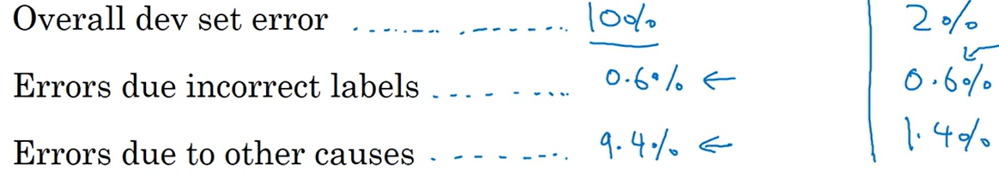

# 深度学习吴恩达老师课堂笔记（三）

## 3. 结构化机器学习项目

### 3.1 一些优化理论或经验

对于机器学习问题，大多数情况下有非常多的可以调节的超参数，在解决实际问题的时候需要有比较明确的方向来决定到底该调整哪个超参数，因此需要对超参数进行正交化，实际上也就是让每个超参数的含义更加明确。实际上这里就是通过设定目标（给定性能指标）和分析性能偏差（高方差or高偏差）这两步实现正交化。

首先比较重要的就是需要构建**单一**的网络性能评价指标（单实数评估指标）。比如偏斜分类问题中可以选取召回率和准确率的调和平均数作为评价指标。不过指标也会通过实际运行情况和误差分析结果不断改进（比如一开始认为只需要评价错误率后来发现必须要严格避免某一种错误从而在指标中增加该错误带来的权重之类的）。

前面提到过可以通过分析网络的训练集性能与验证集性能来判断当前是处于高方差还是处于高偏差，不过当时的分析都是将网络性能与100%正确率进行比较，在有些问题中这样的比较会导致网络性能反而下降，这是由参考对象选取的不准确导致的。一般而言，对于大多数问题而言，存在一个理论最高分类正确正确率，这一部分是由于样本本身就存在非常明显的人类都无法分辨的特征，进而导致网络也很难从中学习到明显的分类特征，这一部分会导致网络在实际应用的时候会存在贝叶斯最优错误率(Bayes optimal error)。实际上人类的能力在大多数任务中都很接近贝叶斯最优错误率，这也是为什么很多神经网络的性能在接近或者超过贝叶斯最优错误率以后进步就很缓慢，另一个可能是在达到人类水平之前人类可以提出很多方法来改善网络性能（比如外包人来大量标注数据集标签），而这些方法在网络性能已经提升的情况下就不怎么适用了（人类已经很难甚至不能分析出问题来源）。比如下面的问题，我们一般会通过将网络的训练集、验证集正确率来比较以分析当前出现的是高方差问题还是高偏差问题：

这上面这种情况下，一般会倾向于认为左侧网络出现了高偏差问题而右侧网络出现了高方差问题。而这种显然分析在网络性能接近甚至超过人类的情况下不怎么起作用以致人类不知道该如何改进网络（事实上，我们会认为人类能力【这里所谓的人类能力并不会泛指全体人类的平均水平，这个“人类”的定义会随着应用场景和任务需求发生变化，可能有的时候指的是一般人类水平有的时候指的是专家水平，总之需要抓住的一点就是我们在这个问题中使用人类平均水平来替代贝叶斯最优错误率】接近贝叶斯最优错误率从而网络不能再继续改进）。一般会将这里训练集误差与贝叶斯最优错误率之间的差距认为是“可避免偏差”，而将训练集误差与验证集误差之间的差距认为是方差。

对于数据集误标注引起的误差，一般来说，深度学习网络对于在训练集中的个别随机误差的适应能力是很强的，所以一般情况下不需要专门对训练集进行重新数据标注（不过如果标注误差存在明显的规律性则另当别论）。对于验证集和测试集的标注错误引起的问题则需要考察这一部分误标注对于最终分析指标造成的影响，比如下面这两种情况：

左侧情况误标注对最终结果影响很小，基本不会影响网络性能判断所以在左侧情况中也没有必要重新进行数据集标注；但是右侧情况下数据集标注误差已经占了总误差的大头所以在这种情况下很有必要重新进行**测试集+验证集**数据的重新标注。注意这里同时对测试集和验证集都重新进行数据标注主要是为了保证两边数据的严格同分布。在这种重新标注中需要注意的点就在于最好将整个测试集和验证集都重新标注**而不是只重新标注网络误分类的那一部分**，因为可能有些误标注结果被网络“蒙”对了而导致正确率虚高。

建立一个健壮的机器学习系统首先最关键的内容就是要快速搭建出第一版模型，选定指标后开始训练，在此基础上开始进行迭代改进。

在深度学习过程还存在的问题就是由于深度学习网络对于数据集的胃口非常大，所以一般很难获得一批直接完美契合测试场景的数据集。比如想要做一个在移动端进行动物分类的网络，实际可以从用户端获得的数据集可能有 20000 张（使用移动端设备拍摄出来的结果可能是模糊的、质量不佳的），但是可以通过网络手段从网站上找到 500000 张专业摄影后的数据集。在这种情况下直接把这两套数据集随机打乱后分配出训练集、测试集和验证集显然并不合理——实际的测试集中只有很少部分是我们真正想要用来学习的移动端数据，可能会花费大量时间在提高网络对于优质网图的识别正确率。因此合理的分类方式是将搜集到的 50w 张网图全部作为训练集，同时在训练集中掺杂 10000 张搜集到的移动端拍摄图像；再将剩下的 10000 张移动端拍摄图像平均分配到验证集和测试集中。不过这就会造成训练集和验证集、测试集的数据分布不一致，在深度学习网络中这是可以被接受的，但是很关键的一点就是需要保证验证集与测试集的数据分布一致性。

不过这样划分数据集会造成的问题就是，在上述例子中验证集数据的分类难度是高于训练集的，这必然会造成从训练集到验证集分类正确率的下降，按照前面的分析方法这种现象会被归类为过拟合，但是实际上在现在这种情况下这个结论并不能算作很合理。于是需要重新建立一个训练-验证集，这个数据集中的数据应当和训练集同分布但是没有被用于训练的。此时从训练集到训练-验证集的正确率变化反映的就是网络是否出现过拟合，从训练-验证集到验证集的正确率变化反映的**数据不匹配问题**。

对于数据不匹配问题的解决其实没有比较系统化的解决方案，首先就是人工观察两个数据集尝试发现不匹配的特征主要是什么，然后就可以通过数据增强手段（人工数据合成，不过就是需要考虑网络会不会对人工加入的这些特征过拟合）或者扩充数据集的方法来让训练集的分布更像测试集。
