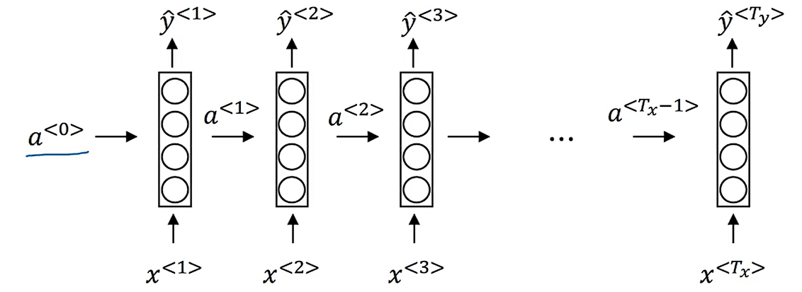
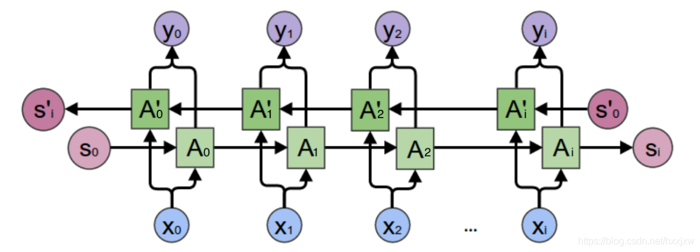
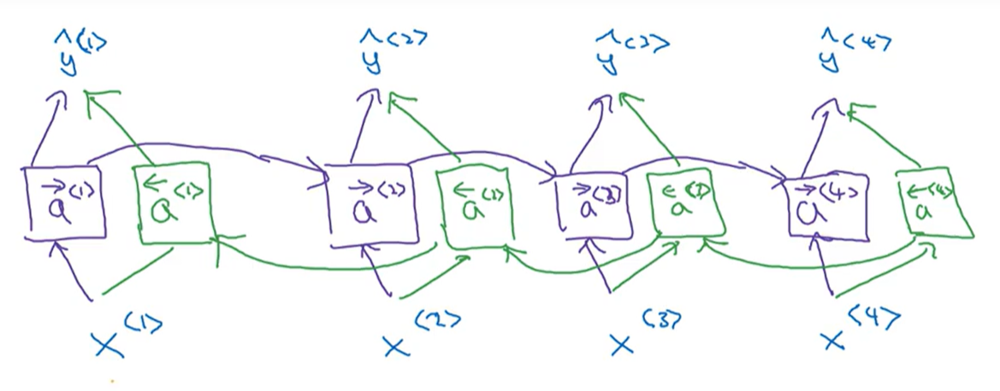

## 4.3 目标检测
目标检测首先要求网络拥有分类能力，比如想要实现图像中对于车辆的检测首先需要能够判断出图像中是否含有车辆；接下来需要完成的内容就是目标定位，即已知图像中有车辆，需要找到车辆在图像的哪个位置；最后需要解决图像中存在多个目标甚至多种不同目标的情况。

首先是分类问题，很显然这使用Softmax层就可以搭建网络训练出来，不再赘述。那么在此基础上开始考虑单目标定位的问题，这种定位我们期望网络输出的是目标所在四个角点的坐标——这里定义的图像坐标系是左上角为坐标原点，水平方向为x轴，垂直方向为y轴，图像右下角点坐标为(1,1)，而需要网络输出的就是目标中心点坐标和目标占据两个坐标轴的宽度四个参数：

以自动驾驶中可能需要的目标定位问题为例，这里需要网络检测的内容主要有这样三个：行人、汽车、摩托车。我们假设每张图像中最多只会出现上面的一个要素，于是构建的监督学习输出向量就是这样几个成员：
$$
\boldsymbol{y}=\begin{bmatrix}
p_c\\b_x\\b_y\\b_h\\b_w\\c_1\\c_2\\c_3
\end{bmatrix}\\
$$
- $p_c$表征的是图像中是否出现了待检测内容（可能会出现图片中没有行人、汽车、摩托车的情况，此时网络应该在这一位输出0）
- $b_x, b_y, b_h, b_w$就是被检测内容在图像中的位置
- $c_1,c_2,c_3$就是使用Softmax层输出的分类结果，指示网络的分类结果

此时如果输出参数的第一维为0，那么剩余的变量也将毫无意义，于是我们可以将损失函数定义为：
$$
L(\boldsymbol{y},\boldsymbol{\hat y})=\begin{cases}
\begin{align*}
\displaystyle\sum_{i=1}^8(\boldsymbol{y}_i-\boldsymbol{\hat y}_i)^2,\quad&\text{if
 }\boldsymbol{y}_1=1,\\
(\boldsymbol{y}_1-\boldsymbol{\hat y}_1)^2,\quad&\text{if
 }\boldsymbol{y}_1=0.
\end{align*}
\end{cases}\\
$$
当然对于$c_1,c_2,c_3$部分其实应该使用逻辑回归的方式来定义损失函数，这里就不再展开了。

相同的思路也可以用于特征点的标注检测从而可以用在其他比如表情检测、动作检测任务中。

而图像中存在多种多个目标情况的目标检测问题其实思路也很显然了，可以构造一组滑动窗口，在遍历过程中使用分类网络进行检测，不过常规滑动窗口在实现上计算成本非常高，因此有了为了优化这种思路的卷积滑动窗口实现。首先有一个观点就是全连接层其实也是一种卷积层，可以使用适当大小的卷积核将卷积层展平得到“全连接层”：

接下看如何使用卷积方式实现滑动窗口，首先已经有一个网络可以处理14×14×3的图像：

接下来考虑输入图像大小为16×16×3的情况，按照滑动窗口的思路这里需要使用14×14×3的窗口滑动共得到四组分类结果，但是因为这里的图像重合部分很大，所以前期卷积运算的重合度很高，因此构造出了卷积形式的滑动窗口实现：

实际上由于卷积核大小远小于图像大小，在滑动窗口运算中很大一部分运算都是重复的，因此在计算第二个滑动窗口的卷积结果的时候只需要增量计算黄色部分的卷积结果，相当于相同内容不再重复计算而是共同存储共同计算，不过在最后全连接的时候这里还是按照四个不同的输入图像来进行全连接。对于更大的图像也是这样的：

这样就大幅度降低了滑动窗口过程需要的计算量，但是这种方法还是会存在问题也就是位置边框的识别不够准确（滑动窗口使用的是分类网络而不是定位网络，因此找到的边界其实是滑动窗口的边界，很大概率和实际被检测目标的边框不重合），这里的解决方案就是大名鼎鼎的YOLO算法，它完成的内容主要就是将单张输入图像切割成非常多的小格（比如19×19），但是并不分开检测，还是套用前面的思路只对图像进行一次卷积，但是网络的期望输出修改成19×19×8的矩阵，这里每个块内的8维向量都是前面描述的向量$\boldsymbol{y}$，这里的创新点就是网络在观测到一个目标的时候只会在目标中心所在的方格对应的输出向量中说明，剩余的方格中则不会有额外说明：

比如上面的这张图，右侧面包车只会在黄橙色中心点所在的方块输出的向量中将pc输出为1，而这里的中心点坐标对应的是在小方格内的坐标，长宽信息也是相对于小方格的长款信息。而将这种方格划分得更密集可以使得一个方格内检测到两个目标**中心**的概率变得很低，从而实现每个网格输出的稳定性。

在这类任务中我们还需要找到一个能够评估网络性能指标的唯一实变量，在目标检测任务中这个变量一般定为期望标签与实际标签之间的IoU(Intersection over Union)也就是**交并比**，计算上就是两个图形的交集的面积和并集的面积之间的商。一般来说会认为IoU≥0.5的时候网络结果就是可以接受的。

在实际YOLO算法中，还会遇到的问题就是有可能有好几个网格都认为自己检测到了一个目标，但是实际上他们检测到的都是同一个目标，也就是一个目标可能会被多次识别：

为了解决这个问题，有一种常见做法就是非极大值抑制(Non-max suppression).实际上这里用到了前面的IoU的概念，首先算法会对网络检测出的目标按照输出pc的大小（网络直接输出的向量其实是认为这里存在目标的概率）进行排序并去除所有pc比较小的目标，从pc最大值开始检测对应边框与其他边框之间的IoU，通过这一步筛选会将重合度很高的边框全部抑制，从而使得算法最终输出的框确实是来自于不同的目标。

对于多种目标的检测，需要完成的就是按照类别分别进行多次非极大值抑制。

到此为止目标检测还有的最后一个问题就是同一个方格内存在多个目标中心的问题：

针对这种问题的解决方案就是构造多种不同的边框，比如针对上面的问题，车辆一般都是扁宽的长方形而人一般都是窄高的长方形所以构造两种不同的边框，同时将网络的输出向量扩充为16维（两种边框分别有8个变量），（标注时）每当遇到一个目标的时候，将目标所在边框和前面定义好的两种边框进行IoU运算选择更高的一个边框填入向量，比如上面的问题就可以这样标注标签：

这里的黄色标注的就是人而绿色部分标注的就是汽车。

还有一种R-CNN算法，就是通过图像分割算法先将图像分割成不同的部分，然后可以找到可能潜在目标的地方，可以减小无意义计算降低计算量，还能保证检测的精准性：

不过这种图像分块算法的运算速度也比较低，所以近来又提出了Fast R-CNN算法（卷积实现）和Faster R-CNN算法（使用卷积网络实现图像分块），不过整体来说都比YOLO要慢。
## 4.4 特殊应用：人脸识别和神经风格迁移
人脸识别在门禁系统中应用的比较多，而人脸识别会遇到的比较明显的问题就是一次性学习问题——你搜集到的目标人脸可能只有一张照片，需要通过单单一张照片构建出能够识别出这个人的网络。因此直接使用输入图片输出分类的方式搭建这个系统显然是不可行的——深度学习网络需要大量数据来支撑。

这里的解决方案就是不要让网络学习人脸分类，而是学习人脸照片之间的相似度函数，需要让网络完成的就是输入两张照片，输出这两张照片是同一个人的可能性。

这里使用的就是Siamese网络，该网络输入一张图片输出该图片的“特征向量”，而相似度函数可以定义为两张图片的“特征向量”终点之间的距离平方（下图描述的是同一个网络对于不同输入的输出）：

这里输出的特征向量$\boldsymbol{f}(\boldsymbol{x}^{(i)})$就被称为输入的编码(encoding)，我们期望实现的就是当输入图片不是同一个人的时候两者输出编码差异比较大，反之比较小。首先需要明确的时候为了衡量这里的误差以及大小差异，需要同时向网络中输入三张图片（两张是同一个人的，另一张其他人的）：

于是我们可以将损失函数定义为：
$$
L(\boldsymbol{A},\boldsymbol{P},\boldsymbol{N})=\max(||\boldsymbol{f}(\boldsymbol{A})-\boldsymbol{f}(\boldsymbol{P})||^2-||\boldsymbol{f}(\boldsymbol{A})-\boldsymbol{f}(\boldsymbol{N})||^2+\alpha,0)\\
$$
显然可以发现这里的损失函数是一个“三元”函数，这里的$\alpha$是间隙系数，该参数主要是为了使得两个分类之间具有一定的间隙（有点像SVM的思路）。于是在大数据集下我们就需要划分出这样的三元组数据集，使用这些三元组数据集进行梯度下降来学习这里的编码函数。实际上如果完全随机选取这样的三元组的话这里的约束条件其实很容易达到，因为A，P和N之间的差距会比较明显，网络实际能学习到的有效内容不多，为此研究者建立了FaceNet系统来加大学习难度，整体而言提升了网络的学习效果。

前面的三元训练方法是一种完成该任务的方法，不过Siamese网络结构中直接构建二分类的方法其实也有很多，比如还是通过同一网络分别对两张图像进行卷积输出特征向量，然后在外面专门构建一组激活函数：
$$
\hat y=\sigma\left(\sum_{k=1}^N \omega_i\left|\boldsymbol{f}(\boldsymbol{x}^{(i)})_k-\boldsymbol{f}(\boldsymbol{x}^{(j)})_k\right|+b\right)\\
$$
这里$\boldsymbol{x}^{(i)}$是当前人脸识别系统从相机输入的图像，$\boldsymbol{x}^{(j)}$是数据库中录制好的人脸图像。除了这里直接每个元素做差求和，也有采用$\chi^2$判据写成：
$$
\hat y=\sigma\left[\sum_{k=1}^N \omega_i\frac{\left(\boldsymbol{f}(\boldsymbol{x}^{(i)})_k-\boldsymbol{f}(\boldsymbol{x}^{(j)})_k\right)^2}{\boldsymbol{f}(\boldsymbol{x}^{(i)})_k+\boldsymbol{f}(\boldsymbol{x}^{(j)})_k}+b\right]\\
$$
这样就可以在部署的时候将该问题作为一个二分类问题来使用。为了计算的方便，网络对于数据库中已有数据的特征向量可以预存储，而不用每次计算的时候重新用网络计算特征向量。

深度学习网络还能完成的另一项内容就是风格迁移，比如输入内容**C**和风格**S**就可以得到迁移以后的图像**G**：

构建这种风格迁移网络首先需要构建代价函数来描述迁移的好坏。为了让网络自己找到内容和风格之间的平衡，这里构建的代价函数分为内容代价和风格代价两个部分：
$$
J(\boldsymbol{G})=\alpha J_{\textrm{content}}(\boldsymbol{C},\boldsymbol{G})+\beta J_{\textrm{style}}(\boldsymbol{S},\boldsymbol{G})\\
$$
这个算法的大致工作流程就是随机初始化G图像，然后直接使用梯度下降方法最小化J(G)，这里梯度下降的输入变量其实是G图像的每一个像素点。不过现在这里最关键的还是选择合适的风格代价函数和内容代价函数。

这里使用一个预先训练好的网络（比如VGG）来计算内容误差，分别取两张图像在该网络下输出的激活值$\boldsymbol{a}^{[l](C)}$和$\boldsymbol{a}^{[l](G)}$（是向量），于是可以将内容代价定义成这样：
$$
J_{\textrm{content}}(\boldsymbol{C},\boldsymbol{G})=||\boldsymbol{a}^{[l](C)}-\boldsymbol{a}^{[l](G)}||^2\\
$$
接下来考虑风格代价函数，这里我们还是使用一个网络来提取风格，使用两张图片在同一网络下的输出实际的相关程度来描述风格的接近程度。这里使用输出激活值的自相关矩阵（为了方便起见就不减去平均值了）来刻画相关程度，假设$a_{i,j,k}^{[l](S)}$是图像S在网络第l层输出（是三维矩阵）的下标为i,j,k的值，那么我们可以将风格矩阵定义成这样：
$$
\boldsymbol{G}_{kk'}^{[l](S)}=\sum_{i=1}^{n_H^{[l]}}\sum_{j=1}^{n_W^{[l]}}a_{i,j,k}^{[l](S)}a_{i,j,k'}^{[l](S)}\\
\boldsymbol{G}_{kk'}^{[l](G)}=\sum_{i=1}^{n_H^{[l]}}\sum_{j=1}^{n_W^{[l]}}a_{i,j,k}^{[l](G)}a_{i,j,k'}^{[l](G)}\\
$$
而风格代价函数就是这两个矩阵按元素平方和：
$$
\begin{align*}
J_{\textrm{style}}(\boldsymbol{S},\boldsymbol{G})&=\frac{1}{\left(2n_H^{[l]}n_W^{[l]}n_c^{[l]}\right)^2}||\boldsymbol{G}^{[l](S)}-\boldsymbol{G}^{[l](G)}||_F^2\\
&=\frac{1}{\left(2n_H^{[l]}n_W^{[l]}n_c^{[l]}\right)^2}\sum_k\sum_{k'}\left(\boldsymbol{G}_{kk'}^{[l](S)}-\boldsymbol{G}_{kk'}^{[l](G)}\right)^2
\end{align*}\\
$$
实际上，如果对每一层都单独计算风格代价并求和效果会更好，不过会需要更多的超参数。

# 5. 序列模型
## 5.1 循环神经网络(Recurrent Neural Network, RNN)
输入序列一般记作$\boldsymbol{x}$，访问输入序列的固定下标一般使用$\boldsymbol{x}^{<t>}$，输入序列的长度一般使用$T_x$来表示；同理，输入序列一般记作$\boldsymbol{y}$，访问输入序列的固定下标一般使用$\boldsymbol{y}^{<t>}$，输入序列的长度一般使用$T_y$来表示。值得注意的就是不同的输入样本可能具有不相同的长度，表述具体某一个数据样本的某一个数据可以使用$\boldsymbol{x}^{(i)<t>}$来表示，该样本的长度是$T_x^{(i)}$。

实际上在表述输入的语句的时候很多网络会首先将语句划分成单词表里面的单词，然后使用一个列向量来替换这个单词，每个列向量的长度都和字典中的单词数相等，而只有在对应单词的位置对应元素是1其余位置都是0，我们将这种字典索引向量称为One-shot Vector：

通过上面的符号定义很容易就可以构建出监督学习网络的框架（输入$\boldsymbol{x}$通过监督学习输出$\boldsymbol{y}$），不过会遇到的问题就是不同的输入序列的长度可能并不一致，所以输入神经元的个数就不确定；其次，如果是按照常规神经元的连接方式，从文本不同位置上学习到特征并不共享；最后就是前面对于单词的编码格式决定了输入层体量非常大，进而决定着输入层的参数量非常非常大。为了解决序列预测中存在的这些问题提出了循环神经网络的结构：

循环神经网络的输出是按照时间步进行的，对于每一个输入，网络都会预测一个输出，同时还会将本次输出对应的激活值保留在网络中，等待下一时刻网络的输入，有些时候这种结构也会被画成这种循环的格式：

循环神经网络从左到右扫描输入序列，在每一个时间步上，网络的参数都是共享的，所以每一时刻的输出不仅取决于当前时刻的输入，还会取决于前面的输入，有点像IIR滤波器。显然这种结构的缺点也很明显，也就是网络在计算t时刻的输出时，只会考虑t时刻之前的输入，不会使用到t时刻之后的信息（因为还没被输入到网络中），为了解决这个问题需要提出双向RNN的概念，不过这里暂时还不会涉及到。

这里来看一下RNN的前向传播过程，其实基本过程和前面描述的很相似：
$$
\boldsymbol{a}^{<0>}=\boldsymbol{0}\\
\boldsymbol{a}^{<1>}=g_1(\boldsymbol{\omega}_{aa}\boldsymbol{a}^{<0>}+\boldsymbol{\omega}_{ax}\boldsymbol{x}^{<1>}+b_a)\\
\boldsymbol{\hat y}^{<1>}=g_2(\boldsymbol{\omega}_{ya}\boldsymbol{a}^{<1>}+b_y)\\
\vdots\\
\boldsymbol{a}^{<t>}=g_1(\boldsymbol{\omega}_{aa}\boldsymbol{a}^{<t-1>}+\boldsymbol{\omega}_{ax}\boldsymbol{x}^{<t>}+b_a)\\
\boldsymbol{\hat y}^{<t>}=g_2(\boldsymbol{\omega}_{ya}\boldsymbol{a}^{<t>}+b_y)\\
$$
在RNN中常见的激活函数是在$g_1$部分使用$\tanh$或者$\text{ReLU}$函数而在$g_2$部分使用$\text{Sigmoid}$函数（用于0-1分类问题），上面的计算式最终可以被简写成这样：
$$
\boldsymbol{a}^{<t>}=g_1\left(\boldsymbol{W}_{a}\begin{bmatrix}\boldsymbol{a}^{<t-1>}\\\boldsymbol{x}^{<t>}\end{bmatrix}+b_a\right)\\
\boldsymbol{\hat y}^{<t>}=g_2(\boldsymbol{W}_{y}\boldsymbol{a}^{<t>}+b_y)\\
$$
RNN的前向传播流程就是这样的，接下来考虑一下反向传播过程，首先需要定义针对单个元素的损失函数：
$$
L^{<t>}(\boldsymbol{\hat y}^{<t>},\boldsymbol{y}^{<t>})=-\boldsymbol{y}^{<t>}\ln\boldsymbol{\hat y}^{<t>}-\left(1-\boldsymbol{y}^{<t>}\right)\ln\left(1-\boldsymbol{\hat y}^{<t>}\right)\\
$$
而整个序列的损失函数就是各个元素损失之和：
$$
L(\boldsymbol{\hat y},\boldsymbol{y})=\sum_{t=1}^{T_y}L^{<t>}(\boldsymbol{\hat y}^{<t>},\boldsymbol{y}^{<t>})\\
$$
接下来反向传播过程其实就和普通神经网络的推导方式一样了，这种反向传播有一个比较令人惊讶的名字就是“随时间反向传播”(Backpropagation Through Time, BPTT)，其实只是随着序列反向传播回去罢了。

前面讨论的RNN结构其实只能处理输入输出序列长度相等的情况，但是有很多问题输入输出序列长度并不相等，所以需要针对这个问题改进网络结构。首先刚刚处理的问题其实是多对多问题，首先再来考虑一种比较简单的情况也就是多对一情况——需要读取用户评价给出用户可能的评分，这就是输入一个序列输出一个数字；有时候也会出现一对多结构——使用一个关键词来生成一段音乐，网络结构可能是这样的：

以及多对多问题——翻译问题中输入序列的长度可能和输出序列的长度不一样，可以考虑在输入语句结束以后进行输出，这样网络就被划分成Encoder和Decoder两个部分：

总的来说，常见的RNN网络结构大体来说是这样的：

语言模型的构建是RNN的一个重大应用场合，语言模型的主要任务就是计算某一中序列组合出现的概率（比如“我是学生”这个组合出现的概率就远高于“我是学牛”以及“我学是生”），这种计算在翻译等场合中非常常见。为了训练这样的语言模型，需要的训练集是大量的语言文本序列，这里的构建方式就是每个语句都使用若干One-shot Vector（表征语句中的每个单词）来构建，有些模型中还需要加入语句结束标识符EOS(End of Sentence)和标点符号信息等。当然有的时候也会出现字典中没有出现过的句子，这种情况下可以考虑将该单词标记为未知\<UNK>，按照这种方式构建完输入序列以后就可以开始预测了。以Cats average 15 hours of sleep a day.\<EOS>这句话为例，第一步首先向网络输入第一个输入值为$\boldsymbol{x}^{<1>}=\boldsymbol{0}$，上一次的激活值$\boldsymbol{a}^{<0>}=\boldsymbol{0}$，于是网络计算出各个词出现的可能性最终通过Softmax层预测出可能的第一个单词$\boldsymbol{\hat y}^{<1>}$，同时将此时的激活值$\boldsymbol{a}^{<1>}$作为下一时刻的初始激活值，将下一时刻的输入选定为$\boldsymbol{x}^{<2>}=\boldsymbol{y}^{<1>}$（**相当于这里告诉网络实际该句子第一个单词是Cat让网络预测第二个单词是什么**），依次循环，此时的网络输出其实是$\boldsymbol{\hat y}^{<2>}=P(\textrm{average}|\textrm{Cat})$，最终到句子输入结束。这个过程中网络一直都可以获得在这个时间步之前的所有单词，需要完成的就是预测出这个时间步所对应的单词。我们可以针对每个时间步写出损失函数：
$$
L^{<t>}(\boldsymbol{\hat y}^{<t>},\boldsymbol{y}^{<t>})=-\sum_{i}y_i^{<t>}\ln\hat y_i^{<t>}\\
$$
总的代价函数为：
$$
J=\sum_{t}L^{<t>}(\boldsymbol{\hat y}^{<t>},\boldsymbol{y}^{<t>})\\
$$
这样就可以开始训练一个RNN网络了。在训练好一个RNN网络**生成模型**以后，一种检测网络行为的方法就是对网络进行新序列采样——首先在第一个时间步给网络输入零向量，然后在网络的输出上根据输出概率进行随机采样得到单词作为下一时间步的输入，依此循环往复得到输出序列一直到获得EOS标签为止。不过这种方法有的时候会输出UNK标志，这会导致输出结果并不完全合理，不过在这种输出框架下的唯一解决方案就是在采样的时候避开UNK标识符或者遇到UNK的时候重新采样。大概的输出模式就是这样的：

不过还可以考虑构建字典的时候并不构建单词，而是只构建单个的英文字母，这样模型就不会遇到未知字符了，比如将字典构造成$\{a,b,c,\dots,z,A,B,\dots,Z,\dots\}$的形式就不再会遇到UNK这种内容了，不过这样构建出来的模型就是基于字符的模型而不是基于单词的模型了。不过缺点就是会得到太多太长的序列进而导致模型捕获句子之间的依赖关系的能力下降，此外这种模型的计算成本比较高昂。

通常来说，RNN模型很难捕获长语句前后的关系（比如动词是否应该使用第三人称单数形式，在句子很长的时候网络很容易犯错误），这是因为梯度消失导致的长语句前后部分的关联性很弱导致的。在RNN中梯度爆炸很容易发现（输出NaN等）也比较容易解决——比如使用梯度修剪方法，当梯度大于某个阈值以后通过一些最大值来修剪梯度，但是梯度消失的问题比较难处理。一般而言会采用GRU(Gated Recurrent Unit, 门控循环单元)来解决，GRU的主要思路就是在RNN中引入记忆单元来帮助网络记忆长跨度信息，这里的记忆单元的记忆方式就是：
$$
c^{<t>}=a^{<t>}\\
\tilde c^{<t>}=g\left(\boldsymbol{W}_{c}\begin{bmatrix}\boldsymbol{c}^{<t-1>}\\\boldsymbol{x}^{<t>}\end{bmatrix}+b_c\right)\\
$$
不过这个记忆单元并不是每次都会记忆新的内容，这里就引出了所谓的“门”的概念，这里构造了一个阈值函数：
$$
\Gamma_u=\textrm{Sigmoid}\left(\boldsymbol{W}_{u}\begin{bmatrix}\boldsymbol{c}^{<t-1>}\\\boldsymbol{x}^{<t>}\end{bmatrix}+b_u\right)\\
$$
这个阈值结果会作用于记忆结果：
$$
c^{<t>}=\Gamma_u\tilde c^{<t>}+(1-\Gamma_u)c^{<t-1>}\\
$$
为了使这个记忆单元发挥该有的记忆作用，这里的$\Gamma_u$的结果一般非常接近0或者1，也就是几乎呈现出门开启或者关闭的二值状态。不过实际上完整的标准形式的GRU还有另一个阈值来表征上一次记忆结果与当前输出值的相似程度，最终的运算流程是这样的：
$$
\vdots\\ \textrm{}\\
\boldsymbol{\Gamma}_r=\textrm{Sigmoid}\left(\boldsymbol{W}_{r}\begin{bmatrix}\boldsymbol{c}^{<t-1>}\\\boldsymbol{x}^{<t>}\end{bmatrix}+b_r\right)\\
\boldsymbol{\tilde c}^{<t>}=g\left(\boldsymbol{W}_{c}\begin{bmatrix}\boldsymbol{\Gamma}_r\odot\boldsymbol{c}^{<t-1>}\\\boldsymbol{x}^{<t>}\end{bmatrix}+b_c\right)\\
\boldsymbol{\Gamma}_u=\textrm{Sigmoid}\left(\boldsymbol{W}_{u}\begin{bmatrix}\boldsymbol{c}^{<t-1>}\\\boldsymbol{x}^{<t>}\end{bmatrix}+b_u\right)\\
\boldsymbol{c}^{<t>}=\boldsymbol{\Gamma}_u\odot\boldsymbol{\tilde c}^{<t>}+(\boldsymbol{1}-\boldsymbol{\Gamma}_u)\odot\boldsymbol{c}^{<t-1>}\\
\vdots\\
$$
这里的$\boldsymbol{\Gamma}_r$决定的是是否需要记忆新的数据，当他趋于0的时候说明上一时刻的内容需要全部丢弃，只保留当前时刻的输入，所以可以用来丢弃与预测无关的历史信息；反之当它趋于1的时候表示完全保留上一时刻的隐藏状态，因此它也被称为重置门，有助于捕捉时间序列里短期的依赖关系。

同理$\boldsymbol{\Gamma}_u$用于控制前一时刻的状态信息被带入到当前状态中的程度，也就是更新门帮助模型决定到底要将多少过去的信息传递到未来，简单来说就是用于更新记忆。因此它也被称为**更新门**。GRU就是通过这两个门来实现的记忆更新，这里的c其实也就是实际网络的输出y。网上常见的符号体系与上面的这一套不一致，不过可以参看一下大致的步骤：

除了GRU以外，还有一种比较常见的用于解决梯度消失的网络结构就是LSTM(Long Short Term Memory, 长短期记忆)，它相比GRU提出得更早，参数量也更大，不过两者的效果差不多。有些时候 LSTM 在记忆部分能够做得比 GRU 更好，它相比 GRU 多了一个门，它的更新方式是这样的：
$$
\vdots\\
\boldsymbol{\tilde c}^{<t>}=\tanh\left(\boldsymbol{W}_c
\begin{bmatrix}
\boldsymbol{a}^{<t-1>} \\ \boldsymbol{x}^{<t>}
\end{bmatrix}
+b_c\right)\\
\boldsymbol{\Gamma}_u=\sigma\left(\boldsymbol{W}_u
\begin{bmatrix}
\boldsymbol{a}^{<t-1>} \\ \boldsymbol{x}^{<t>}
\end{bmatrix}
+b_u\right)\\ \textrm{}\\
\boldsymbol{\Gamma}_f=\sigma\left(\boldsymbol{W}_f
\begin{bmatrix}
\boldsymbol{a}^{<t-1>} \\ \boldsymbol{x}^{<t>}
\end{bmatrix}
+b_f\right)\\ \textrm{}\\
\boldsymbol{\Gamma}_o=\sigma\left(\boldsymbol{W}_o
\begin{bmatrix}
\boldsymbol{a}^{<t-1>} \\ \boldsymbol{x}^{<t>}
\end{bmatrix}
+b_o\right)\\ \textrm{}\\
\boldsymbol{c}^{<t>}=\boldsymbol{\Gamma}_u\odot\boldsymbol{\tilde c}^{<t>}+\boldsymbol{\Gamma}_f\odot\boldsymbol{\tilde c}^{<t-1>}\\
\boldsymbol{a}^{<t>}=\boldsymbol{\Gamma}_o\odot\tanh\boldsymbol{c}^{<t>}\\ \vdots\\
$$
这里使用的三个门分别被称为更新(Update)门、遗忘(Forget)门和输出(Output)门，整体算法结构大概是这样的：

通过这种框图可以很容易发现神经元之间除了传递$\boldsymbol{a}^{<t>}$以外还会传递$\boldsymbol{c}^{<t>}$，可以很容易地通过上述框图意识到神经元的记忆方式。

上面的结构还是具有改进空间，主要就是[当前的细胞状态不能影响到三个门在下一时刻的输出，使整个细胞状态对上一单元模块的序列处理中丢失了部分信息，因此在内部网络结构中加入了窥孔连接，该连接可以让门观察到细胞状态](https://blog.csdn.net/weixin_55575757/article/details/128065468)。因此需要将网络更新迭代的结构改成这样：
$$
\vdots\\
\boldsymbol{\tilde c}^{<t>}=\tanh\left(\boldsymbol{W}_c
\begin{bmatrix}
\boldsymbol{a}^{<t-1>} \\ \boldsymbol{x}^{<t>}
\end{bmatrix}
+b_c\right)\\ \textrm{}\\
\boldsymbol{\Gamma}_u=\sigma\left(\boldsymbol{W}_u
\begin{bmatrix}
\boldsymbol{c}^{<t-1>} \\ \boldsymbol{a}^{<t-1>} \\ \boldsymbol{x}^{<t>}
\end{bmatrix}
+b_u\right)\\ \textrm{}\\
\boldsymbol{\Gamma}_f=\sigma\left(\boldsymbol{W}_f
\begin{bmatrix}
\boldsymbol{c}^{<t-1>} \\ \boldsymbol{a}^{<t-1>} \\ \boldsymbol{x}^{<t>}
\end{bmatrix}
+b_f\right)\\ \textrm{}\\
\boldsymbol{\Gamma}_o=\sigma\left(\boldsymbol{W}_o
\begin{bmatrix}
\boldsymbol{c}^{<t-1>} \\ \boldsymbol{a}^{<t-1>} \\ \boldsymbol{x}^{<t>}
\end{bmatrix}
+b_o\right)\\ \textrm{}\\
\boldsymbol{c}^{<t>}=\boldsymbol{\Gamma}_u\odot\boldsymbol{\tilde c}^{<t>}+\boldsymbol{\Gamma}_f\odot\boldsymbol{\tilde c}^{<t-1>}\\
\boldsymbol{a}^{<t>}=\boldsymbol{\Gamma}_o\odot\tanh\boldsymbol{c}^{<t>}\\ \vdots\\
$$
这种结构常被称为“窥视孔连接”。

接下来讨论一下另一种 RNN 网络，他也被称为“双向循环神经网络”(Bidirectional RNN, or Bi-RNN, BRNN)，它能够实现在序列的某个位置同时能够获取当前时间步之前和之后的信息；这一点需求在前面已经提到过，可以在序列前长度比较短的时候实现比较高准确率的预测。它实质上就是构造了两条信号通路来实现信号的双向流通，不过代价就是会增加一组神经元，这就是它的网络结构图（**注意图中的神经元不仅可以是简单的 RNN 神经元还可以是 GRU 或者 LSTM 单元**）：

此时的输出单元的计算表达式就应该写成：
$$
\boldsymbol{\hat y}^{<t>}=g(\boldsymbol{W}_{y}\begin{bmatrix}
{\mathop{\boldsymbol{a}}\limits^{\leftarrow}}^{<t>} \\ {\mathop{\boldsymbol{a}}\limits^{\rightarrow}}^{<t>}
\end{bmatrix}+b_y)
$$
到此为止已经学习了很多的 RNN 算法，不过为了让 RNN 能够学习到更加深层更加复杂的特征，通常会使用深度 RNN 网络，首先来回顾一下 RNN 网络的结构：

可以写一下$\boldsymbol{a}^{[2]<3>}$神经元的计算公式：
$$
\boldsymbol{a}^{[2]<3>}=g\left(\boldsymbol{W}_a^{[2]}\begin{bmatrix}
    \boldsymbol{a}^{[2]<2>} \\ \boldsymbol{a}^{[1]<3>}
\end{bmatrix}+b_a^{[2]}\right)
$$
当然这里的神经元也没有必要一定得是标准的 RNN 神经元，其实也可以是 LSTM 或者 GRU 神经元，可以发现，由于横向的时间步之间的连接存在， RNN 神经网络的推理速度其实是比较慢的。当然深层 RNN 可以不断叠加这种具有水平连接的网络层，不过更常规的做法是在这种 RNN 层以后连接互相独立的、没有水平连接的深度神经网络层：

