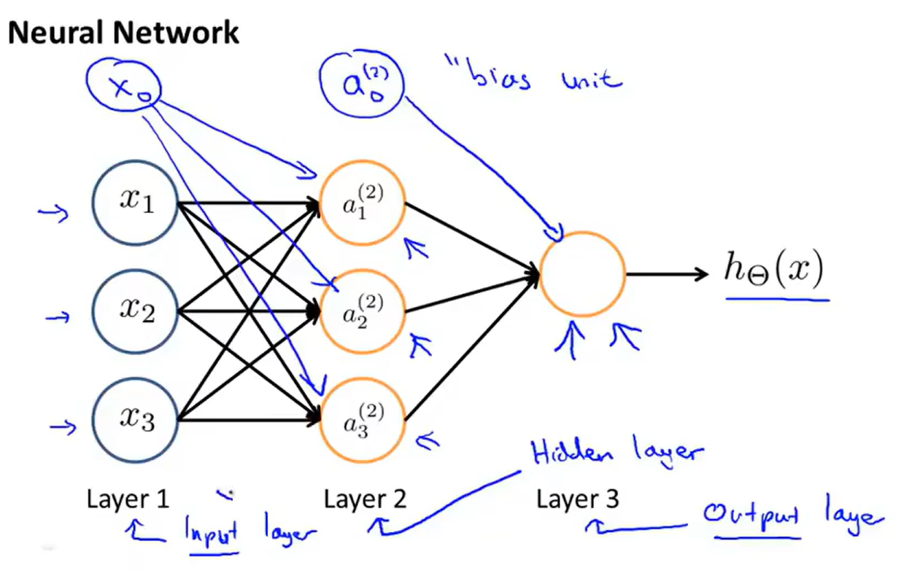
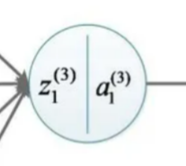
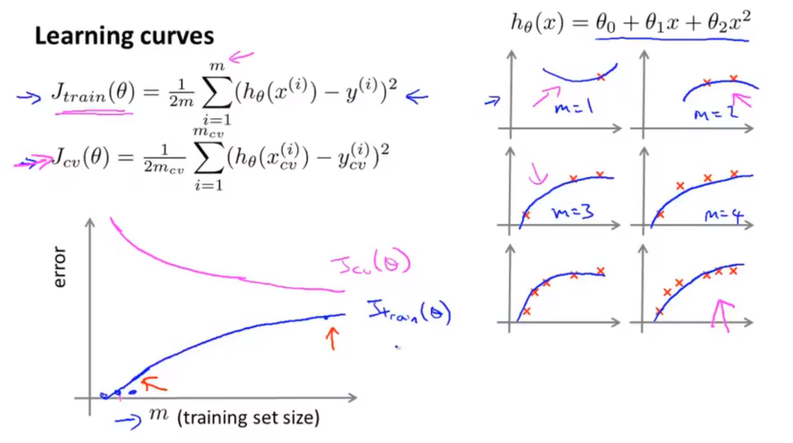
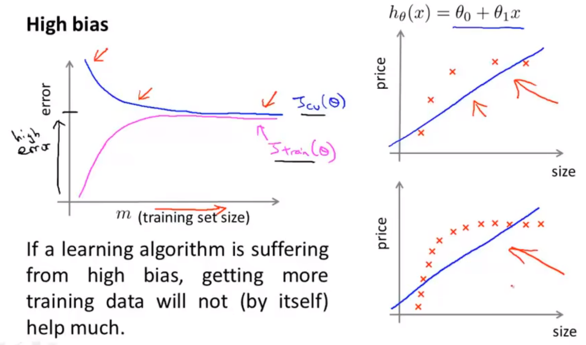

#! https://zhuanlan.zhihu.com/p/662954666
# 机器学习吴恩达老师课堂笔记（二）
前面已经在[机器学习吴恩达老师课堂笔记（一）](https://zhuanlan.zhihu.com/p/662873124)中写过简单的线性回归和逻辑回归模型了，这一部分继续来讲神经网络。

## 2. 有监督学习（续）
### 2.4 非线性回归——神经网络(Neural Network)

在线性回归中一般会使用一些多项式假设函数来表示复杂的函数或者决策边界，但是实际上会发现当特征量的参数越来越多的时候多项式的项数会急速上涨（二次多项式$o(n^2)$，三次多项式$o(n^3)$......），实际上会发现这种多项式拟合的思路在特征量n上涨的时候会带来明显的运算量上升和过拟合问题。因此需要引入非线性拟合的概念。

首先来看一下人类神经网络的构成：神经元具有若干个接受输入信号的树突(Dendrite)和一个轴突(Axon)，总的来说神经元收集来自其他若干神经元的信息经过运算处理以后传输给其他后级神经元。为了模仿人类神经元的这种构造提出了这样的神经网络模型：

<!--  -->
这里的$h_{\boldsymbol{\theta}}(\boldsymbol{x})$就常被称为激活函数，比如$h_{\boldsymbol{\theta}}(\boldsymbol{x})=\displaystyle\frac{1}{1+e^{-\boldsymbol{\theta}^T\boldsymbol{x}}}$就是Sigmoid激活函数(Sigmoid/Logistic activation function).而这里的$\boldsymbol{\theta}$被称为神经网络的参数或者权重(Weight)。

说完单个的神经元就不难想到整个的神经网络：

<!--  -->
在这个神经网络中就存在一个输入层、一个输出层和一个隐藏层（任何一个不是输入层也不是输出层的神经网络层就是隐藏层）。
这里有几个参数的含义需要解释一下：

- $a_i^{(j)}$代表第j层中的第i个神经元的激活项（输出）
- $\Theta^{(j)}$代表控制从第j层到第(j+1)层映射的参数矩阵，如果第j层共有$s_j$个神经元而第s+1层共有$s_{j+1}$个神经元那么$\Theta^{(j)}$的维数就是$s_{j+1}\times(s_j+1)$

上面这个神经网络表达的表达式就是这样：
$$
\begin{align*}
\begin{cases}
a_1^{(2)}&=g(\Theta_{10}^{(1)}x_0+\Theta_{11}^{(1)}x_1+\Theta_{12}^{(1)}x_2+\Theta_{13}^{(1)}x_3)\\
a_2^{(2)}&=g(\Theta_{20}^{(1)}x_0+\Theta_{21}^{(1)}x_1+\Theta_{22}^{(1)}x_2+\Theta_{23}^{(1)}x_3)\\
a_3^{(2)}&=g(\Theta_{30}^{(1)}x_0+\Theta_{31}^{(1)}x_1+\Theta_{32}^{(1)}x_2+\Theta_{33}^{(1)}x_3)\\
h_{\boldsymbol{\Theta}}(\boldsymbol{x})&=a_1^{(3)}=g(\Theta_{10}^{(2)}a_0^{(2)}+\Theta_{11}^{(2)}a_1^{(2)}+\Theta_{12}^{(2)}a_2^{(2)}+\Theta_{13}^{(2)}a_3^{(2)})
\end{cases}
\end{align*}\\
$$
可以发现这里的$\Theta$的右下角标是层间映射的映射关系，比如$\Theta_{20}$就表示的是从上一层的第0个元素到下一层的第2个元素的映射关系，而右上角标则表示的是当前所在层的层号。

接下来就是将神经网络进行矩阵化描述，首先假设每一层的部分值分别可以表述为：
$$
\boldsymbol{x}=\begin{bmatrix}
x_0 \\ x_1 \\ x_2 \\ x_3
\end{bmatrix}, \boldsymbol{z}^{(2)}=\begin{bmatrix}
\boldsymbol{z}_1^{(2)} \\ \boldsymbol{z}_2^{(2)} \\ \boldsymbol{z}_3^{(2)}
\end{bmatrix}\\
$$
这里的z代表的是未激活的函数值，于是就可以写出这样的表达式：
$$
\boldsymbol{z}^{(2)}=\boldsymbol{\Theta}^{(1)}\boldsymbol{x}=\boldsymbol{\Theta}^{(1)}\boldsymbol{a}^{(1)}\\
\boldsymbol{a}^{(2)}=g(\boldsymbol{z}^{(2)})\in\mathbb{R}^3\\
$$
这里的$\boldsymbol{a}^{(1)}$就是输入第一层的特征数据，但是注意从上面方式计算出来的结果其实是缺维度的，我们需要补充$a_0^{(2)}=1$才能正常组合出一个四维向量继续进行后面的计算：
$$
\boldsymbol{z}^{(3)}=\boldsymbol{\Theta}^{(2)}\boldsymbol{a}^{(2)}\\
h_{\boldsymbol{\Theta}}(\boldsymbol{x})=\boldsymbol{a}^{(3)}=g(\boldsymbol{z}^{(3)})\\
$$
这种网络的结构也被称为前向传播网络。

按照这种方法其实对于解决前面提到的多分类问题就有比较好的解决方案了，比如四分类问题就可以将输出向量选定为
$$
\begin{bmatrix}
1 & 0 & 0 & 0
\end{bmatrix}^T,\begin{bmatrix}
0 & 1 & 0 & 0
\end{bmatrix}^T,\begin{bmatrix}
0 & 0 & 1 & 0
\end{bmatrix}^T,\begin{bmatrix}
0 & 0 & 0 & 1
\end{bmatrix}^T
$$
中的一个，构建合适的网络结构（就是后面会提到的Softmax）就可以实现多分类问题。

对于一个典型的神经网络结构，我们做如下的规定：

- L——神经网络的总层数
- sl——在第l层网络中神经元的个数（不算偏置神经元）

在分类问题中，二分类问题的输出都是1个单元(K=1)输出单个的数字而n分类问题的输出都是n个神经元(K=n≥3)分别输出n维向量【K=2的时候就是二分类问题，只需要一个输出变量就可以了】。

接下来就需要定义神经网络的代价函数了，与逻辑回归的代价函数相似的，神经网络的代价函数可以被写成：
$$
J(\boldsymbol{\Theta})=-\frac{1}{m}\left[\sum_{i=1}^{m}\sum_{k=1}^{K} \left[y_{k}^{(i)} \log \left( h_{\boldsymbol{\Theta}} (x^{(i)}\right)_ {k} +(1- y_ {k}^ {(i )} ) \log \left(1-(h_{\boldsymbol{\Theta}}(x^ {(i)})_ {k} \right) \right]\right]+\frac{\lambda}{2m}\sum_{l=1}^{L-1}\sum_{i=1}^{s_l}\sum_{j=1}^{s_l+1}\left(\Theta_{ji}^{(l)}\right)^2\\
$$
这里因为$h_{\boldsymbol{\Theta}} (x^ {(i)})\in\mathbb{R}^K$所以这里用$h_{\boldsymbol{\Theta}} (x^ {(i)})_k$来表示该向量的第k个元素。

接下来介绍反向传播算法(Backpropagation Algorithm)，这是一种梯度下降的算法（网络中参数过多，直接计算梯度有困难）（吴恩达老师这一部分没有推导，所以这一部分是从网上找了一个链接[解读反向传播算法（图与公式结合）](https://zhuanlan.zhihu.com/p/96046514#:~:text=%E5%8F%8D%E5%90%91%E4%BC%A0%E6%92%AD%EF%BC%88BP%2C,back%20propagation%EF%BC%89%E6%98%AF%E2%80%9C%E8%AF%AF%E5%B7%AE%E5%8F%8D%E5%90%91%E4%BC%A0%E6%92%AD%E2%80%9D%E7%9A%84%E7%AE%80%E7%A7%B0%EF%BC%8C%E6%98%AF%E4%B8%80%E7%A7%8D%E4%B8%8E%E6%9C%80%E4%BC%98%E5%8C%96%E6%96%B9%E6%B3%95%EF%BC%88%E5%A6%82%E6%A2%AF%E5%BA%A6%E4%B8%8B%E9%99%8D%E6%B3%95%EF%BC%89%E7%BB%93%E5%90%88%E4%BD%BF%E7%94%A8%E7%9A%84%EF%BC%8C%E7%94%A8%E6%9D%A5%E8%AE%AD%E7%BB%83%E4%BA%BA%E5%B7%A5%E7%A5%9E%E7%BB%8F%E7%BD%91%E7%BB%9C%E7%9A%84%E5%B8%B8%E8%A7%81%E6%96%B9%E6%B3%95%E3%80%82)），以一个四层的网络为例：

<!--  -->
所有训练数据的总误差（代价函数）可以写作：
$$
J(\boldsymbol{\Theta})=\frac{1}{m}\sum_{i=1}^mJ(\boldsymbol{\Theta})_{i}\\
$$
现在的目标是通过调整参数使得总误差的梯度下降，也就是：
$$
\begin{align*}
\Theta_{ji}^{(l)}:&=\Theta_{ji}^{(l)}-\alpha\frac{\partial J}{\partial \Theta_{ji}^{(l)}}\\
&=\Theta_{ji}^{(l)}-\alpha\frac{\partial J}{\partial z_j^{(l+1)}}\frac{\partial z_j^{(l+1)}}{\partial \Theta_{ji}^{(l)}}\\
&=\Theta_{ji}^{(l)}-\alpha a_{i}^{(l)}\frac{\partial J}{\partial z_j^{(l+1)}}\\
&\equiv\Theta_{ji}^{(l)}-\alpha a_{i}^{(l)}\delta_j^{(l+1)}
\end{align*}
$$
计算的时候可以画一下这样的神经网络结构图方便理解：

<!--  -->
不难写出对于输出层神经元而言：
$$
\delta_j^{(4)}=\frac{\partial J}{\partial z_j^{(4)}}=\frac{\partial J}{\partial a_j^{(4)}}\frac{\partial a_j^{(4)}}{\partial z_j^{(4)}}=\frac{\partial J}{\partial a_j^{(4)}}g'(z_j^{(4)})\\
$$
如果选择代价函数为$J=\displaystyle\frac{1}{2}\sum_{k=1}^4\left(y_k-a_k^{(4)}\right)^2$（前面已经证明过选取线性回归模型和逻辑回归模型的代价函数在计算结果上是一致的，所以为了计算方便这里还是选取线性回归的代价函数，不影响理解；为了讨论问题的方便，这里没有计算正则项引起的梯度），那么就有：
$$
\frac{\partial J}{\partial a_j^{(4)}}=\frac{\partial}{\partial a_j^{(4)}}\frac{1}{2}\sum_{k=1}^4\left(y_k-a_k^{(4)}\right)^2=-(y_j-a_j^{(4)})\\
$$
如果选择的激活函数还是Sigmoid函数就可以得到：
$$
g'(z_j^{(4)})=\frac{e^{-z_j^{(4)}}}{\left(1+e^{-z_j^{(4)}}\right)^2}=a_j^{(4)}(1-a_j^{(4)})\\
$$
因此输出层误差可以写作：
$$
\delta_j^{(4)}=\frac{\partial J}{\partial a_j^{(4)}}g'(z_j^{(4)})=-(y_j-a_j^{(4)})a_j^{(4)}(1-a_j^{(4)})\\
$$
接下来考虑隐藏层误差，比如第三层的误差，不难写出（链式法则沿线求导支线偏导）：
$$
\begin{align*} \delta_j^{(3)}&=\frac{\partial J}{\partial z_j^{(3)}}\\ &=\sum_{i=1}^4\frac{\partial J}{\partial z_i^{(4)}}\frac{\partial z_i^{(4)}}{\partial z_j^{(3)}}\\ &=\sum_{i=1}^4\frac{\partial J}{\partial a_i^{(4)}}\frac{\partial a_i^{(4)}}{\partial z_i^{(4)}}\frac{\partial z_i^{(4)}}{\partial a_j^{(3)}}\frac{\partial a_j^{(3)}}{\partial z_j^{(3)}}\\ &=\sum_{i=1}^4\delta_i^{(4)}\Theta_{ij}^{(3)}g'(z_j^{(3)}) \end{align*}\\
$$
也就是隐藏层神经元误差可以写作：
$$
\delta_i^{(l)}=\left(\sum_{j=1}^{s_{l+1}}\delta_j^{(l+1)}\Theta_{ji}^{(l)}\right)a_i^{(l)}\left(1-a_i^{(l)}\right)\\
$$
接下来考察参数更新过程，新的参数就是按照梯度下降的方式进行的：
$$
\begin{align*} \Theta_{ji}^{(l)}:&=\Theta_{ji}^{(l)}-\alpha\frac{\partial J}{\partial \Theta_{ji}^{(l)}}\\ &=\Theta_{ji}^{(l)}-\alpha a_{i}^{(l)}\delta_j^{(l+1)} \end{align*}\\
$$
特别地对于每层网络的第一个输入节点$x_0^{(l)}$，参数优化的公式可以被写成：
$$
\Theta_{j0}^{(l)}:=\Theta_{j0}^{(l)}-\alpha\delta_j^{(l+1)}\\
$$

最终来梳理一遍整体反向传播的算法流程：

- 首先构造对于数据集中的每个训练样本$\left(\boldsymbol{x}^{(i)},\boldsymbol{y}^{(i)}\right)$的遍历：
  - 设置输入层参数为$\boldsymbol{a}^{(1)}=\boldsymbol{x}^{(i)}$
  - 用前向传播网络计算出每层网络每个神经元的激活值$\boldsymbol{a}^{(l)},(l=2,3,\cdots,L)$
  - 根据当前的期望输出计算输出层网络神经元的误差$\boldsymbol{\delta}^{(L)}=-(\boldsymbol{y}^{(i)}-\boldsymbol{a}^{(L)})\odot g'(\boldsymbol{z}^{(L)})$
    - （这里有一个值得注意的点就是这里的上标具有两种不同的含义——层数或者样本下标）
    - （$\odot$表示矩阵的Hadamard积，就是对应元素相乘）
  - 使用反向传播计算隐藏层神经元的误差$\boldsymbol{\delta}^{(L-1)},\boldsymbol{\delta}^{(L-2)},\cdots,\boldsymbol{\delta}^{(2)}$
  - 遍历每一层l计算该样本导致的每一层神经元参数对代价函数的偏导数矩阵：$\boldsymbol{\Delta}^{(l)}:=\boldsymbol{\Delta}^{(l)}+\boldsymbol{\delta}^{(l+1)}\left(\boldsymbol{a}^{(l)}\right)^T$
- 在完成对训练样本的遍历以后计算每一层的平均偏导数矩阵（考虑正则项），这也就是后续优化算法需要的梯度：$\boldsymbol{D}^{(l)}:=\frac{1}{m}\boldsymbol{\Delta}^{(l)}+\lambda\boldsymbol{\Theta}^{(l)}$
  - （还有一个小细节就是对于每一层网络的偏置项不需要增加正则惩罚项，这是上面这个式子没有说明的）

为了验证反向传播过程中计算梯度的正确性，可以手动搭建梯度实验来检验计算出来的梯度矩阵（只是用于测试梯度计算的正确性，注意不要在训练的时候开启梯度实验，梯度实验的实际计算效率是远低于反向传播的）是否与反向传播方法计算出来的梯度矩阵相近（$\varepsilon\approx10^{-4}$）：
$$
\begin{cases} \displaystyle\frac{\partial J(\boldsymbol{\theta})}{\partial \theta_1}\approx\frac{J(\theta_1+\varepsilon,\theta_2,\cdots,\theta_n)-J(\theta_1-\varepsilon,\theta_2,\cdots,\theta_n)}{2\varepsilon}\\ \displaystyle\frac{\partial J(\boldsymbol{\theta})}{\partial \theta_2}\approx\frac{J(\theta_1,\theta_2+\varepsilon,\cdots,\theta_n)-J(\theta_1,\theta_2-\varepsilon,\cdots,\theta_n)}{2\varepsilon}\\ \quad\vdots\\ \displaystyle\frac{\partial J(\boldsymbol{\theta})}{\partial \theta_n}\approx\frac{J(\theta_1,\theta_2,\cdots,\theta_n+\varepsilon)-J(\theta_1,\theta_2,\cdots,\theta_n-\varepsilon)}{2\varepsilon}\\ \end{cases}\\
$$
通过这种方法计算出来的偏导数近似值应当与反向传播计算出来的相近，这就是梯度实验。

在实际部署的时候还会遇到的问题就是给参数选择一个合适的初始值来启动梯度下降过程，实际上不难发现将参数全部初始化为固定参数是不可行的，因为这样计算出来的每个参数对输出的偏导数都是完全一致的，神经网络的参数就会变得完全冗余，最终训练结果也会很不如意，所以在开始训练的时候一般需要将网络的初始参数进行**随机初始化即全部都设置为一个小范围内的随机数**。

训练神经网络的步骤：

1. 第一步就是选择一个合适的网络结构：
   - 输入单元的个数就是输入特征的维数
   - 输出单元的个数就是需要分类的类数（比如要进行5分类就需要5个输出单元）
   - 神经网络的层数默认值都是3——只有一个隐藏层；但是如果选择多个隐藏层的话一般而言会让每个隐藏层的神经元个数保持一致（理论上隐藏层神经元个数越多网络效果越佳）；有的是还会要求隐藏层神经元个数与输入或者输出层神经元个数存在倍数关系等。
2. 第二步开始训练网络：
   1. 随机初始化参数
   2. 前向传播得到每个训练样本的输出
   3. 计算代价函数
   4. 反向传播得到梯度
   5. 使用梯度实验检查计算梯度是否计算正确，检查结束后关闭梯度实验
   6. 使用梯度下降法或者其他高级优化算法收敛参数使得代价函数最小

还值得一提的就是针对多分类问题，这里还可以引入一个新的算法也就是Softmax回归，它实际上就是逻辑回归的推广，对于一个N分类问题，期望输出为$y\in\{1,2,\cdots,N\}$，我们可以写出回归模型的**输出层激活函数**为
$$
a_1=\frac{e^{z_1}}{e^{z_1}+e^{z_2}+\cdots+e^{z_N}}=P\{y=1|\boldsymbol{x}\}\\ a_2=\frac{e^{z_2}}{e^{z_1}+e^{z_2}+\cdots+e^{z_N}}=P\{y=2|\boldsymbol{x}\}\\ \vdots\\ a_N=\frac{e^{z_N}}{e^{z_1}+e^{z_2}+\cdots+e^{z_N}}=P\{y=N|\boldsymbol{x}\}\\
$$
接下来可以定义Softmax回归的代价函数：
$$
J(\boldsymbol{\theta})=\begin{cases} -\log a_1, \text{if }y=1,\\ -\log a_2, \text{if }y=2,\\ \quad\quad\vdots\\ -\log a_N, \text{if }y=N. \end{cases}\\
$$
通过这种方式就可以训练出多分类的分类器。

### 2.5 机器学习诊断法(Machine learning diagnostic)

如果神经网络的表现结果不佳，可能的处理方式：

1. 获得更多的训练数据
2. 使用更少的特征量
3. 增加新的特征
4. 增加多项式项
5. 增大或减小正则化参数

机器学习诊断法是一种可以获得机器学习算法运行状态的一种测试，通过这种测试可以让我们知道网络的改进方向。

首先是假设评估，一个不恰当的假设函数会对机器学习造成非常显著的影响（可能会导致过拟合或者欠拟合等泛化能力弱的问题），因此需要有有效手段来评估假设函数的好坏。比较典型的处理方法就是把数据集分为两个部分，一个是训练集而另一个是测试集（一般的典型划分比例是7:3）。

在训练集上训练结束以后可以在测试集上进行验证并计算模型在测试集上的代价函数，比如线性回归的测试集代价函数就定义为：
$$
J_{\rm{test}}(\boldsymbol{\Theta})=\frac{1}{2m_{\rm{test}}}\sum_{i=1}^{m_{\rm{test}}}\left(h_{\boldsymbol{\Theta}}(\boldsymbol{x}_{\rm{test}}^{(i)})-\boldsymbol{y}_{\rm{test}}^{(i)}\right)^2\\
$$
而逻辑回归的测试集代价函数定义为：
$$
J_{\rm{test}}(\boldsymbol{\Theta})=-\frac{1}{m_{\rm{test}}}\sum_{i=1}^{m_{\rm{test}}}\left[\boldsymbol{y}_{\rm{test}}^{(i)}\log(h_{\boldsymbol{\Theta}}(\boldsymbol{x}_{\rm{test}}^{(i)}))+(1-\boldsymbol{y}_{\rm{test}}^{(i)})\log(1-h_{\boldsymbol{\Theta}}(\boldsymbol{x}_{\rm{test}}^{(i)}))\right]\\
$$
有的时候也会定义为0/1误分类误差(0/1 misclassification error)：
$$
J_{\rm{test}}(\boldsymbol{\Theta})=\frac{1}{m_{\rm{test}}}\sum_{i=1}^{m_{\rm{test}}}\rm{err}(h_{\boldsymbol{\Theta}}(\boldsymbol{x}_{\rm{test}}^{(i)}),\boldsymbol{y}_{\rm{test}}^{(i)})\\
$$
其中：
$$
\rm{err}(h_{\boldsymbol{\Theta}}(\boldsymbol{x}_{\rm{test}}),\boldsymbol{y}_{\rm{test}})=\begin{cases} 1\quad,\text{if }h_{\boldsymbol{\Theta}}(\boldsymbol{x}_{\rm{test}})\geqslant0.5\text{ and }y=0\\ 0\quad,\text{if }h_{\boldsymbol{\Theta}}(\boldsymbol{x}_{\rm{test}})<0.5\text{ and }y=1 \end{cases}\\
$$
对于多个不同的假设函数可以分别使用训练集训练出各自的参数$\boldsymbol{\Theta}$，然后分别在测试集上测试并计算测试集误差，选择测试集误差最小的就是泛化能力比较强的网络结构。但是实际上这也是对于泛化能力比较乐观的估计，因为实际上的泛化能力应该用于评价网络在遇见没有见到过的数据的时候的回归能力，而有可能实际上测试集中的数据包含很多预先已经见过的数据。为了解决这个问题，我们需要重新对网络进行划分将其划分成三个部分：训练集、交叉验证集（也称验证集,Cross Validation Set）和测试集。典型的数据分配比例是6:2:2.

这里重新讲一下验证集的由来，在评价多个模型参数或者多个模型假设函数的时候都使用测试集实际上是不合理的，因为这样得到的结论只是在测试集上表现最优的，而不是表征模型的泛化能力。所以这里的解决方案就是引入验证集，训练的时候调整超参数都是选择验证集进行评估，而测试集是完全用于评估网络泛化能力的集合。而这样的话数据集的利用率就太低了，所以有的时候会选择将训练集分成互补的子集，每个模型用随机的几个不同子集合并训练，再用剩下的子集验证。不断调整超参数和模型类型训练并用验证集测试，直到确定模型类型和超参数。最终的模型再使用最佳超参数和全部的训练集进行训练，用测试集得到泛化误差率，这就是交叉验证集的由来。有一个比喻就是【训练集——教科书、验证集——课后习题、测试集——期末考试】。这个链接讲得还不错： [【机器学习】训练集，测试集，为啥还要验证集？_为什么需要验证数据集-CSDN博客](https://blog.csdn.net/weixin_44378835/article/details/109830125#:~:text=%E4%B8%BA%E4%BB%80%E4%B9%88%E5%91%A2%EF%BC%9F%20%E7%AD%94%E6%A1%88%E5%9C%A8%E4%BA%8E%EF%BC%8C%E4%BD%A0%E8%B0%83%E6%95%B4%E8%B6%85%E5%8F%82%E6%95%B0%E6%98%AF%E9%92%88%E5%AF%B9%E6%B5%8B%E8%AF%95%E9%9B%86%E7%9A%84%EF%BC%8C%E4%BD%A0%E5%9C%A8%E6%B5%8B%E8%AF%95%E9%9B%86%E4%B8%8A%E5%A4%9A%E6%AC%A1%E6%B5%8B%E9%87%8F%E4%BA%86%E6%B3%9B%E5%8C%96%E8%AF%AF%E5%B7%AE%E7%8E%87%EF%BC%8C%E7%84%B6%E5%90%8E%E6%A0%B9%E6%8D%AE%E8%AF%AF%E5%B7%AE%E8%B0%83%E6%95%B4%E6%A8%A1%E5%9E%8B%E5%92%8C%E8%B6%85%E5%8F%82%E6%95%B0%EF%BC%8C%E8%BF%99%E4%BD%BF%E5%BE%97%E4%BD%A0%E8%AE%A4%E4%B8%BA%E7%9A%84%E6%9C%80%E4%BD%B3%E8%B6%85%E5%8F%82%E6%95%B0%E5%8F%AF%E8%83%BD%E5%8F%AA%E6%98%AF%E9%80%82%E5%90%88%E8%BF%99%E4%B8%AA%E6%B5%8B%E8%AF%95%E9%9B%86%E3%80%82%20%E8%BF%99%E6%84%8F%E5%91%B3%E7%9D%80%E6%A8%A1%E5%9E%8B%E5%9C%A8%E5%AE%9E%E9%99%85%E4%BD%BF%E7%94%A8%E6%97%B6%E5%AF%B9%E4%BA%8E%E6%96%B0%E7%9A%84%E6%95%B0%E6%8D%AE%E7%9A%84%E6%80%A7%E8%83%BD%E4%B8%8D%E4%BC%9A%E9%AB%98%E3%80%82%20%E8%BF%99%E4%B8%AA%E9%97%AE%E9%A2%98%E9%80%9A%E5%B8%B8%E7%9A%84%E8%A7%A3%E5%86%B3%E6%96%B9%E6%A1%88%E6%98%AF%EF%BC%8C%E5%86%8D%E4%BF%9D%E7%95%99%E4%B8%80%E4%B8%AA%E9%9B%86%E5%90%88%EF%BC%8C%E7%A7%B0%E4%BD%9C%20%E9%AA%8C%E8%AF%81%E9%9B%86%E5%90%88%20validation,set%20%E3%80%82%20%E7%94%A8%E8%AE%AD%E7%BB%83%E9%9B%86%E5%92%8C%E5%A4%9A%E4%B8%AA%E8%B6%85%E5%8F%82%E6%95%B0%E5%AF%B9%E6%A8%A1%E5%9E%8B%E8%BF%9B%E8%A1%8C%E8%AE%AD%E7%BB%83%EF%BC%8C%E9%80%89%E6%8B%A9%E5%9C%A8%E9%AA%8C%E8%AF%81%E9%9B%86%E4%B8%8A%E6%9C%89%E6%9C%80%E4%BD%B3%E6%80%A7%E8%83%BD%E7%9A%84%E6%A8%A1%E5%9E%8B%E5%92%8C%E8%B6%85%E5%8F%82%E6%95%B0%E3%80%82%20%E5%BD%93%E4%BD%A0%E5%AF%B9%E6%A8%A1%E5%9E%8B%E6%BB%A1%E6%84%8F%E6%97%B6%EF%BC%8C%E7%94%A8%E6%B5%8B%E8%AF%95%E9%9B%86%E5%86%8D%E5%81%9A%E6%9C%80%E5%90%8E%E4%B8%80%E6%AC%A1%E6%B5%8B%E8%AF%95%EF%BC%8C%E4%BB%A5%E5%BE%97%E5%88%B0%E6%B3%9B%E5%8C%96%E8%AF%AF%E5%B7%AE%E7%8E%87%E7%9A%84%E9%A2%84%E4%BC%B0%E3%80%82%20%E4%B8%BA%E4%BA%86%E9%81%BF%E5%85%8D%E2%80%9C%E6%B5%AA%E8%B4%B9%E2%80%9D%E8%BF%87%E5%A4%9A%E8%AE%AD%E7%BB%83%E6%95%B0%E6%8D%AE%E5%9C%A8%E9%AA%8C%E8%AF%81%E9%9B%86%E4%B8%8A%EF%BC%8C%E9%80%9A%E5%B8%B8%E7%9A%84%E5%8A%9E%E6%B3%95%E6%98%AF%E4%BD%BF%E7%94%A8%20%E4%BA%A4%E5%8F%89%E9%AA%8C%E8%AF%81cross-validation%20%EF%BC%9A%E8%AE%AD%E7%BB%83%E9%9B%86%E5%88%86%E6%88%90%E4%BA%92%E8%A1%A5%E7%9A%84%E5%AD%90%E9%9B%86%EF%BC%8C%E6%AF%8F%E4%B8%AA%E6%A8%A1%E5%9E%8B%E7%94%A8%E9%9A%8F%E6%9C%BA%E7%9A%84%E5%87%A0%E4%B8%AA%E4%B8%8D%E5%90%8C%E5%AD%90%E9%9B%86%E5%90%88%E5%B9%B6%E8%AE%AD%E7%BB%83%EF%BC%8C%E5%86%8D%E7%94%A8%E5%89%A9%E4%B8%8B%E7%9A%84%E5%AD%90%E9%9B%86%E9%AA%8C%E8%AF%81%E3%80%82)

于是就可以定义训练误差：
$$
J_{\rm{train}}(\boldsymbol{\Theta})=\frac{1}{2m}\sum_{i=1}^{m}\left(h_{\boldsymbol{\Theta}}(\boldsymbol{x}^{(i)})-\boldsymbol{y}^{(i)}\right)^2\\
$$
交叉验证误差：
$$
J_{\rm{cv}}(\boldsymbol{\Theta})=\frac{1}{2m_{\rm{cv}}}\sum_{i=1}^{m_{\rm{cv}}}\left(h_{\boldsymbol{\Theta}}(\boldsymbol{x}_{\rm{cv}}^{(i)})-\boldsymbol{y}_{\rm{cv}}^{(i)}\right)^2\\
$$
测试误差：
$$
J_{\rm{test}}(\boldsymbol{\Theta})=\frac{1}{2m_{\rm{test}}}\sum_{i=1}^{m_{\rm{test}}}\left(h_{\boldsymbol{\Theta}}(\boldsymbol{x}_{\rm{test}}^{(i)})-\boldsymbol{y}_{\rm{test}}^{(i)}\right)^2\\
$$
在进行模型自由度选择的时候可以使用训练误差和交叉验证误差的大小来选择比较合适的模型，这主要是来源于自由度较高的模型可能会陷入过拟合，反之会陷入欠拟合，这也称为Bias/Variacnce问题，而对于一般的线性回归问题，训练误差、交叉验证误差随自由度的变化曲线大致是这样的：

<!--  -->
图像的左边部分也就是训练误差和交叉验证误差都很大（且比较接近）的情况一般会被认为是陷入欠拟合也就是Bias问题，而图像的右边部分也就是训练误差小但是交叉验证误差大的情况一般会被认为是陷入过拟合也就是Variance问题。

前面说过面对过拟合问题一般会选择正则化方法，也就是会在训练过程中使用的用于梯度下降的代价函数中加入正则化项，但是为了后续研究过拟合/欠拟合问题的方便，后续用于分析的时候**定义的训练误差不应该包含正则化项**。所以上面分析的分析方法也可以用于选择合适的正则化参数，可能的误差曲线随正则化参数的变化关系是这样：

<!--  -->
在此基础上可以引入学习曲线的概念，学习曲线描述的是训练集样本变化的时候训练误差与验证误差的变化情况，标准的训练结果应该是这样的：

<!--  -->
但是如果该问题正在因为选择过于简单的假设函数而陷入欠拟合，那么学习曲线中训练误差与验证误差都会快速收敛到一个很大的水平而且随着训练数据的增多不会发生明显变化，这种情况下网络性能并不会随着训练集样本的增多而发生改善【**训练误差和验证误差大且基本不随样本数的增多而下降**】：

<!--  -->
然而如果当前网络因为过于复杂的模型而陷入过拟合，那么不难发现训练集误差会随着训练样本数的增多而不断增大，不过这个增大趋势相对比较慢，同时随着样本数的增多，验证集误差也会不断减小，因而过拟合的学习曲线的显著特征就是训练误差与验证误差之间存在比较明显的差距，不过根据曲线趋势来看增多训练样本确实可以缓解过拟合问题，不过需要的样本量会很高【**训练误差和验证误差之间差距大但是随着样本数量增多差距缓慢减小**】：

<!--  -->
在拥有了学习曲线这种工具以后就可以开始判断本章节开始的时候提到的哪些解决方法对于处理哪些问题有帮助了：

1. 获得更多的训练数据——高方差/过拟合问题
2. 使用更少的特征量——高方差/过拟合问题
3. 增加新的特征——高偏置/欠拟合问题
4. 增加多项式项——高偏置/欠拟合问题
5. 增大正则化参数——高方差/过拟合问题
6. 减小正则化参数——高偏置/欠拟合问题

结构简单（神经元数量少、网络层数少）的神经网络：计算量小但是容易出现欠拟合；结构复杂（神经元数量多、网络层数多）的神经网络：计算量大且容易出现过拟合。

但是一般而言使用复杂的网络配合合理的正则化参数得到的效果会优于简单的网络的效果，唯一的问题就是计算量可能比较大。

篇幅限制这一部分就先到这里了，下一部分就是机器学习的最后一部分了，可能会讨论一下机器学习系统设计和支持向量机的内容。
